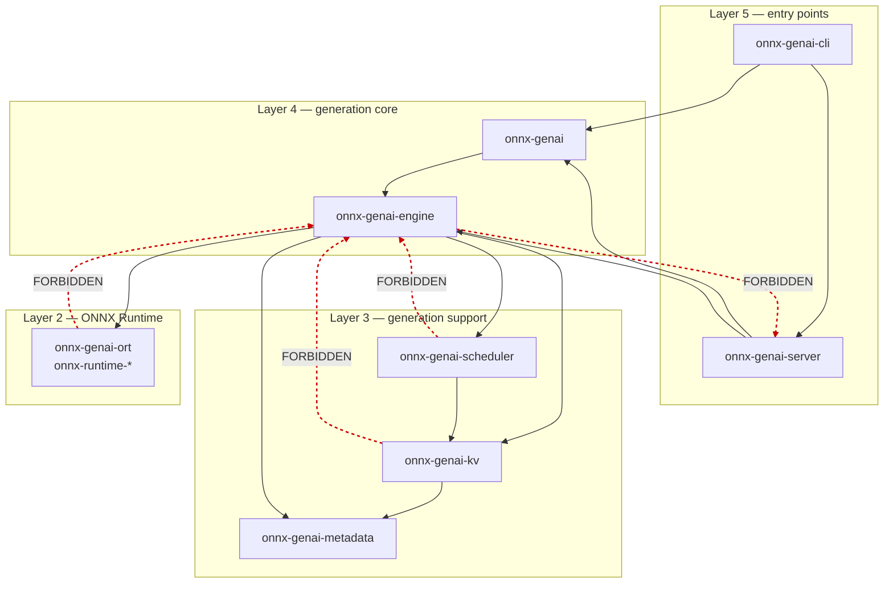
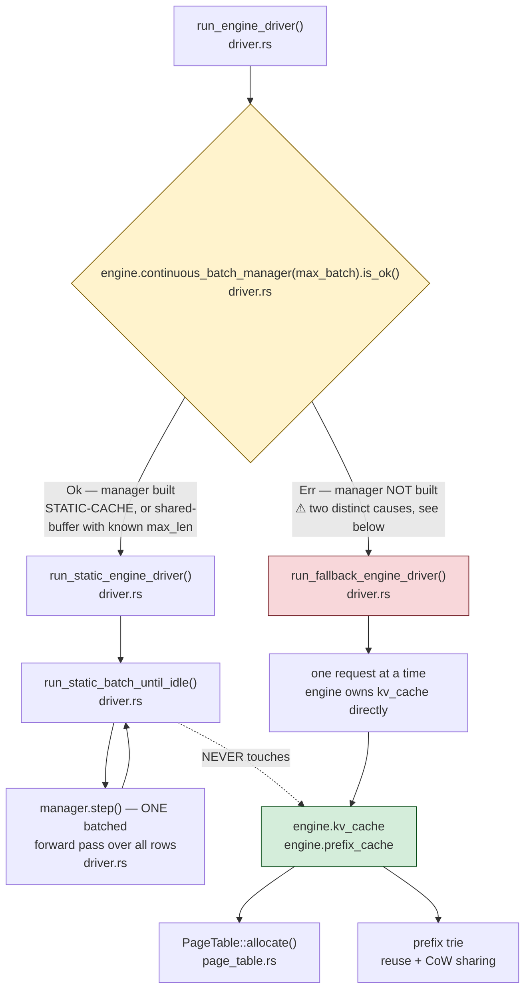

# onnx-genai — Architecture

**Audience.** §1 orients anyone in five minutes. §2–§7 are implementer reference. §8 is the honest list of what is stubbed or missing.

**Ground rules for this document.** Every non-obvious claim carries a `file:line`. Nothing aspirational is stated as fact. Where an invariant is *assumed* rather than *enforced*, it says so — those are where bugs live.

Line numbers are accurate as of the commit this document was added. Structure changes slowly; if a line has drifted, the symbol name will still find it.

**Verification.** All 87 distinct `file:line` citations in this document were checked mechanically against the tree — every one resolves to an existing file with that line present. The load-bearing claims were additionally verified by reading the code at each cited location, not by trusting the recon notes they came from.

**How each claim was established — verified vs inferred.** This document deliberately distinguishes the two rather than blending them:

| Evidence class | What it means | Examples |
|---|---|---|
| **Observed** | Confirmed against a *running server* — curled, streamed, or profiled — **and stamped with the commit sha the binary was built from** | §5.6's mode matrix (both model types run and profiled); the endpoint behaviours in §8.3; debug endpoints returning **404**, not 403 |
| **Read** | Established by reading the cited *executable* source — a constant, handler, assignment or signature | The dependency edges in §2; the command-deferral dispatch in §5.11 |
| **Stated intent** | Established by reading a **comment or docstring**. Supports a claim about what the authors *meant*, **never** about what the code *does*. | The preemption rationale at `crates/onnx-genai-engine/src/batched.rs::run_continuous_batch_scheduled` (the *behaviour* is cited separately at `:759`); the `NodeStatus` scope comment in §4.7 |
| **Inferred** | A conclusion drawn from the above, not directly witnessed | §5.3's claim that a shared-page write *would* corrupt silently — no test provokes it, and nothing in the code prevents it |

> **Why `Observed` carries a sha, and `Read` a `file:line`.** A live-server result is a measurement of a *binary*, and a binary is a snapshot of a tree at one instant. It never announces that it has expired. During this project HEAD moved seven times in ninety minutes, and the CORS middleware existed for **3 minutes 51 seconds** — long enough for two agents to independently measure it working, correctly, and to close the question on that evidence. Both measurements were honest; both described a tree that no longer existed.
>
> **An `Observed` claim without a sha is not observed — it is observed-at-some-unknown-time, which on a tree moving this fast is weaker than `Read`.** `Read` at least names the line it can be re-checked against. The failure is silent and asymmetric in the usual direction: a stale `Observed` claim reports a capability that is *present*, so it reads as reassurance.
>
> The same decay applies to any measurement of the document itself. A line count, a test tally or a citation offset quoted without a sha is a claim about a file that has since moved.

**Why the distinction is worth the overhead.** Verification tools share blind spots with the assumptions they are used to check. Several classes of defect in this codebase are **invisible to the instrument a reader would naturally reach for**:

| The instrument | What it cannot see |
|---|---|
| `curl` against an endpoint | Anything enforced by the *caller* rather than the server. A same-origin-policy failure returns **200 OK** to `curl` and to the server log, and fails only inside a browser. |
| Reading a handler | Whether the value survives the path to it (§5.14), or whether the field name means what it says (§5.13). |
| A passing test | A behaviour that is *structurally impossible* rather than merely absent — the test and the stub agree (§5.6.1). |
| A single measurement | Whether the instrument can resolve the effect at all. A run-to-run difference can exceed the threshold being tested for. |
| A line citation | That the line moved. The claim stays true while the reference silently rots. |
| `grep` returning nothing | Absence of a **spelling**, not of a **concept**. `grep -rn cors` reports zero on a tree containing `CorsLayer` and `CORS`, and the prefix-counter tripwire banned `prefix_cache_hits` while `prefix_cache.hits` shipped past it unnoticed (§8.4). An absence proof needs case-insensitive, multi-spelling coverage — and even then establishes only that nothing *names* the thing, not that nothing *does* it. |
| A bare filename in a citation (`metrics.rs`) | That it names one file. This repo has 39 crates and several `metrics.rs`, `state.rs`, `loader.rs`, `session.rs`. Three citations in this document silently pointed at the **wrong crate** and no line-number check could ever have noticed, because the wrong file has a line 123 too. **Cite a path that is unique, or cite a symbol that is.** |
| A citation converted from `file:line` to `file::symbol` | That it is now correct. Anchoring inherits the accuracy of the position it was migrated from: a citation that was already pointing at the wrong place becomes **stably** wrong instead of **silently drifting**. That is an improvement in diagnosability, not a proof of correctness. Every migrated citation in a load-bearing claim was re-verified at source; the rest are honest residue. |
| A correction from a colleague | That the correction's own evidence has expired. Corrections arrive with more authority than the claims they overturn, are rarely re-checked, and on this project a correct finding was overturned by a confident wrong one more than once. **A correction needs a sha for the same reason the original did.** |

The common shape: **each tool inspects a *state*, while these defects live in a *transition* or a *relationship*.** None of them can express *"and then it changed"* or *"and it means something different over there."*

> **Why `Stated intent` is a separate class and not a flavour of `Read`.** A doc comment is prose that lives in a code file: it inherits the authority of code while carrying none of the guarantees — nothing executes it, no test covers it, and it drifts silently when the code beneath it changes. This document cited *preemption is disabled* four separate times and every one of those citations landed on the docstring 40 lines above the assignment that actually disables it. **The comment happened to be accurate, which is precisely what makes the practice dangerous: it works until it doesn't, and no amount of careful reading can tell you which case you are in.** An audit of every citation here (`scripts/audit_citation_targets.py`) found 20 of 95 resolved citations anchored on prose. The behaviour claims among them have been re-anchored to executable lines; the rationale claims were relabelled to this class rather than deleted, because *why* the authors did something is genuinely useful and a comment is the correct source for it.

The practical consequence for this document is that **a chain of individually-true statements can compose into a false one** — every step verifiable, the conclusion wrong. That is why claims here carry their evidence class rather than a uniform tone of authority: the reader needs to know which links were witnessed and which were reasoned, in order to check the composition rather than the steps.

Where a claim is inferred, the text says so. The distinction matters most in §5: an **ASSUMED** invariant is precisely one where the code offers no evidence either way, so the reader is the last line of defence.

**How to read §5.** Each invariant is tagged **ENFORCED** (the code prevents violation) or **ASSUMED** (nothing stops you; violation compiles, runs, and corrupts or degrades silently). The ASSUMED ones — §5.3, §5.8, §5.10 — are the highest-risk sections in this document. §5.12 is **half enforced**: unified in Rust, still ASSUMED across the shell scripts, where a third validator lives that no Rust change can reach.

---

## 1. Orientation

### What this is

`onnx-genai` is a **generative-AI serving runtime written in Rust**. It loads ONNX models from a directory, runs autoregressive text generation on them, and serves the result over an OpenAI-compatible HTTP API.

It contains two stacks in one workspace:

- **`onnx-runtime-*`** — a Rust reimplementation of ONNX Runtime concerns: IR, graph loading, optimization, quantization, memory, execution providers (CPU, CUDA), tracing.
- **`onnx-genai-*`** — the generation layer built on top: KV cache paging, scheduling, the decode loop, the HTTP server, the CLI.

### How it differs from `onnxruntime-genai`

The upstream C++ `onnxruntime-genai` is a generation library. This project targets **serving**, which changes the design in three ways:

| Capability | What it means here |
|---|---|
| **Continuous batching** | Multiple in-flight requests share one batched forward pass. Finished rows are backfilled from waiting requests so the batch stays occupied, instead of draining and restarting. |
| **Paged KV allocation** | KV cache is allocated in fixed-size **pages** from a pool rather than one contiguous slab per sequence, so memory is reused across sequences and fragmentation is bounded. |
| **Prefix caching** | Sequences sharing a token prefix share the *same physical pages* via reference counting, so a repeated system prompt is not recomputed or re-stored. |

> **Precision, because it matters:** this repo implements a paged KV **allocator**. It does **not** implement paged-attention **kernels**. The allocator is real and observable; attention still reads through the runtime's own cache path. See §8.1.

### The system in one picture

```
   HTTP client
        │  POST /v1/chat/completions  (SSE stream)
┌───────▼─────────────────────────────────────────────┐
│ onnx-genai-server        axum router, crates/onnx-genai-server/src/lib.rs        │
│   AppState → ModelRegistry → ModelHandle            │
└───────┬─────────────────────────────────────────────┘
        │  mpsc DriverCommand  +  oneshot / mpsc replies
┌───────▼─────────────────────────────────────────────┐
│ EngineDriver     dedicated OS thread, driver.rs     │
│                                                     │
│   ┌── continuous batch path ──┐  ┌── per-request ─┐ │
│   │ ContinuousBatchManager    │  │ Engine::generate│ │
│   │ static-cache models only  │  │ paged KV +      │ │
│   │ batched.rs                │  │ prefix cache    │ │
│   └───────────────────────────┘  └─────────────────┘ │
│              ▲ mutually exclusive — see §5.6         │
└───────┬─────────────────────────────────────────────┘
        │
┌───────▼──────────┐  ┌──────────────┐  ┌────────────┐
│ onnx-genai-kv    │  │ scheduler    │  │ onnx-genai │
│ PageTable        │  │ admission,   │  │ -ort       │
│ PrefixCache      │  │ preemption   │  │ Session    │
└──────────────────┘  └──────────────┘  └─────┬──────┘
                                              │
                                   ┌──────────▼────────┐
                                   │ onnx-runtime-*    │
                                   │ IR, EPs, memory   │
                                   └───────────────────┘
```

A reader can stop here and be usefully informed.

---

## 2. Component hierarchy

39 workspace crates in five layers. **Dependencies point downward only.**

### Layer 5 — Entry points (public surface)

| Crate | Single responsibility |
|---|---|
| `onnx-genai-cli` | The `onnx-genai` binary: `serve`, `generate`, `run`, `show`, `list`. Also the `_onnx_genai_server` PyO3 module for the wheel. |
| `onnx-genai-server` | The axum HTTP server and OpenAI-compatible routes. |
| `onnx-genai-capi` / `onnx-genai-python` | C and Python bindings. |
| `onnx-genai-bench` | Benchmark binaries. |
| `onnx-genai-router` | Multi-node request routing. |

### Layer 4 — Generation core

| Crate | Single responsibility |
|---|---|
| `onnx-genai` | The public generation library — the crate external users depend on. |
| `onnx-genai-engine` | `Engine`, the decode loop, batching, the resource governor. The heart. |

### Layer 3 — Generation support

| Crate | Single responsibility |
|---|---|
| `onnx-genai-kv` | `PageTable`, `PrefixCache`. **Depends on `onnx-genai-metadata` and nothing else** — deliberately near-leaf so the allocator is testable in isolation. |
| `onnx-genai-scheduler` | Admission order, batch eligibility, preemption policy, byte budget. |
| `onnx-genai-ort` | Model-directory resolution and the ORT session/tokenizer boundary. |
| `onnx-genai-preprocess` | Image/audio preprocessing. |
| `onnx-genai-metadata`, `-genai-config`, `-runtime-config`, `onnx-model-package` | Model metadata schemas and package layout. |

### Layer 2 — ONNX Runtime

`onnx-runtime-ir`, `-loader`, `-session`, `-optimizer`, `-quantization`, `-memory`, `-shape-inference`, `-operator-selection`, `-eager`, `-tracer`, `-protocol-trace`, `-comm`, `-dlpack`, `-cpuinfo`, `-capi`, `-python`, and the execution providers `-ep-api`, `-ep-cpu`, `-ep-cuda`.

### Layer 1 — Foundation

`onnx-std`, `mlas-sys`.

### Dependency direction — verified, and the forbidden edges

Confirmed from the manifests:

```
onnx-genai-server  → onnx-genai, onnx-genai-engine, onnx-genai-metadata,
                     onnx-genai-ort, onnx-genai-preprocess
onnx-genai-engine  → onnx-genai-kv, onnx-genai-scheduler, onnx-genai-ort,
                     onnx-genai-metadata, onnx-genai-genai-config,
                     onnx-genai-runtime-config, onnx-runtime-{ep-cpu,ep-cuda,
                     ep-api,ir,loader,session,tracer}, onnx-std
onnx-genai-scheduler → onnx-genai-kv, onnx-runtime-protocol-trace
onnx-genai-kv        → onnx-genai-metadata
```

**FORBIDDEN — a PR introducing any of these should be rejected:**

| Forbidden edge | Why |
|---|---|
| `onnx-genai-kv` → engine, scheduler, or server | The page table must stay independently testable. It is the one component whose correctness is provable in isolation; adding an upward edge destroys that. |
| `onnx-genai-scheduler` → engine or server | Scheduling policy must be expressible without knowing how decode works. |
| `onnx-genai-engine` → server | The engine is a library. A server dependency would make it unusable from the CLI and bindings. |
| `onnx-runtime-*` → any `onnx-genai-*` | The runtime layer must remain usable without the generation layer. |

**Cycle note.** `onnx-genai-cli` exists as a separate crate specifically to avoid a dependency cycle: it needs both the core `onnx-genai` crate and `onnx-genai-server`, so it cannot live inside either (`crates/onnx-genai-cli/Cargo.toml`, header comment).

Dependencies flow **strictly downward**. Every red edge below is a rejection:



**Why this shape is worth defending:** `onnx-genai-kv` at the bottom is the reason the page table can be tested without a model, a session, or a server. That property is the codebase's single biggest testability asset, and exactly one upward edge would end it.

---

## 3. The request lifecycle

The spine of the system. Following one `POST /v1/chat/completions` from socket to socket.

### 3.1 Startup — before any request

1. `main()` (`crates/onnx-genai-cli/src/main.rs::main`) → `run(argv)` in `crates/onnx-genai-cli/src/lib.rs`.
2. `Commands::Serve` (`crates/onnx-genai-cli/src/lib.rs::Commands`) → `run_serve` (`crates/onnx-genai-server/src/cli.rs::run_serve`). The standalone `onnx-genai-server` binary calls the same function — **one serving path, not two**.
3. Model source resolution (`crates/onnx-genai-server/src/cli.rs::run_serve`). A clap `ArgGroup` (`crates/onnx-genai-server/src/cli.rs::ServeArgs`) requires exactly one of `--model` / `--models-dir` / `--models-config`, producing `Vec<ModelSpec>`.
4. `AppState::load_from_specs` (`crates/onnx-genai-server/src/cli.rs::run_serve`) → `build_handle` per spec (`crates/onnx-genai-server/src/state.rs::with_default_fim_config`) — **the single shared construction path** for both eager startup and lazy load.
5. `build_handle` resolves the directory (`ModelDirectory::load`, `crates/onnx-genai-ort/src/loader.rs::load`), loads the tokenizer, then `Engine::from_dir` (`crates/onnx-genai-engine/src/engine/load.rs::from_dir`).
6. `EngineDriver::start(engine, DEFAULT_MAX_BATCH, max_queue_depth)` (`crates/onnx-genai-server/src/driver.rs::start`) spawns the engine thread.
7. `app(state)` builds the router (`crates/onnx-genai-server/src/lib.rs::app`).

### 3.2 Arrival and admission

- Axum matches `POST /v1/chat/completions` (`crates/onnx-genai-server/src/lib.rs::app`); every request passes `trace_request` middleware (`crates/onnx-genai-server/src/lib.rs::app`).
- The handler resolves a `ModelHandle` from the `ModelRegistry`, applies the chat template, and tokenizes.
- The request is submitted to the driver over the `DriverCommand` mpsc channel. **Backpressure lives here:** the channel is bounded by `max_queue_depth`; over-depth submissions are rejected rather than queued without limit, and the rejection is counted in `metrics.rs`.

### 3.3 The engine thread and the path fork

`EngineDriver::start` (`crates/onnx-genai-server/src/driver.rs::DriverRoute`) spawns a **dedicated OS thread** via `std::thread::Builder` — not a tokio task. Rationale in §6.

Inside `run_engine_driver` the decisive branch is `crates/onnx-genai-server/src/driver.rs::embed`:

```
if engine.continuous_batch_manager(max_batch).is_ok() {
    // continuous batch path — logs "continuous batch driver enabled"
} else {
    // per-request path      — logs "continuous batch driver disabled"
}
```

`continuous_batch_manager` succeeds **only for static-cache models**. This single line determines which half of the system you are running. See §5.6.

The fork, and everything downstream of it:



**Read this diagram as the map of what is available where.** The dotted line is the whole story: the batched path never reaches the KV cache, so paged allocation, prefix reuse, and preemption are all absent on it — not broken, just never invoked (§5.6).

**The `Err` branch does not tell you the model is dynamic-cache.** Two structurally different failures land in the same branch, produce the same fallback, and log almost identically:

| | what happened | where it is decided |
|---|---|---|
| (a) | the model's decode path is `PastPresent` (non-shared-buffer) or `Legacy` — genuinely not batchable | the catch-all arm in `crates/onnx-genai-engine/src/batched.rs::continuous_batch_manager`, which bails with *"continuous batching requires a STATIC-CACHE or shared-buffer past/present model"* |
| (b) | the model **is** batch-capable — it matched `PastPresent { shared_buffer: true }` — and then failed *inside* that arm because `max_len` was `None`, i.e. `inference_metadata.yaml` omitted one field | the same function, `.context("shared-buffer continuous batching requires a known max_len")?` |

Case (b) is the one to watch, and it is not a rejection: the model reached the *capable* arm and fell out of it over missing metadata, not missing capability. Labelling the `Err` branch "dynamic-cache model" would infer a property of the **model** from an **error arm** — the same inference defect this project has hit before, and the reason the branch label above states only that the manager was not built.

> ⚠️ **The most commonly missed line in this file is `crates/onnx-genai-server/src/driver.rs::run_engine_driver`** — the `else` branch. It is easy to read `run_engine_driver` and see only the batching path, because that is the one with the interesting code. But every model that takes the `Err` branch — for *either* reason above — goes through the `else`, and *all* paged-KV and prefix-cache behaviour lives there. Instrumentation, logging, or error handling added only to the batch path silently does nothing for an entire class of models.

### 3.4 The decode step loop (continuous batch path)

- `run_static_batch_until_idle` (`crates/onnx-genai-server/src/driver.rs::run_fallback_engine_driver`) is the outer loop.
- Each iteration first drains newly arrived commands with `rx.try_recv()` (`crates/onnx-genai-server/src/driver.rs::run_static_engine_driver`), then calls `manager.step()` (`crates/onnx-genai-server/src/driver.rs::run_static_batch_until_idle`) — **one shared batched forward pass across all active rows**.
- **Only `Generate { session_id: None, .. }` is submitted to the running batch inline.** Every other command reaches `handle_or_defer_during_batch` (`crates/onnx-genai-server/src/driver.rs::intake_during_batch`), which answers `ResourceSnapshot` immediately through a `&Engine` borrow and pushes the rest onto `deferred` (`crates/onnx-genai-server/src/driver.rs::run_static_batch_until_idle`), drained only at `crates/onnx-genai-server/src/driver.rs::run_static_engine_driver` after the batch goes idle. **✅ RESOLVED (`a6fefde2`) — this section previously stated that *every* non-`Generate` command was deferred, which was true when written.** The mid-batch `&Engine` reader closed the `/v1/resources` hang structurally: state written inside the exclusive borrow is now readable without any borrow at all. **The invariant that remains is narrower and still load-bearing: anything needing `&mut Engine` cannot be served during a batch, which is why telemetry must be *published* from the decode loop rather than *requested* from it.**
- New arrivals are admitted at `crates/onnx-genai-server/src/driver.rs::run_static_batch_until_idle`; finished rows are backfilled so occupancy is maintained.
- Admission eligibility, when scheduler-driven, is `run_continuous_batch_scheduled` (`crates/onnx-genai-engine/src/batched.rs::run_continuous_batch_scheduled`): FCFS order (`crates/onnx-genai-engine/src/batched.rs::run_continuous_batch_scheduled`, `priority_policy = PriorityPolicy::Fcfs`) gated by the shared KV byte budget and total-token ceiling (`crates/onnx-genai-engine/src/batched.rs::batched_max_context_for_request`).
- Per-request events are funnelled through `route_continuous_events` (`crates/onnx-genai-server/src/driver.rs::handle_or_defer_during_batch`, called at `:660`) — **the single place where every request's lifecycle events pass**. TTFT is **not** recorded there: it is observed inside `crates/onnx-genai-server/src/metrics.rs::GenerationMetrics`, in `crates/onnx-genai-server/src/metrics.rs::token`, guarded by `first_token_seen`. This citation has now been wrong about the **file** twice: an early draft placed it in `driver.rs`, and the positional-to-anchored migration re-pointed it at the **router** crate's `metrics.rs`, because a bare filename is ambiguous across 39 crates. Both errors were invisible to a line-number checker and both were caught by asking whether the named symbol exists where the citation claims.

**Output equivalence guarantee** (`crates/onnx-genai-engine/src/batched.rs::run_continuous_batch_scheduled`): a request's tokens never depend on which rows share its batch. Batched output is byte-identical to running the request alone. Batching is a throughput optimization, not a semantic change.

### 3.5 KV allocation (per-request / paged path)

- `PageTable::allocate(device)` (`crates/onnx-genai-kv/src/page_table.rs::build`) returns a free `PageId`, or `None` when the pool is exhausted.
- On exhaustion, eviction runs (`crates/onnx-genai-kv/src/page_table.rs::allocate_page`), which deliberately **skips pages belonging to a live sequence or a retained prefix** (`ref_count > 1`).
- Prefix reuse: `PrefixCache::lookup_shared` (`crates/onnx-genai-kv/src/prefix_cache.rs::lookup_shared`) matches a token prefix, **increments the ref count of the matched pages**, and returns them for sharing rather than allocating and recomputing.
- `PageTable::free` (`crates/onnx-genai-kv/src/page_table.rs::page_owners`) decrements; the page returns to the pool only at `ref_count == 0`.

### 3.6 Streaming and teardown

- Generated token ids are detokenized incrementally and emitted as SSE chunks (`crates/onnx-genai-server/src/sse.rs`).
- The client observes TTFT as the first chunk's arrival.
- On completion the stream terminates, the session's pages are freed, and e2e latency is recorded into the histogram in `metrics.rs`.
- On client disconnect the response future drops; the driver stops routing events for that request.

---

## 4. Contracts

For each boundary: what the **caller** must guarantee, what the **callee** guarantees back, error semantics, and the consequence of violation.

### 4.1 Server ↔ EngineDriver

- **Transport:** mpsc `DriverCommand` with `oneshot` (single reply) or mpsc (streaming) response channels. Definitions from `crates/onnx-genai-server/src/driver.rs::DriverCommand`.
- **Caller guarantees:** submits only tokenized, validated requests; respects `max_queue_depth`; holds the reply channel until the stream ends or drops it to signal cancellation.
- **Callee guarantees:** every accepted command receives exactly one terminal outcome (completion or error). The engine thread never blocks the async runtime.
- **Errors:** a dropped reply channel means the client vanished — the driver treats it as cancellation, not a fault.
- **Violation:** blocking on the reply inside an async handler without `spawn_blocking` stalls a tokio worker. Model construction is explicitly documented as blocking (`crates/onnx-genai-server/src/state.rs::model_id`).

### 4.2 EngineDriver ↔ Engine

- **Ownership:** the driver thread **owns** the `Engine` exclusively. No `Arc<Mutex<Engine>>` — single ownership is what removes lock contention from the decode loop.
- **Borrow facts that matter for instrumentation:** `continuous_batch_manager(&self)` (`crates/onnx-genai-engine/src/batched.rs::continuous_batch_manager`), `page_usage(&self)` and `page_stats(&self)` (`crates/onnx-genai-engine/src/engine/runtime.rs::set_vram_limit`) all take **immutable** borrows, so they are callable from inside the batch loop without restructuring.
- **Violation:** any attempt to reach the engine from another thread. Add a `DriverCommand` variant instead — `ResourceSnapshot` (`crates/onnx-genai-server/src/driver.rs::DriverCommand`, async accessor `:383`, handler `:732`) is the pattern to copy.

### 4.3 Engine ↔ PageTable

- **Caller guarantees:** every `allocate` is eventually matched by a `free`; a page id is never used after its ref count reaches zero; a page shared with another sequence is never mutated in place.
- **Callee guarantees:** `allocate` returns a page not currently owned by anyone else, or `None`. `free` is idempotent-safe via `saturating_sub` (`crates/onnx-genai-kv/src/page_table.rs::page_owners`).
- **Errors:** exhaustion is `None`, not a panic — the caller decides between eviction, preemption, and rejection.
- **Violation:** mutating a shared page corrupts another sequence's KV silently. There is **no runtime guard** against this — see §5.3, an *assumed* invariant.

### 4.4 Engine ↔ ORT session

- **Caller guarantees:** input tensor shapes match the model's declared IO. For static-cache models this includes the `model.io.static_cache` declaration in `inference_metadata.yaml`.
- **Callee guarantees:** shapes and placement hints are validated at load; contradictory forced-placement hints are a hard error (`crates/onnx-genai-engine/src/engine/load.rs::from_dir_impl`).
- **Violation:** a static-cache model missing its `io.static_cache` block **fails to load** — this is a real, observed failure, see §8.5.

### 4.5 Model directory boundary

- **`ModelDirectory::load`** (`crates/onnx-runtime-loader/tests/loader.rs::tensor_type`) is the validation gate. It requires the root to be a directory (`:36-42`), then resolves `decoder.onnx` or exactly one `.onnx` (`:391`, `:412`) plus `tokenizer.json` (`:65-69`).
- **Canonical errors:** `model directory does not exist: {}` (`crates/onnx-genai-ort/src/loader.rs::load`), `tokenizer.json not found in {}` (`crates/onnx-genai-ort/src/loader.rs::load_flat`).
- ✅ **Duplication removed:** the server's `--models-dir` fan-out previously ran a *second, laxer* filter that accepted `tokenizer.json` **OR** `model.onnx` **OR** `genai_config.json`, so a directory could pass admission and then fail at load. It now delegates to the loader (`crates/onnx-genai-server/src/models_config.rs::from_models_dir`). See §5.12 and §8.6.

### 4.6 Tokenizer boundary

- **Caller guarantees:** the same tokenizer instance is used for encoding a prompt and decoding its output.
- **Why it matters:** `run_continuous_batch_scheduled` tokenizes every prompt **up front** and hands the manager token ids specifically so that "no re-tokenization can drift between the two" (`crates/onnx-genai-engine/src/batched.rs::batched_max_context_for_request`). Re-tokenizing mid-flight would desynchronize the scheduler's length accounting from the batch's actual rows.

### 4.7 `/v1/status` is a **node**-level contract with no model dimension

This is the clearest example in the codebase of a wire contract constraining an architecture decision, so it is worth stating precisely.

`GET /v1/status` returns `NodeStatus` (`crates/onnx-genai-server/src/routes/mod.rs::HealthResponse`, handler `crates/onnx-genai-server/src/routes/admin.rs::models`). Its own doc comment defines the scope (`crates/onnx-genai-server/src/routes/mod.rs::ModelObject`):

> All values are model-agnostic; `node_id` names this node, never a model.

- **Consumer:** the cluster router, not just local tooling. It is a shared contract, not an internal detail.
- **Guarantee:** every field describes *the node*. There is no field identifying which model a number came from, and no place to put one without changing the struct.

**The consequence, spelled out.** Multi-model mode gives each model its **own** `EngineDriver` (`crates/onnx-genai-server/src/state.rs::build_handle`), so two models really do run in one process. But `/v1/status` has no model dimension, so with two drivers behind one node it can only report one engine's numbers or blend them — and **a consumer cannot tell which**. Blending is the dangerous outcome precisely because the response still looks well-formed and plausible.

Adding a model dimension is possible but is a **breaking change to a contract another component consumes**. Running one server per model instead makes `/v1/status` unambiguous *by construction*: one engine per origin, no new fields, no migration, and no way to misattribute a number.

> **Guidance for anyone extending this endpoint:** if you find yourself wanting to add per-model fields to `NodeStatus`, prefer a separate model-scoped endpoint. Node-level and model-level data have different cardinality, and merging them silently breaks the guarantee the cluster router depends on.

---

### 4.9 Session ids on the wire are credentials — redaction is structural ⚠️ SECURITY

`/v1/status` returns `sessions[].id` (`crates/onnx-genai-server/src/routes/admin.rs::batch_utilization`), and unlike most of that struct it is **genuinely populated** — which makes it the field most likely to be bound by a consumer looking for something real to show. **A full session id is a bearer token**: possession of it is what authorises requests against that session. What appears on the wire is deliberately truncated — `sess-` plus the first 8 hex characters, then `…` (`crates/onnx-genai-engine/src/session.rs::DraftSession`).

**The redaction is enforced by the shape of the API, not by remembering to call it.** Three properties do that, and they are worth preserving deliberately:

1. **There is exactly one id-listing accessor, and it redacts.** `client_ids_redacted()` (`crates/onnx-genai-engine/src/session.rs::DraftSession`) is the *only* method that yields client ids. No unredacted sibling exists to reach for by mistake.
2. **Redaction happens inside the registry lock**, at `:125`, before the values escape. A caller never holds a full id, so it cannot leak one by accident.
3. **It fails closed.** An id not matching the expected `sess-<32 hex>` shape is replaced wholesale with `[redacted]` (`:170-171`) rather than passed through. An unrecognised format degrades to *less* disclosure, not more.

> **The consequence for anyone changing this.** Widening the redaction — showing more characters, or adding an unredacted accessor "just for debugging" — **leaks credentials into whatever consumes this endpoint**, and dashboards are exactly the kind of consumer that logs, screenshots and screen-shares its inputs. Truncated ids remain perfectly adequate for correlating rows in a UI, which is the only thing a consumer legitimately needs them for.
>
> **Contrast with §5.3.** This is what an *enforced* invariant looks like: violating it requires deliberately adding a new API, not merely forgetting a step. §5.3's copy-on-write rule protects something arguably more valuable and is enforced by nothing at all. **The difference is not importance — it is whether the type system was given the chance to help.**

---

### 4.8 The metrics registry is process-wide and has no model dimension

`crates/onnx-genai-router/src/metrics.rs::encode` declares `static REGISTRY: Registry` — a single, process-global instance. Every counter it holds is flat (`crates/onnx-genai-router/src/metrics.rs::encode`): `prefix_cache_hits`, `prefix_cache_lookups`, `batch_size`, `pending`, `active_sessions`, `rejections`, and the `ttft` / `e2e` histograms. **None is keyed by model.**

- **Guarantee:** these numbers describe *the process*, never a particular model.
- **Deliberate design:** the registry is a lock-free static specifically so recording a metric costs a relaxed atomic add and never allocates. That property is why it is safe to touch from the decode path at all (§5.10).

**The consequence for multi-model serving.** Loading two models gives each its own `Engine` and its own `EngineDriver` on its own thread (`crates/onnx-genai-server/src/state.rs::build_handle`, `:376`) — so the two genuinely run concurrently, one batching and one paging. **But they share this one registry.** Their counters are summed, and nothing in the response says so.

The sharpest instance follows from §5.13: `prefix_cache_lookups` increments on **every completed generation** (`crates/onnx-genai-router/src/metrics.rs::encode`), so in a two-model process, generations served by a *static-cache* model — which never consults the prefix cache at all — inflate the denominator of the *dynamic* model's prefix hit rate. **The displayed rate is not merely blended; it is actively depressed by unrelated traffic**, while looking authoritative.

Adding a model dimension means reworking a deliberately allocation-free static that sits on the hot path — precisely the change §5.10 warns against.

> **Why this is architecture, not trivia.** `static` means *per process*. Running one server per model therefore makes every counter model-scoped **for free**, with no hot-path change and no new fields: two processes are two registries. This, together with §4.7's `NodeStatus` having no model dimension, is why per-model observability is obtained by running separate processes rather than by extending either contract. Both are cases of choosing a topology that makes a guarantee structural instead of defending it with discipline.

---

## 5. Invariants

Each states the rule, **where it is enforced**, and what breaks. Critically: whether the code **enforces** it or merely **assumes** it.

### 5.1 Page accounting — ENFORCED

> A page is in the free pool if and only if `ref_count == 0`.

Enforced in `PageTable::free` (`crates/onnx-genai-kv/src/page_table.rs::page_owners`): decrement, and return to the pool only on reaching zero. `allocate` (`:836`) draws only from the free pool.

Corollary: `free_count(device)` (`crates/onnx-genai-kv/src/page_table.rs::free_count`) plus the count of pages with `ref_count > 0` equals capacity. **Breaks if violated:** double-free returns a live page to the pool, and two sequences then write the same physical KV.

*Note:* `free` uses `saturating_sub` (`:950`), which makes an extra free **silent** rather than a panic. Safe against underflow, but it means a refcount bug degrades quietly instead of failing loudly.

### 5.2 Reference counting for sharing — ENFORCED

> A page shared by N sequences (or retained by the prefix trie) has `ref_count == N`.

`PrefixCache::lookup_shared` (`crates/onnx-genai-kv/src/prefix_cache.rs::lookup_shared`) increments on match; release decrements. There is a test pinning exactly this (`crates/onnx-genai-kv/src/prefix_cache.rs::lookup_shared_increments_and_release_decrements_page_refs`, `lookup_shared_increments_and_release_decrements_page_refs`).

The prefix trie holds **its own** reference. So `ref_count == 2` with a single owning sequence means "one sequence plus a prefix-cache retention" — that is the mechanism by which a prefix survives its originating request.

### 5.3 Copy-on-write before mutation — **ASSUMED, NOT ENFORCED** ⚠️

> A page with `ref_count > 1` must never be written in place.

**Nothing at runtime prevents this.** `Page.ref_count` is a plain `pub u32` field (`crates/onnx-genai-kv/src/page_table.rs::Page`) and `Page.data` is a plain `pub Vec<f32>` (`:328`) — any holder of `&mut Page` can write a shared page. Correctness rests on callers checking the ref count first.

**This is the single most dangerous invariant in the codebase.** Violation corrupts another sequence's KV with no error, no panic, and no log — it surfaces as subtly wrong generated text in an unrelated request. **Any change touching page mutation deserves disproportionate review.**

### 5.4 Eviction respects liveness — ENFORCED

> Eviction never reclaims a page belonging to a live sequence or a retained prefix.

Enforced at `crates/onnx-genai-kv/src/page_table.rs::allocate_page`, which filters to `ref_count <= 1` and documents the intent inline. **Breaks if violated:** an active sequence loses KV mid-generation.

### 5.5 Batch composition — ENFORCED

> Physical concurrency never exceeds `max_batch` decode rows; each admitted row reserves its worst-case KV footprint up front.

Enforced in `run_continuous_batch_scheduled` (`crates/onnx-genai-engine/src/batched.rs::run_continuous_batch_scheduled` — the executable assignments `preemption_policy = PreemptionPolicy::Disabled` and `priority_policy = PriorityPolicy::Fcfs`): the scheduler governs *eligibility* (ordering plus the shared token/byte budget) while the manager's `max_batch` bounds *row count*. Up-front worst-case reservation is what makes byte-budget admission sound (`crates/onnx-genai-engine/src/batched.rs::run_continuous_batch_scheduled`).

`DEFAULT_MAX_BATCH` is **4** (`crates/onnx-genai-server/src/state.rs::DEFAULT_MAX_BATCH`), and it is a default rather than a fixed value: `--max-batch` overrides it (`crates/onnx-genai-server/src/cli.rs::max_batch`, env `ONNX_GENAI_MAX_BATCH`).

### 5.6 The static-cache requirement — ENFORCED (and load-bearing)

> Continuous batching engages **only** on static-cache models. Paged KV and continuous batching are **mutually exclusive**.

Enforced by the branch at `crates/onnx-genai-server/src/driver.rs::embed`. `ContinuousBatchManager` (`crates/onnx-genai-engine/src/batched.rs::ContinuousBatchManager`) holds a `BatchedDecodeSession`, a tokenizer, and rows — **it never touches `engine.kv_cache`**. Static-cache models use runtime-owned in-place KV buffers, so there are no pages to page.

Because the paged KV cache is the owner of *both* the page table and the prefix trie, bypassing it bypasses both. A static-cache model therefore never consults the prefix index at all — the question is never asked, so there is no answer to report. This distinction matters when reporting these metrics: a bypassed subsystem is **not applicable**, which is a different fact from **not measured** and a different fact again from **measured as zero**. Reporting any of the three as the others is a correctness bug in the reporting layer, even though every underlying number is accurate.

Consequences, all verified by running the server:

| | Static-cache model | Dynamic-cache model |
|---|---|---|
| Continuous batching | ✅ enabled | ❌ disabled |
| Paged KV allocator | ❌ inactive | ✅ active |
| Prefix cache | ❌ unavailable | ✅ available |
| Preemption | ❌ **hardcoded off** | ✅ available |

**A prefix-cache hit count of zero while continuous batching is enabled is correct behaviour, not a bug.** Likewise a preemption counter would be permanently zero on that path.

#### 5.6.1 The three consequences of the split

The batching/paged-KV split is not one limitation. It is a single structural fact that surfaces in three unrelated-looking places, and each was discovered independently before the common cause was recognised:

| Feature | Where it dies on the batching path | Evidence |
|---|---|---|
| **Prefix cache reuse** | The batch never consults the prefix trie | `prefix_cache_hit_len` is a literal `0` at `crates/onnx-genai-engine/src/batched.rs::admit_pending_into_row` and `:486`, so the `> 0` test at `crates/onnx-genai-router/src/metrics.rs::encode` is never true |
| **Preemption** | Disabled by construction, not by default | `scheduler_config.preemption_policy = PreemptionPolicy::Disabled` (`crates/onnx-genai-engine/src/batched.rs::run_continuous_batch_scheduled`) |
| **KV memory pressure / eviction** | Nothing to evict — rows are physical and pre-reserved | `crates/onnx-genai-engine/src/batched.rs::run_continuous_batch_scheduled` sets `PreemptionPolicy::Disabled` (executable). Stated rationale at `:713-718`. |

The rationale at `crates/onnx-genai-engine/src/batched.rs::run_continuous_batch_scheduled` is the common cause stated in the source itself: **the batch owns its KV in physical rows, and each row reserves its worst-case footprint up front.** Pre-reserved physical rows are what make the batching path fast and predictable, and they are *precisely* what removes the freedom that sharing, eviction and preemption all require. **Every one of the three is the same trade, seen from a different angle.**

> **The practical rule.** Before adding any counter or panel for a KV-related behaviour, establish **which execution path it can fire on**. A metric can be correctly implemented, correctly plumbed, and permanently zero — and that is indistinguishable from a bug for anyone who does not know this invariant. Zero here means *structurally impossible*, not *not yet happening*, and the two must never be rendered the same way.

### 5.7 Preemption is disabled on the batched path — ENFORCED

> `PreemptionPolicy::Disabled` is set unconditionally for scheduler-driven continuous batching.

`crates/onnx-genai-engine/src/batched.rs::run_continuous_batch_scheduled` (`scheduler_config.preemption_policy = PreemptionPolicy::Disabled`). The reason is structural, not a policy choice — stated rationale, not executable evidence, at `crates/onnx-genai-engine/src/batched.rs::run_continuous_batch_scheduled`:

> *"this batch owns its KV in the batched decode session's physical rows, which cannot be swapped out and resumed in place, so mid-flight eviction/swap of a running row is deferred."*

### 5.8 Output independence — ASSUMED (documented, not asserted)

> A request's output tokens do not depend on which other requests share its batch.

Documented at `crates/onnx-genai-engine/src/batched.rs::run_continuous_batch_scheduled`. There is no runtime assertion; it follows from the batched forward pass being mathematically per-row independent. **Breaks if violated:** batching becomes observable to users, and results stop being reproducible.

### 5.9 Configuration asserts — ENFORCED, at construction

`crates/onnx-genai-kv/src/page_table.rs::new_with_layer_storage` requires non-empty layer configs. This is an `assert!`, so violation panics at construction — loud and early, which is correct for configuration errors.

### 5.10 The decode loop never blocks for observability — **ASSUMED, NOT ENFORCED** ⚠️

> No code inside the decode step loop may `.await`, acquire a lock, block, or allocate unboundedly — including for telemetry.

Nothing in the type system prevents it. The engine thread (`crates/onnx-genai-server/src/driver.rs::DriverRoute`) is a plain OS thread that owns the `Engine` outright, so there is no borrow-checker or runtime guard that would reject a blocking call; it will compile and run and simply make every token slower.

**Why it holds:** the loop at `crates/onnx-genai-server/src/driver.rs::run_static_engine_driver` runs once per decode step for *every* in-flight request. Latency added there is multiplied by steps and by batch size, and it lands directly in inter-token latency — the number users feel most.

**What breaks if violated:** token generation stalls for every concurrent request at once. It degrades gradually rather than failing, so it survives review and shows up later as "the server got slower" with no obvious cause.

**Safe primitives:** relaxed atomics (the pattern already used throughout `crates/onnx-genai-router/src/metrics.rs::encode`), or `tokio::sync::broadcast::send`, which is deliberately non-`async` and returns immediately even with no receivers.

### 5.11 Non-`Generate` commands are deferred until the batch drains — ENFORCED

> While a continuous batch is running, the **only** command processed inline is `DriverCommand::Generate` with `session_id: None`. Every other command is queued and not handled until the batch goes idle.

Enforced by the dispatch inside `run_static_batch_until_idle` (`crates/onnx-genai-server/src/driver.rs::run_static_engine_driver`): the `try_recv` drain matches `Generate { session_id: None, .. }` and submits it to the manager, and the catch-all arm at **`crates/onnx-genai-server/src/driver.rs::run_static_engine_driver`** pushes everything else onto `deferred`. That queue is only drained at `crates/onnx-genai-server/src/driver.rs::run_static_engine_driver`, after the batch loop has exited.

**Why it holds:** the `Engine` is single-owner with no interior locking (§6). Servicing an arbitrary command mid-batch would need mutable access the batch loop is already holding.

**What breaks if violated — and this is a live trap:** anything latency-sensitive implemented as a `DriverCommand` is answered **only when the server is idle**. A telemetry command is the worst case: batch occupancy, queue depth, and KV stats would be unavailable *precisely while the server is busy*, which is the only time they are interesting. A dashboard built that way appears to work in testing and freezes under load — looking like a UI bug rather than an architectural one.

> ⚠️ **Correction to earlier guidance in this project.** An earlier draft of the telemetry plan proposed adding a `DriverCommand` to fetch a `ResourceSnapshot`. That is correct for the per-request path but **wrong for the batched path**, for the reason above. Instrumentation for batching must be gathered **inline**, right after `manager.step()` (`crates/onnx-genai-server/src/driver.rs::run_static_batch_until_idle`), and published through an atomic. `Engine::continuous_batch_manager`, `page_usage`, and `page_stats` all take `&self`, so reading them inline is permitted. **✅ This is now shipped, not proposed: `KvTelemetry` (`onnx-genai-kv/src/telemetry.rs`) is a block of atomics stored with `Ordering::Relaxed`, attached via `Engine::attach_kv_telemetry` (`crates/onnx-genai-engine/src/engine/runtime.rs::page_stats`) on both driver paths (`crates/onnx-genai-server/src/driver.rs::run_engine_driver`, `:463`) and read lock-free by the HTTP handlers.** The measured consequence is the argument: routing the same data through a driver round-trip turns two 1.8 ms endpoints into **14.8-second stalls during a generation**, because the round-trip queues behind the exclusive `&mut Engine` borrow. **A relaxed atomic store is cheaper than servicing a channel, so the correct design is also the lower-overhead one.**

### 5.12 Exactly one model-directory validator in the server — **ENFORCED (Rust), ASSUMED (scripts)** ⚠️

> A directory is a valid model directory if and only if `ModelDirectory::load` (`crates/onnx-genai-ort/src/loader.rs::load`) accepts it. No other component may define its own criterion.

**Enforced inside the server as of this commit.** `looks_like_model_dir` is deleted; `from_models_dir` (`crates/onnx-genai-server/src/models_config.rs::from_models_dir`) now delegates admission to `ModelDirectory::load` directly, so the scanner and the loader cannot disagree — there is no second criterion left to drift.

**This was not a hypothetical defect.** The deleted heuristic accepted on an **OR** of markers where the loader requires an **AND**. The shared models directory this project is developed against contains `mobilenetv2/`, holding exactly one `model.onnx` and no tokenizer. The old scanner admitted it, so a vision model was registered as a text-generation model and failed later, at load, with an error naming the wrong cause. The regression test (`crates/onnx-genai-server/src/models_config.rs::models_dir_scan_rejects_weights_without_a_tokenizer`) was mutation-verified: restoring the OR heuristic makes the scan return `ModelSpec { id: "mobilenetv2" }`.

**A silent skip was the other half of the bug, and deleting the validator alone would not have fixed it.** A rejected directory previously vanished without a word, so a model that was *almost* right — one missing file, one misnamed weight — was indistinguishable from a directory nobody intended to serve. `from_models_dir` now collects each rejection with the loader's own reason and prints them when the scan finds nothing, because the near-misses are the only entries a user can act on.

**⚠️ The invariant is still ASSUMED outside Rust, and this is now the weaker half.** A **third** validator exists in shell: `models_dir_contains_model` (`scripts/lib/models_dir.sh`) admits a directory only if it contains a file named literally `model.onnx`. The loader *prefers* `decoder.onnx` and accepts any single `.onnx` file. **A model directory built around `decoder.onnx` therefore loads correctly in the server and is invisible to every script that locates models** — the script reports no model found, and the skip is a banner rather than a failure. Nothing in the Rust type system can reach this, and no refactor of the server will ever surface it.

### 5.13 A metric's name is part of its contract — **ASSUMED, NOT ENFORCED** ⚠️

> A field must mean what its name says. Before consuming a metric, read the code that **increments** it, not the code that declares it.

**Why this is the sharpest observability trap in this codebase:** a stub is discoverable — someone greps and finds the hardcoded literal. **A correctly-computed number under a misleading name looks perfect forever.** It survives review, passes any "is this field populated?" check, and produces confident, precise, wrong conclusions.

Verified instances in this repo, all genuinely measured and all easy to misread:

| Field | Name implies | Actually counts | Evidence |
|---|---|---|---|
| `prefix_cache_lookups` | cache lookups | **completed generations** — incremented unconditionally, with no predicate | `crates/onnx-genai-server/src/metrics.rs::result` |
| `active_sessions` | concurrent requests | **persistent `X-Session-Id` sessions** — 4 concurrent stateless requests report `0` | `crates/onnx-genai-server/src/session.rs::remove` |
| `vram.used` | GPU memory in use | the scheduler's **KV byte-budget accounting** | `crates/onnx-genai-engine/src/engine/governor.rs::resolved_host_ram_budget`, `crates/onnx-genai-scheduler/src/governor.rs::snapshot` |
| `host_ram.used` | this process's memory | **whole-machine** OS query, including every other process | `crates/onnx-genai-engine/src/engine/governor.rs::resolved_host_ram_budget` |

**What breaks if violated:** the failure is silent and self-confirming. `prefix_cache_lookups` is the cautionary case — it would read `5` on a build with the prefix cache **deleted entirely**, so any hit-rate derived from it is a ratio against an unrelated denominator.

**Rule for consumers:** if a name is wrong, **rename it at your boundary** to what it actually measures. Do not inherit a misleading name because upstream chose it. Naming `active_sessions` "concurrent requests" in a UI would be a fabricated measurement even though the number itself is correct.

### 5.14 A getter's existence does not mean the value survives the path — **ASSUMED, NOT ENFORCED** ⚠️

> Check that the field you need survives the *whole* call chain. A correctly-named function can compute exactly what you want and then discard it one line later.

Four independent instances:

- **`PageUsage` collapses page identity into a count.** `SequenceUsage.pages` is `pages.len()` (`crates/onnx-genai-kv/src/page_table.rs::build`) — the `Vec<PageId>` is consumed to produce a length. The table knows *which* pages each sequence holds (`self.sequences`, `crates/onnx-genai-kv/src/page_table.rs::TelemetryHandle`), but that mapping never crosses the API boundary. **Consequence:** per-block sequence ownership — colouring a block grid by owning sequence — cannot be built from `page_usage()` as it stands.
- **`GovernorReconfigureOutcome` drops the eviction plan**, so a caller learns that reconfiguration happened but not what it decided. `overage_bytes` and `eviction_order` (`crates/onnx-genai-scheduler/src/governor.rs::GovernorReconfigureOutcome`) have **no consumers anywhere outside `governor.rs`'s own tests** (`crates/onnx-genai-scheduler/src/governor.rs::lower_below_usage_reports_overage_and_engine_eviction_order`). *(Verified repo-wide: no reference to either field exists in any other file.)*
- **`crates/onnx-genai-server/src/driver.rs::submit_to_continuous_manager` discards the reconfigure result** entirely.
- **`execution_provider` is resolved and dropped.** Determined at `crates/onnx-genai-engine/src/engine/load.rs::package_selection_from_session_options`, then not carried out to any handler. *(Reported by @d7cf9b84; the first three verified here.)*

**Why it holds:** each of these was a reasonable narrowing for its original caller — a length is all the original consumer needed.

**What breaks if violated:** you discover mid-implementation that the data was computed and thrown away, and the fix is an API change in a lower crate rather than the "just call the getter" you planned for. Widening the return type is usually the right fix; recomputing at the call site duplicates the invariant.

> **Trace to the handler that RETURNS the value, not the function that COMPUTES it.** This is the
> next rung down from "a handler that computes it, not a struct that declares it": a function can
> both exist and be correctly named and still be a dead end.

---

### 5.15 Telemetry must be *published* by the engine, never *requested* from it — ASSUMED ⚠️

The engine holds no concurrent-reader path. Both driver paths take an **exclusive borrow** for the whole of a generation:

- **Batched path:** commands needing `&mut Engine` are deferred (`crates/onnx-genai-server/src/driver.rs::run_static_batch_until_idle`) until `manager.is_idle()` (`:661`), drained at `:570`. Under sustained load the batch may never idle. **`ResourceSnapshot` is exempt — it is answered inline through a `&Engine` borrow (`crates/onnx-genai-server/src/driver.rs::intake_during_batch`).** (§5.11)
- **Pipeline/fallback path:** `handle_driver_command(engine: &mut Engine, ..)` (`crates/onnx-genai-server/src/driver.rs::intake_during_batch`) runs `run_fallback_generation` **inline** at `:696`. The generation completes *inside* the command handler, so the next command — telemetry or otherwise — is not read until it returns.

**These look like two problems and are one.** The queue policy is not the cause; **`&mut Engine` is.** While a generation holds the exclusive borrow, no reader can observe the engine *at all* — not because a channel is busy, but because the borrow makes concurrent observation unrepresentable. Draining the queue faster cannot fix it, and neither can adding another command.

**The consequence is uniform and severe:** the engine is observable only when idle. Every interesting quantity — page allocation, block sharing, batch occupancy — exists **only during** generation. The system can be measured precisely when it has nothing to say.

**The shape that works** is to invert the direction. State written from *inside* the mutable borrow into shared, atomic storage (`Arc<...AtomicU64...>`) can be read from outside with **no borrow at all**: wait-free, no channel, no deferral, no borrow conflict — and cheaper in the decode loop than servicing a channel, since it is a relaxed store rather than a `try_recv` plus a reply.

**The approved implementation** is an `Option<Arc<KvTelemetry>>` of atomics on the engine, updated after each decode step, with HTTP handlers reading it **without ever touching the driver thread**. Note what this fixes and how: it does not make the queue drain sooner, it removes the dependency on the queue draining at all. **The `/v1/resources` hang (§8.10) is closed structurally rather than by timing luck** — the difference between a race made less likely and a race made impossible.

**One subtlety when placing the write.** `run_fallback_engine_driver` delegates to `handle_driver_command`, so instrumenting the shared handler covers the pipeline path too; there is no separate site to add for it. A redundant extra site would not be harmless — two writers to the same atomic publishing at different points in the step produce values that are individually valid and jointly inconsistent.

**Measured.** QA timed endpoint latency during a 384-token generation on a clean tree:

| Endpoint | Idle | During generation |
|---|---|---|
| `/metrics` | 0.8 ms | **14,784 ms** (5 polls completed) |
| `/v1/resources` | 0.8 ms | **14,785 ms** (5 polls completed) |
| `/v1/status` | 0.9 ms | 1.8 ms (61 polls, clean 4 Hz) |
| `/v1/debug/kv` | 0.8 ms | 1.9 ms (61 polls, clean 4 Hz) |

The split is exactly the invariant: the two slow endpoints await a driver round-trip, the fast ones do not. **The stall is the full duration of the generation, not a fixed penalty** — it scales with how much work the engine is doing, so it is worst precisely when observation matters.

> **Stated as a rule:** *observability must not traverse the command channel — publish, don't request.* Any telemetry modelled as a `DriverCommand` inherits this ceiling by construction and will read as **frozen under load and fine when idle**, which is the hardest failure mode to catch, because every test that does not hold load passes.

---

## 6. Concurrency model

### Threads

| Thread | Role |
|---|---|
| tokio runtime workers | axum request handling, SSE streaming |
| **one dedicated engine thread per model handle** | `EngineDriver::start`, `crates/onnx-genai-server/src/driver.rs::DriverRoute`, spawned with `std::thread::Builder` |

### Why a dedicated OS thread, not a tokio task

Decode is a long, CPU-bound, uninterruptible compute step. Running it on a tokio worker would block that worker for the duration of a forward pass, starving unrelated requests. An OS thread isolates it completely.

The second-order benefit is the important one: **because exactly one thread owns the `Engine`, no lock is needed around it.** The channel *is* the synchronization. This is why the decode loop has no mutexes in it, and why it is fast.

### Ordering rules

1. Commands are processed **in channel order** — the mpsc queue defines admission order into the driver.
2. The scheduler may reorder *eligibility* among waiting requests (FCFS by default, `crates/onnx-genai-engine/src/batched.rs::run_continuous_batch_scheduled`), but never reorders events **within** a single request.
3. Every request's events pass through `route_continuous_events` (`crates/onnx-genai-server/src/driver.rs::intake_during_batch`) — a single funnel, so per-request event ordering is total.
4. Replies are per-request channels, so responses to different requests are unordered with respect to each other. Callers must not assume completion order.

### Where the locks are

- **Not in the decode loop.** Deliberate.
- Metrics are **lock-free atomics** in a static registry (`crates/onnx-genai-server/src/metrics.rs::Registry`).
- The session registry and model registry use standard synchronization, but are touched per request, not per token.

### Rule for anyone adding instrumentation

> Never `.await`, never lock, never allocate unboundedly inside the decode step loop.

Use an atomic counter, or a non-blocking `tokio::sync::broadcast::send` (which is non-async and returns immediately when there are no receivers). Anything else puts scheduler latency into the token generation path.

---

## 7. Extension points

### Adding an execution provider

Implement the `onnx-runtime-ep-api` traits; follow `onnx-runtime-ep-cpu` (simplest complete reference) or `-ep-cuda`. Register so `SessionOptions` can resolve it.
**Must not break:** placement-hint validation (`crates/onnx-genai-engine/src/engine/load.rs::from_dir_impl`) — an EP that silently ignores forced placement turns a hard error into wrong-device execution.

### Adding a sampler

Sampling lives in the generation core. Model authors' declared defaults are captured before the engine moves into the driver (`crates/onnx-genai-server/src/state.rs::build_handle`), specifically so a model shipping `do_sample: true` is not silently forced to greedy.
**Must not break:** that defaults capture. Overriding it makes model-declared generation config unreachable.

### Adding a scheduling policy

Extend `PriorityPolicy` / `PreemptionPolicy` in `onnx-genai-scheduler`.
**Must not break:** the forbidden edge — the scheduler may not depend on the engine (§2). A policy needing engine internals is a sign the data should be passed in, not reached for. Note also that preemption policies are inert on the continuous-batch path (§5.7).

### Adding an HTTP endpoint

Register in `app()` (`crates/onnx-genai-server/src/lib.rs::app`). Choose a gate deliberately:

- ungated — safe for anonymous callers;
- `enable_debug_endpoints` (`crates/onnx-genai-server/src/lib.rs::app`, flag `--enable-debug-endpoints`, `crates/onnx-genai-server/src/cli.rs::run_serve`) — introspection;
- `enable_admin_endpoints` (`crates/onnx-genai-server/src/lib.rs::app`) — mutating operations.

**Gated routes return `404`, not `403`**, because the route is never registered. Clients must treat 404 on a debug path as "disabled", not "missing".

If the endpoint needs engine data, add a `DriverCommand` variant — copy `ResourceSnapshot` (`crates/onnx-genai-server/src/driver.rs::DriverCommand`, `:383`, `:732`). Do not reach into the engine from a handler.

### Error message convention

`What: / Why: / How:` — see `crates/onnx-genai-server/src/driver.rs::handle_or_defer_during_batch` for the reference example. New errors should follow it.

---

## 8. Known gaps and stubs

The section that makes the rest of this document trustworthy.

### 8.1 Paged-attention kernels are not implemented

There is a paged **allocator** (`PageTable`, `PrefixCache`) that genuinely allocates, shares, reference-counts, and evicts pages. There are **no paged-attention kernels**. Attention does not read KV through the page table.

> **⚠️ "Evicts" is true, but only of one of the two eviction mechanisms in this repo, and they must not be conflated in public copy.**
>
> * **The page allocator's LRU eviction is REAL and RUNS.** `PagedDecode::evict_until_free()`
>   (`crates/onnx-genai-engine/src/pipeline/paged_decode.rs::evict_until_free`) calls `evict_lru(..)`, reached from
>   `crates/onnx-genai-engine/src/pipeline/flat_autoregressive.rs::admit_paged_sequence` — i.e. on the **dynamic / per-request path**, which is the only
>   path with a page table at all (§5.6.1). §5.4's liveness guarantee applies to *this* mechanism.
> * **The resource governor's eviction plan is COMPUTED AND NEVER EXECUTED.**
>   `GovernorReconfigureOutcome` produces `overage_bytes` and an ordered `eviction_order`
>   (`crates/onnx-genai-scheduler/src/governor.rs::GovernorReconfigureOutcome`), and **the only references anywhere are its own tests**
>   (`crates/onnx-genai-scheduler/src/governor.rs::lower_below_usage_reports_overage_and_engine_eviction_order`). `ByteBudget::reconfigure` moves `state.limit` and never touches `state.used`;
>   the repo names the behaviour itself in `reconfigure_lower_reports_overage_without_evicting`.
>   See §8.7 — lowering the VRAM limit affects new allocations only and never releases resident KV.
>
> **So neither "the allocator evicts" nor "the allocator does not evict" is a safe sentence.** The
> first invites a reader to believe a VRAM-limit change reclaims memory; the second is flatly false
> on the dynamic path and would be disproved by anyone who reads `paged_decode.rs`. **Correcting an
> overclaim by installing the opposite underclaim is not a fix — it is the same error with the sign
> flipped, and it is harder to catch because it sounds modest.** Public copy must name the
> mechanism: *pages are reclaimed by LRU eviction when the pool is exhausted; changing the VRAM
> ceiling does not reclaim anything.*

Say "paged KV block table", not "paged attention". The distinction is not pedantry — it is the difference between what is implemented and what is not.

### 8.2 KV introspection is stubbed at the server seam

`GET /v1/debug/kv` (`crates/onnx-genai-server/src/routes/admin.rs::KV_DETAIL`) returns the literal string *"engine does not yet expose KV page statistics"* (`:140`).

**But the data already exists.** `Engine::page_usage()` and `Engine::page_stats()` (`crates/onnx-genai-engine/src/engine/runtime.rs::set_vram_limit`) compute block utilization, per-sequence page counts, and allocation/free/eviction/failure counters; the underlying types are `PageStats` (`crates/onnx-genai-kv/src/page_table.rs::PageStats`), `PageUsage` (`:583-604`), `SequenceUsage` (`:607-614`).

The gap is **one missing `DriverCommand`**, not missing instrumentation. Anyone closing it must **delete the stub comments in the same change** — a stale `// not yet tracked` next to a live value is worse than the stub was.

### 8.3 `/v1/status` returns documented zeros — a real trap for consumers ⚠️

`NodeStatus` (`crates/onnx-genai-server/src/routes/mod.rs::HealthResponse`) declares a rich set of fields. The **handler** (`crates/onnx-genai-server/src/routes/admin.rs::models`) hardcodes most of them.

| Genuinely measured | Hardcoded |
|---|---|
| `node_id` `:45` · `healthy` `:47-51` · `queue_depth` `:59` · `active_sessions` `:61` · `sessions[].id` `:69` (redacted — full ids are bearer tokens) | `kv_usage` `:53` · `kv_pages_used` `:54` · `kv_pages_total` `:55` · `kv_pages_shared` `:56` · `paused_sessions` `:62` · `tokens_per_second` `:63` · `batch_utilization` `:64` · `sessions[].priority` `:75` · `sessions[].kv_pages` `:76` · `sessions[].state` `:77` · `prefix_hashes` `:81` |

The struct doc (`crates/onnx-genai-server/src/routes/mod.rs::ModelObject`) states the intent honestly: metrics the server cannot yet measure are *"reported as documented zeros/empties rather than fabricated"*.

**The trap:** a consumer can bind a dashboard to `kv_usage` or `tokens_per_second`, do everything else correctly, and display a fabricated measurement. **Verify a field is populated before depending on it.** Per-field comments in `status()` mark which are which.

Note `tokens_per_second` is honest about the reason — *"only cumulative token totals recorded"* (`:63`). The intended fix is for consumers to differentiate the cumulative counter over time, not to add windowing in the decode loop.

> **Planned change.** These fields are being wired to real measurements at their source rather than routed around. When that lands, the correct pattern for an unmeasurable field is `null` plus a machine-readable reason — **not** `0`. Any change that populates one of these fields must delete the corresponding `// not yet tracked` comment in the same commit; a stale marker next to a live value misleads worse than the stub did.

> **On how this list was established, and how much to trust it.** Two independent audits produced it: one reading forward from the engine toward the response, one reading backward from the response struct toward its sources. They agree on the same set, which is stronger evidence than either pass alone.
>
> **That convergence still failed once, and the failure is instructive.** Both audits initially placed `prefix_cache_lookups` on the honest side of the line. Both were wrong for the same reason: each read the field's *name* and neither read `crates/onnx-genai-router/src/metrics.rs::encode` (see §5.13). Agreement is only independent evidence when the two paths do not share a premise — and a plausible name is a premise both readers inherit from the same place. The rule this list is built on is therefore **verify the field, not the rule**: confirm each entry at its cited line rather than trusting the table, including this one.

### 8.4 Prefix cache: the zero is safe, the **non-zero** is the defect ⚠️🔴

**Read this section in full before binding any prefix-cache field. It has two halves and they point in opposite directions. The zero on the static path is honest. The non-zero on the dynamic path is not.**

Observed: identical prompts yield `prefix_cache_hits: 0` with non-zero lookups when continuous batching is active.

Per §5.6 this is **expected**: prefix caching lives in the paged KV manager, which is inactive for static-cache models. Recorded here because it looks exactly like a bug.

#### 8.4a The static-path zero

**RESOLVED — the zero is `not-applicable`, not `unavailable`, and the distinction is enforced by tests that already exist.**

The earlier open question ("should these counters report *unavailable* rather than zero?") rested on not knowing whether anyone intended to instrument this path. They do not, and the repository says so in the strongest form available:

| Evidence | Citation |
|---|---|
| `ContinuousBatchManager` holds eight fields — `decode`, `tokenizer`, `metadata_max_context`, `static_max_len`, `queue`, `rows`, `events`, `next_handle`. **No `kv_cache`, no page table.** | `crates/onnx-genai-engine/src/batched.rs::ContinuousBatchManager` |
| `batched.rs` only ever **reads** `row.state.prefix_cache_hit_len` when building a result; it never assigns it | `crates/onnx-genai-engine/src/batched.rs::advance_row`, `:579` |
| The only literal assignment anywhere is `prefix_cache_hit_len: 0` | `crates/onnx-genai-engine/src/pipeline/nested_autoregressive.rs::publish_generation_result` |
| **Three engine tests assert the zero as a postcondition** — `.all(\|result\| result.prefix_cache_hit_len == 0)` | `crates/onnx-genai-engine/tests/batched_static_decode.rs::batched_static_decode_matches_individual_static_generates`, `:88`, `crates/onnx-genai-engine/tests/engine_continuous_batch_scheduled.rs::scheduled_continuous_batch_matches_sequential_under_admission_eviction` |

That last row is what closes it. **A stub is a value nobody has gotten to yet; this is a value the test suite would fail if someone changed.** Instrumenting the batching path is not deferred work — it is work that would break three green tests, because there is no cache to instrument.

**Consequence for consumers:** the batching path must report this field as `not-applicable`, never `unavailable`. `unavailable` is a *promise* that someone will supply the number later; here nobody can, ever. Labelling it `unavailable` would also err in the flattering direction — it implies the project is behind on measurement rather than that static-cache and paged-KV are mutually exclusive by design (§5.6). The zero must never render at full contrast either way; see §8.12 for why the counters' *names* are separately wrong.

---


<!-- cite: crates/onnx-genai-engine/src/engine/runtime.rs:1046 = "fn prepare_session_prefix" -->
<!-- cite: crates/onnx-genai-engine/src/engine/runtime.rs:1066 = "started_empty && state.decode_state.uses_token_prefix_cache()" -->
<!-- cite: crates/onnx-genai-engine/src/engine/runtime.rs:1120 = "loaded_prompt_prefix = materialized_len" -->
<!-- cite: crates/onnx-genai-engine/src/engine/runtime.rs:1132 = "let in_process_hit" -->
<!-- cite: crates/onnx-genai-engine/src/engine/runtime.rs:1143 = "never claiming a hit we can" -->
<!-- cite: crates/onnx-genai-engine/src/decode/state.rs:206 = "fn uses_token_prefix_cache" -->
#### 8.4b The dynamic path reports hits it never serves — `MISLEADING`, not `measured` 🔴

**Correcting my own §8.4a, committed minutes earlier.** Having verified the static-path zero exhaustively, I let its complement — *"therefore the dynamic path is `measured`"* — ride unverified. It is not. QA (@fc8b5d97) measured 19 hits / 20 lookups **including six controls whose prefixes differ from token 0**. I traced it to source and confirm their finding. (Their accompanying timing comparison was later withdrawn as within noise; the counter result, which is what the correction rests on, is unaffected.)

`prepare_session_prefix` (`crates/onnx-genai-engine/src/engine/runtime.rs::prepare_session_prefix`) forks into two mechanisms:

| | Branch A — token cache (`:1029-1036`) | Branch B — paged (`:1037-1088`) |
|---|---|---|
| Guard | `uses_token_prefix_cache()` = `has_runner() \|\| is_windowed()` (`crates/onnx-genai-engine/src/decode/state.rs::uses_token_prefix_cache`) | `use_kv` && `kv_model.is_some()` && `page_table.tensor_config.is_some()` |
| Loads KV? | **No** | Yes — `attach_pages_to_sequence` → `materialize_sequence` → `load_materialized_past` |
| Sets `loaded_prompt_prefix`? | **No** | Yes (`:1087`) |
| Effect on prefill | **None** | Genuinely shortened |

Because `loaded_prompt_prefix` stays `0` under Branch A, the very next statement — `state.tokens.extend_from_slice(&prompt_tokens[loaded_prompt_prefix..])` (`:1093-1095`) — queues the **entire** prompt and prefill recomputes every token. The returned `in_process_hit` (`:1099`) has **no compute saving behind it**, and it is this value that becomes `prefix_cache_hit_len`.

**Two structural facts beyond the measurement, both readable from the control flow:**

1. **Any single shared leading token scores a hit.** The scoring expression is `common_prefix_len(..).filter(|&len| len > 0).max()`. Every `/v1/chat/completions` request shares the chat-template preamble, so **every request reports a hit, permanently.**
2. **Branch A pre-empts Branch B — they are `if` / `else if`, and A is tested first.** So whenever a model has a runner or a sliding window, the genuine paged reuse path is **unreachable**, whatever the page-table configuration. This answers as a matter of static precedence what would otherwise need a debug log: a server that satisfies Branch A's guard *cannot* be getting Branch B's real reuse. Branch B requires **four** simultaneous conditions including `!has_runner() && !is_windowed()`.

**The codebase states the correct rule 30 lines below, and applies it to a different path.** The connector fallback is commented *"never claiming a hit we can't serve"* (`:1108-1110`). Branch A violates the rule its own neighbour states.

> **🔒 Binding: `prefix_cache_hits` / `prefix_cache_hit_rate` MUST NOT be bound to any panel.** The honest signal is `loaded_prompt_prefix` (prefill *actually* skipped), not `prefix_cache_hit_len` (tokens that merely *matched*).

**Why this is more dangerous than every stub in §8.3, and why it inverts the section's own premise:** a zero looks broken and invites scrutiny. **95% looks like success.** This field is not a zero to be fixed — it is a **non-zero to be distrusted**, and it defeats every detector this document recommends: it is genuinely computed (so §8.12's name-tracing passes), it moves when you exercise the cache (so §5.14's motion test passes), and it carries a plausible magnitude. It is also **not** fixable by wiring up telemetry: this is a functional gap in prefix reuse, not a reporting gap, so no telemetry change will incidentally close it.

#### 8.4c Measured: prefix reuse is **proven absent**, not merely unobserved 🔴

Source analysis says the reuse cannot happen. QA measured whether it does. **Evidence class: Observed.**

| Arm | Setup | Warm TTFT |
|---|---|---|
| **A** | one identical ~900-token prefix, fired 6× | **1341 ms** |
| **B** (control) | six prefixes differing **from token 0** — sharing impossible | **1254 ms** |

**The two arms differed by less than the noise floor, so the timing result is inconclusive** — a
later re-run of this same comparison flipped the sign, and a repeat measurement on a byte-identical
binary varied by 9.8%, which is larger than the gap between these two arms. No timing claim survives
that. **What does survive is not a timing at all: every one of the six ARM B controls incremented
the hit counter**, which is the counter's
indictment: it fires when sharing is arithmetically impossible.

**The sensitivity control is what makes this proof rather than absence of evidence, and it is the
methodological point worth carrying forward.** A null result normally cannot distinguish *"the
effect is absent"* from *"the instrument could not see it."* So the magnitude of a working cache was
established independently first: prefill is **~90% of TTFT** (140 ms for a short prompt vs 1380 ms
for a long one), meaning genuine reuse would collapse TTFT from ~1380 ms to ~140 ms — **a 90% drop,
impossible to miss.** Observed: **a difference within the 9.8% noise floor** — inconclusive as to
sign, but bounded well below the effect being looked for. That effect is more than an order of
magnitude larger than the noise, so **the instrument would unquestionably have seen it.**

> **🔒 Ruled: no prefix-cache hit-rate panel ships, in any form, on any server** — not `measured`,
> not `not-applicable`, not a stark `0%`. The field is removed from the demo, enforced by two
> complementary tripwire tests: `examples/serving-dashboard/prefix-counters-forbidden.test.js`
> (no module outside a shrinking allowlist may reference the counters) and
> `examples/serving-dashboard/dashboard/registry-prefix-tripwire.test.js` (no panel may request
> them while every panel in the registry is mounted).

**The two servers' counters are broken in opposite directions, which is why no single rule rescues
either:** the batching path reads **0 / 135** (records nothing, §8.4a) and the paged path reads
**19 / 20** (records everything, §8.4b). **A reviewer who checks one server and generalises will
draw the wrong conclusion whichever one they pick.**

**How the false green was avoided is the part to reuse.** The first measurement *passed*: cold
1535 ms → warm 1334 ms, −13.1%, with hits climbing — a clean, publishable result. Two things did not
fit. The per-pair deltas were **incoherent** (−21.5%, +1.7%, −1.4%, −12.5%; a real cache does not
help only sometimes), and **from pair 1 onward the *cold* request also scored a hit**, which is
impossible for a brand-new prefix. The control arm was built on the strength of that doubt.

> **A result that confirms what you hoped for deserves more scrutiny than one that does not.** Both
> false greens caught tonight (this and the self-built model reference, §8.5) were caught by someone
> re-examining their own *success*. Nothing in a green result asks to be checked.

#### 8.4d The regression test named `prefix_speedup` never asserts a speedup 🔴

**Evidence class: Read (executable lines).**

`crates/onnx-genai-engine/tests/prefix_speedup.rs` is the repo's own guard on
prefix reuse. It:

- times both turns — `cold_start`/`cold_duration` (`:27`, `:29`) and
  `warm_start`/`warm_duration` (`:32`, `:34`);
- **spends both durations on an `eprintln!`** (`:36-39`);
- then asserts 13 times, **not one of them on a duration**. `grep -n
  "assert.*duration"` returns nothing.

The only prefix assertion is `warm.prefix_cache_hit_len > 0` (`:50`), and §8.4c
establishes that `hit_len` is nonzero for *every* request because
`.filter(|len| len > 0).max()` scores the shared chat-template preamble. So the
test passes when the warm turn is faster, when it is identical, and when it is
**slower** — the test discards the quantity regardless of its sign, so no
observed value of it can ever turn the test red.

> **The test computes the exact quantity that would have exposed the defect, and
> discards it into a log line.** It has been green for the entire life of the
> feature it is named after, and its name is the only place the word *speedup*
> appears.

**This is the §1 shape at its purest — the instrument is healthy, the output is
accurate, and the reading does not mean what it appears to mean.** It is also
why §8.4c's verdict required a control arm: no artifact already in the repo
could have distinguished a working cache from a counter that always fires,
*including the test written to do exactly that.*

**⚠️ Do not cite `crates/onnx-genai-engine/tests/prefix_speedup.rs::second_turn_latency_is_reported_for_prefix_cache_validation` as evidence that prefix reuse works.**
It is sound evidence for one narrow fact — that the *counter* reports nonzero on
a same-session second turn — and for nothing else. A test's **name is not an
assertion**; only its `assert!` lines are.

### 8.5 `scripts/build_qwen.sh` produces a model that cannot be loaded

`scripts/build_qwen.sh::# shellcheck source=lib/mobius_env.sh` passes `--runtime ort-genai`, which emits only `genai_config.json`. Loading the result fails because the runtime requires a `model.io.static_cache` declaration in `inference_metadata.yaml`.

The failure is confusing: the script succeeds, artifacts appear correct, and the model fails only at server start. Because continuous batching requires a static-cache model (§5.6), the practical effect is that batching silently never engages. A reproducible build recipe is captured as a skill in `.github/skills/build-static-cache-model/`.

### 8.6 Two model-directory admission filters

`ModelDirectory::load` (`crates/onnx-genai-ort/src/loader.rs::load`) is the only validator. The server's `--models-dir` fan-out (`crates/onnx-genai-server/src/models_config.rs::from_models_dir`) calls it directly rather than approximating it; the laxer OR-of-markers filter that used to sit here is deleted (§5.12).

Because the real loader requires `tokenizer.json` **AND** an onnx file, a directory can pass admission and then fail at load, with an error message (`crates/onnx-genai-server/src/models_config.rs::from_models_dir`) that describes a contract the loader does not implement. Consolidating on `ModelDirectory::load(...).is_ok()` would remove the divergence.

Also asymmetric: the CLI applies `resolve_model_dir` (`crates/onnx-genai-cli/src/lib.rs::resolve_model_dir`) to coerce a config-file path to its parent directory. **The server does not.** So `onnx-genai generate ./m/genai_config.json` works while `--model ./m/genai_config.json` fails.

### 8.7 Runtime VRAM override is inert

`POST /v1/admin/resources/vram-limit` (`crates/onnx-genai-server/src/routes/admin.rs::KV_DETAIL`) cannot shrink a live KV budget:

1. `allow_runtime_override` defaults to `false` (`crates/onnx-genai-router/src/config.rs::rejects_zero_unhealthy_after_misses`) and the server hardcodes `EngineConfig::default()` (`crates/onnx-genai-server/src/state.rs::ServerConfig`) with no flag to change it — so the call returns `403`.
2. Even when enabled, `Governor::set_vram_limit` (`crates/onnx-genai-engine/src/engine/governor.rs::set_vram_limit`) carries `TODO(§26.11.2)` for executing the eviction order. It moves the accounting ceiling; **resident KV is never released.** It affects new allocations only.

### 8.8 OTLP span export is deferred

`/v1/status` reports this explicitly rather than pretending it works (`crates/onnx-genai-server/src/routes/mod.rs::PERFETTO_EXPORT_PATH`). Perfetto export is available at `/v1/debug/trace/perfetto`.

### 8.9 `max_batch` is configurable — RESOLVED

`DEFAULT_MAX_BATCH = 4` (`crates/onnx-genai-server/src/state.rs::DEFAULT_MAX_BATCH`) is a **default**, not a ceiling: `--max-batch` sets it (`crates/onnx-genai-server/src/cli.rs::max_batch`, env `ONNX_GENAI_MAX_BATCH`).

⚠️ **The second half of this section was wrong in a way worth keeping visible: batch utilization is NOT computed against `max_batch`.** It divides by `effective_batch_capacity()` = `max_batch.min(max_queue_depth)` (`crates/onnx-genai-server/src/state.rs::effective_batch_capacity`), because `max_batch` alone overstates capacity whenever admission is the tighter constraint — with `max_batch = 4` and `max_queue_depth = 1` the batch can never hold more than one generation, so `1/4 = 25%` would show a fully saturated server as three-quarters idle.

**Do not surface `max_batch` as the denominator to clients.** A client-side `3 of 4` beside a server-side `100%` is two honest fields disagreeing because they divide by different things.

**And the numerator is process-global** (`crates/onnx-genai-server/src/metrics.rs::current_batch_size`) while the denominator belongs to one configuration, so the numerator can legitimately exceed it. The reported value is clamped, which hides a **scope mismatch** rather than a bug.

### 8.10 `/v1/resources` queued behind the work it reports on — RESOLVED, and mis-attributed first

`GET /v1/resources` sends `DriverCommand::ResourceSnapshot(reply)` and awaits a oneshot. **✅ RESOLVED — but by the second of two fixes, and this document credited the first one for two hours.** Two distinct defects blocked this endpoint, on two different drivers, and **the one that was measured is not the one that was first fixed.**

**Defect A — deferral on the continuous-batch path.** The command was not `Generate`, so it hit the catch-all, was parked on `deferred`, and was not drained until `manager.is_idle()` (`crates/onnx-genai-server/src/driver.rs::run_static_batch_until_idle`) — which under sustained load may never happen. Fixed by `a6fefde2` (23:58): `handle_or_defer_during_batch` (`crates/onnx-genai-server/src/driver.rs::handle_or_defer_during_batch`) answers `ResourceSnapshot` inline through a `&Engine` borrow and defers only what genuinely needs `&mut Engine`.

**Defect B — head-of-line blocking on the fallback driver, which is the one that was benchmarked.** `run_fallback_engine_driver` (`crates/onnx-genai-server/src/driver.rs::run_fallback_engine_driver`) runs generations **inline, one at a time** — its own comment states the capacity "is not `max_batch` — no batch exists — it is one." It is a strictly serial `blocking_recv` loop, so *no* command of any kind is serviced until the in-flight generation returns. **No change inside a command loop could ever have fixed this**, which is why Defect A's fix left the measured symptom untouched.

Fixed by `bd2197a4` (01:51, ancestor of HEAD) — **not** by `a6fefde2`. `EngineDriver::resource_snapshot` (`crates/onnx-genai-server/src/driver.rs::resource_snapshot`) now returns `governor.snapshot()` directly when a governor handle is present, **bypassing the driver channel entirely on every real-engine driver**. Pipeline engines hold no governor and keep the command path with its honest "not available" error rather than inventing a snapshot.

> ⚠️ **Name the type, not just the method.** An earlier draft of this very paragraph read `Engine::resource_snapshot`. A distinct `Engine::resource_snapshot` genuinely exists (`crates/onnx-genai-engine/src/engine/runtime.rs::resource_snapshot`) — it is the one `handle_or_defer_during_batch` calls — so the sentence named a real symbol in the wrong crate while citing the right file. **The citation resolved. The prose was still wrong**, and no citation checker can catch that, because a checker verifies that a target exists, never that it is the target the sentence is about.

⚠️ **The mis-attribution is the durable lesson here, and it is worth more than either bug.** Defect A explains the symptom perfectly: a snapshot request parked behind a batch is exactly what a hanging `/v1/resources` looks like. It was a real defect, correctly found and correctly fixed. **It was also not running.** The benchmarked server never entered that loop. **A mechanism that explains your symptom perfectly is not evidence that it was involved — before blaming a code path, prove it ran.** The identical error, in the identical file, is recorded in §8.9's post-mortem: a citation that resolves onto a plausible neighbour is more convincing than one that resolves onto nonsense.

**Why a shared read and not a published mirror.** A mirror was considered and rejected, and the reasoning is the part that generalises: **a mirror refreshed between generations is stalest exactly when the server is busiest — which is the one condition this endpoint exists for.** The governor's accessors take `&self`, so a shared handle is both always-available and always-live. No copy means no field can go stale. The fix is **structural rather than probabilistic**: the incapacity was never the queue depth, it was the exclusive borrow, so a fix that merely made the hang rarer would have passed every test the correct one does.

**Under sustained concurrent load the batch may not go idle**, because finished rows are backfilled from new arrivals to maintain occupancy. The reply was therefore held for as long as the server stayed busy — the request did not fail, it simply did not answer, and it surfaced as a client-side timeout rather than an error the server reported.

**Measured, worst case and error count — never the mean**, because a mean over a bimodal latency hides exactly the failure being described:

| | Worst case | Errors |
|---|---|---|
| Before | **7910 ms** | **5 of 6 polls timed out** |
| After | **86.6 ms** | **0 across 1055 polls** |

Taken on a box at load average 13 (measured by @d7cf9b84; not independently reproduced by this document's author). The load figure is part of the result, not context: an improvement measured on an idle box would not speak to the condition the endpoint exists for.

#### 8.10a A second, separate intake defect — fixed in the same commit, and *not* the cause of the above

`bd2197a4` also repaired the static driver's intake: the outer loop drained commands into a holding queue that the inner batch loop never read, degrading continuous batching toward serialisation. It ships with a regression test (`crates/onnx-genai-server/src/tests.rs::commands_parked_before_a_batch_starts_are_drained_into_it`).

**This is recorded here specifically to keep it separated from §8.10's measurement.** Two defects fixed in one commit, in one file, both touching command intake, both plausibly explaining a stalled endpoint — and only one of them was on the measured path. **The commit boundary is not an attribution boundary.** Reading a diff tells you what changed together; it does not tell you which change moved the number.

#### 8.10b Open question — measured and unexplained

The benchmarked server logged the **continuous batch driver as disabled**, while a freshly built model logs it **enabled at two widths**. Something about the older model or its configuration selects the fallback path.

**This is deliberately left unresolved rather than answered from source.** Which branch a server takes is a property of a *running process* — its model, its flags, and its build — and §7's capability table is the discriminator that makes the boot log interpretable, not a substitute for reading it. Section 7 already documents *why* the branch exists (continuous batching and paged KV are mutually exclusive); it cannot tell you which side a given process landed on. **An open question stated as open is a smaller error than a confident answer derived from the wrong artefact** — and per §8.10 above, a compiled binary carries no record of the commit it was built from, so the source cannot settle this even in principle.

Two consequences worth separating:

- **The endpoint appears to hang precisely when the machine is under load** — the condition a resource endpoint exists to report on.
- **A poller gets a burst of identically-stale values** when the batch finally drains, because several deferred snapshots are serviced back-to-back against the same post-drain state.

**Not the cause:** the pipeline driver arm is *not* at fault. It replies with an explicit `Err` for both `ResourceSnapshot` (`crates/onnx-genai-server/src/driver.rs::run_pipeline_driver`) and `SetVramLimit` (`crates/onnx-genai-server/src/driver.rs::run_pipeline_driver`) rather than dropping the oneshot, so pipeline models return a clean error instead of hanging. The deferral above is the whole mechanism.

**This is the practical face of invariant §5.11**, and it is why observability must be collected inline in the batch loop rather than requested through the command channel: *the command channel is not serviced during batch decode, which is exactly when observability matters most.*

---

### 8.11 `/metrics` inherits the driver round-trip for two gauges it treats as optional ⚠️

`prometheus_metrics` (`crates/onnx-genai-server/src/routes/admin.rs::prometheus_metrics`) does two things:

```rust
let mut output = crate::metrics::encode_prometheus();          // atomic registry, ~0.8 ms
if let Some(handle) = state.registry.resolve("")?
    && let Ok(snapshot) = handle.engine.resource_snapshot().await   // driver round-trip
{
    output.push_str(&crate::metrics::encode_resource_governor(&snapshot));
}
```

**The first line is already fast and already correct** — it reads the lock-free `static REGISTRY` (§4.8) and needs no engine. Everything genuinely measured on this endpoint (TTFT and e2e histograms, token counters, session and queue gauges) is produced there.

**The entire stall comes from the second part**, which exists only to append resource-governor gauges. Per §5.15 that `.await` parks behind the driver's exclusive borrow for the whole of a generation, so an endpoint that is 0.8 ms idle becomes ~15 s under load — **and the part that stalls is not the part carrying the real data.**

> **Why this is a small fix, not a redesign.** The handler is *already* written to tolerate absent resource gauges: the `if let Ok(..)` arm silently omits them when the snapshot fails. **Degrading gracefully is existing, intended behaviour** — so satisfying it from a cached or published snapshot rather than a round-trip requires no change to the response contract and no change to any consumer. The honest telemetry on this endpoint is being held hostage by two optional gauges.

---

### 8.12 Fields whose **names** are wrong while their **values** are correct ⚠️

This is the highest-value table in this document for a new contributor, and it is the one class of
defect against which **every mechanism described in §4 and §5 gives no signal at all**.

A fabricated value can be found: it is a literal, so it is greppable, and a zero invites suspicion.
**A correctly-computed value under a misleading name has no tell.** It is live, it moves when you
exercise the system, it is internally consistent, and it survives code review, unit tests, and a
careful reading of the struct definition — because nothing about it is *broken*. The only way to
catch one is to read the increment site and ask what actually causes it to move.

> **The rule this yields:** provenance is not *"is this field computed?"* — it is
> **"does this field mean what its name says?"** Trace every displayed number to the line that
> *changes* it, not to the struct that *declares* it.

| Field | What the name implies | What it actually counts | Evidence |
|---|---|---|---|
| `prefix_cache_lookups` | cache lookups | **completed generations** — `fetch_add(1)` is unconditional in `GenerationMetrics::result()` | **Verified** — `crates/onnx-genai-router/src/metrics.rs::encode` |
| `prefix_cache_hits` | cache hits | **generations with *any* prefix overlap ≥1 token** (`if prefix_cache_hit_len > 0`) — a shared chat template alone satisfies it | **Verified** — `crates/onnx-genai-router/src/metrics.rs::encode` |
| `prefix_cache_hit_rate` | hits ÷ lookups | **hits ÷ generations** — a real, useful per-generation rate, but not a hit rate | **Verified** (both terms above) |
| `batch_size_current` | the engine's decode batch | **live `GenerationMetrics` guards** — incremented in `start()`, decremented in `Drop`. On the dynamic server this is structurally ≤1 (§5.15); on the scatter server it is requests in flight, not decode rows. **It is never the batch size on either server.** | **Verified** — `crates/onnx-genai-router/src/metrics.rs::escape`, `:145` |
| `vram` / `host_ram` (on `/v1/resources`) | memory used | **ceilings only** — sourced from `configured_limits` / `resolved_limits`. There is no consumption term anywhere in the payload, so **any utilisation ratio drawn from it invents its own numerator.** | **Verified** — `crates/onnx-genai-server/src/routes/admin.rs::from` |
| `active_sessions` | concurrent requests | persistent `X-Session-Id` sessions — reads `0` at the busiest moment of a batching run, correctly | **Reported** (Lead), not independently verified here |
| `kv_usage` (on `/v1/status`) | KV utilisation | hardcoded `0.0`. **Not demo-only:** `RoutingPolicy::LeastKvUsage` sorts on it (`crates/onnx-genai-router/src/router.rs::load_score`), so the comparison cannot discriminate and the weighted policy silently loses its 30% term. | **Reported** (@d7cf9b84), traced cross-crate |
| ~~`created` (on `/v1/models`)~~ | model creation time | ~~**`now_unix()` — the current clock, evaluated per call.**~~ **✅ RESOLVED by `e556b7f4`** — now `directory_mtime_secs(&status.path)` (`crates/onnx-genai-server/src/routes/admin.rs::models`). Confirmed by observation: two calls 3 s apart returned an identical `created` (§8.13). | **Observed** |

> **🔴 `created` is the most dangerous entry in this table, and it is the one that defeats our own
> detection heuristic.** Every instinct we have treats **motion as evidence of life**: `stale` exists
> because a frozen value is suspicious, and a reviewer hunting fabrications is scanning for a
> literal that never changes. **This one changes on every single call.** There is no `0` to grep,
> nothing to notice in a diff, and it sits on `/v1/models` — **the one ungated endpoint that works
> with no flags**, so it is the field most likely to be reached by an integrator who never reads a
> provenance document.
>
> **The rule it yields, which is the mirror of the one above: a value changing is not evidence that
> it is measured.** Ask what would have to happen *in the engine* for this number to move. If the
> answer is "nothing," it is a clock, not a measurement. *(Found by @376a0297; verified here.)*

**Two things to take from the shape of this table rather than its contents.**

**First, the failures are not independent — five of the seven concern one subsystem** (prefix
caching and batching), because that is where §5.6.1's mutual exclusion lives. A field name written when
a capability was designed keeps its name after the execution path routes around the capability.
**The name records an intention; the increment site records what shipped.**

**Second, a guard derived from one of these incidents tends to be shaped like the incident rather
than like the fault.** The rule *"`hit_rate` must be unavailable when `lookups == 0`"* is correct and
does not fire here, because the denominator is the half that *works* — `135` really is 135
generations. The lie is in the numerator, and **no threshold on the denominator can ever detect
it.** When a ratio is suspect, audit its numerator and denominator **separately**: they usually have
different provenance, and here one is a live count and the other is a compile-time constant.

---

### 8.14 A prefix "hit" on the token path is a comparison, never a reuse ⚠️🔴

**Status: LIVE GAP.** Every value of `prefix_cache_hit_len` in the engine originates in one
function, `crates/onnx-genai-engine/src/engine/runtime.rs::prepare_session_prefix`, reached from
exactly two call sites. It has two mutually exclusive branches, and they differ in a way no
consumer of the metric can see:

| Branch | Gate | What it does | Prefill shortened? |
|---|---|---|---|
| token-prefix | `uses_token_prefix_cache()` (`crates/onnx-genai-engine/src/decode/state.rs::uses_token_prefix_cache`) | computes a longest-common-prefix length and **falls through** | **no** |
| paged | `use_kv` + tensor config present | calls `lookup_shared` and **materializes `matched.page_ids` into the page table** | yes |

On the token branch the match length is filtered by `len > 0` — **a single shared token scores a
hit.** Since every prompt in this repo shares a chat-template preamble, essentially every
generation scores one. That is not a bug in the counter; it is the counter faithfully reporting
that all prompts share a template.

**Why this is the canonical §5.13 specimen:** every individual layer is correct.
`crates/onnx-genai-server/src/metrics.rs::prefix_reuse_increments` returns `(0, 0)` for a zero
match, and `crates/onnx-genai-server/src/metrics.rs::result` only increments when it does not.
The server crate is clean, there is no stub, and **there is no literal to grep for.** The
composition still misleads, because `generations_with_prefix_reuse`
(`crates/onnx-genai-server/src/routes/admin.rs::resources`) names *work saved* while measuring
*a comparison performed*.

**Do not derive a hit rate from these fields.** A ratio whose numerator counts template-preamble
matches and whose denominator counts completed generations is a real number about nothing.

**What is NOT settled here, stated plainly:** which branch a given server takes at runtime.
`has_runner()` is a runtime state, and this document's own §1 rule is that a state is not
settleable by reading source. The branch table above is the discriminator; it is not the verdict.

### 8.15 LRU prefix eviction is live — the allocator's *other* eviction is not ⚠️

Two different mechanisms in this codebase are both called "eviction," and conflating them
produces confident errors in **both** directions.

**Live.** Cached prefix pages are evicted under pool pressure through five production hops with
no test in the chain: `crates/onnx-genai-engine/src/pipeline/flat_autoregressive.rs` calls
`crates/onnx-genai-engine/src/pipeline/paged_decode.rs::evict_until_free`, which calls
`crates/onnx-genai-kv/src/prefix_cache.rs::evict_lru`, which **frees real pages** and then calls
`crates/onnx-genai-kv/src/page_table.rs::note_prefix_eviction`. Pages are returned to the pool,
not merely counted.

**Inert.** The VRAM byte-budget governor computes an eviction order that nothing outside its own
file consumes, and `ByteBudget::reconfigure` never touches `used`. The repo's own test is named
`reconfigure_lower_reports_overage_without_evicting`. Lowering the ceiling **refuses new
allocations rather than reclaiming existing ones.**

**The lesson is directional.** This project spent a session hunting overclaims and found six. It
found zero underclaims — because nobody greps to check whether we are being too hard on
ourselves. An honesty process that only ever ratchets toward understating is not calibrated; it
is a different bias, and it is harder to catch because every individual step feels virtuous. A
claim of "no eviction occurs" is falsifiable in one grep, and it fails.

### 8.13 Observed against a running server — evidence class **Observed** 🟢

Everything above this section is **Read**: derived from source at `file:line`. This section is
**Observed**: a server was built from HEAD and exercised, and the numbers below are responses it
actually returned. The distinction matters because three claims in this document changed status
under observation, and **one of them was false.**

**Provenance of this run** — stated precisely, because an observation is only as good as the
artifact it was made against:

| | |
|---|---|
| Binary | built from HEAD `a5d065b0`, `git status` clean across `crates/`, `Cargo.toml`, `Cargo.lock` |
| Model | `qwen2.5-0.5b-scatter-v2` (static cache), `--model-id qwen-scatter --max-batch 4`, CPU EP |
| Confirmed at boot | `INFO onnx_genai_server::driver: continuous batch driver enabled max_batch=4` |

> ⚠️ **A prebuilt binary is not the shipped code.** The `target/release/onnx-genai-server` already
> present in this worktree was **10 commits behind `crates/`** — it still had `--cors-allow-origin`
> and lacked `--max-batch`. Observing from it would have "confirmed" gaps that were already fixed
> and missed the fixes that closed them. **A frozen artifact is the right instrument for a
> performance baseline and the wrong one for verifying current behaviour.** Rebuild, then check
> `--help` against the tree before trusting a single response.

#### What observation confirmed

- **§8.12 `prefix_cache_lookups` counts completed generations.** After exactly **two** chat
  completions, `onnx_genai_prefix_cache_lookups_total` read **2**. This was previously an inference
  from `crates/onnx-genai-router/src/metrics.rs::encode`; it is now a measurement.
- **§8.3 `tokens_per_second` is a placeholder.** 425 tokens were generated across the run and
  `/v1/status` still reported `tokens_per_second: 0.0`. The server accumulates totals and never
  computes a rate.
- **§4.8 the registry has no model dimension.** The only labels anywhere in `/metrics` are histogram
  `le=` buckets. Every counter is process-global, exactly as `crates/onnx-genai-router/src/metrics.rs::encode` implies.
- **§8.12 `vram`/`host_ram` are ceilings.** `/v1/resources` reported `vram: {used: 0, limit:
  5746050801}` — a 5.7 GB limit against a consumption term that is structurally absent.
- **§8.4a the batching path never hits.** `onnx_genai_prefix_cache_hits_total` was `0` after both
  generations, alongside a live `lookups` of 2.

#### What observation corrected

- **🔴 `created` is no longer a clock — that §8.12 row is RESOLVED.** The row asserted
  `created: now_unix()`, re-verified at `crates/onnx-genai-server/src/routes/admin.rs::directory_mtime_secs`. Two successive `/v1/models` calls three
  seconds apart returned the **identical** `created: 1785389982`. Commit **`e556b7f4`** replaced it
  with `directory_mtime_secs(&status.path)` — a real property of a real directory. **The claim was
  true when written and false when shipped, and only a running server could tell the difference.**
- **The misnamed counters now carry honest `HELP` text.** `/metrics` describes
  `prefix_cache_lookups_total` as *"Generation requests checked for prefix-cache reuse"* and
  `hit_rate` as *"Fraction of completed generations that reused a cached prefix."* **The metric
  names still lie; their documentation no longer does.** A Prometheus consumer reading `HELP` gets
  the truth, and one reading only the name does not — so §8.12 stays open, downgraded.

#### What observation revealed that no reading would have

**§8.10 is PARTIALLY RESOLVED, and the residual is measurable.** `a6fefde2` stopped `/v1/resources`
blocking until a batch drains, and it no longer does. But telemetry still contends with decode:

| Condition | `/v1/resources` latency |
|---|---|
| Idle (control, n=5) | **1.6 – 8.8 ms** |
| During generation, **first** call (n=2 runs) | **2.49 s, 3.03 s** |
| During generation, subsequent calls | 27 – 170 ms |

The first read after a batch starts is **~1000× slower than idle**, then synchronises and stays
cheap. **The control arm is what makes this a finding rather than an anecdote** — without it, 2.5 s
is equally consistent with ordinary first-call warm-up.

> **Consequence for the dashboard, and it is a design input, not a footnote: a 4 Hz poll issues
> every 250 ms against an endpoint that can take 2.5 s at exactly the moment generation begins.**
> The poll that matters most is the one guaranteed to be late. This is the measured form of the
> threading constraint that motivates event-sampling the block table instead of polling it: a panel
> that is flat because it was not read is pixel-identical to one that is flat because nothing
> happened.


---

| Question | Start at |
|---|---|
| How does a request become tokens? | §3, then `crates/onnx-genai-server/src/driver.rs::embed` |
| Why is my batching panel flat? | §5.6 — check whether your model is static-cache |
| Why is this metric zero? | §8.3, then the per-field comments in `crates/onnx-genai-server/src/routes/admin.rs::models` |
| Where do I add an endpoint? | §7, `crates/onnx-genai-server/src/lib.rs::app` |
| Can I call this from the engine thread? | §4.2 — check whether the accessor takes `&self` |
| Is this invariant enforced or assumed? | §5 — assumed ones are marked ⚠️ |
