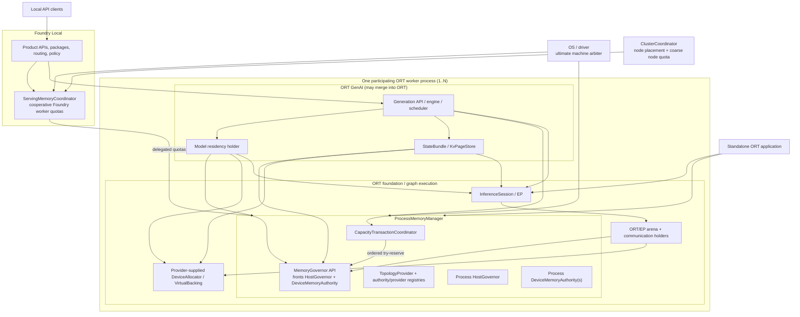

# Unified Memory Management for ONNX Runtime and ONNX Runtime GenAI

**Status:** Design proposal  
**Date:** 2026-08-13  
**Scope:** Local inference memory: one ORT process through optional
Foundry-managed multi-process and multi-node coordination
**Supporting detail:** [design appendix](./MEMORY_MANAGEMENT_MODEL_DESIGN_APPENDIX.md)

## Motivation

Memory is currently retained independently by ORT/EP arenas, model weights,
generation state, and backend caches. The pools cannot safely lend or reclaim
capacity across components, so memory is stranded and configured limits do not
describe actual process pressure.

To address this, the proposal introduces:

1. A GenAI-independent `ProcessMemoryManager` in each ORT process.
2. An optional Foundry Local `ServingMemoryCoordinator` that delegates
   coarse quotas only to participating Foundry workers.
3. The OS/driver as the ultimate machine-wide arbiter; unrelated programs
   are external pressure, not reclaimable holders.
4. ORT GenAI responsible for generation/state policy and ORT responsible
   for graph execution, allocator contracts, EPs, and kernels.
5. One memory control plane with multiple model-view/data-plane mechanisms:
   flat VMM, blocks-plus-table, static buffers, and fixed/indexed state.

## Contracts

**Definitions**

- An **authority** is the canonical accounting identity for one physical pool in
  one accounting scope.
- A **governor** is the lease/pressure interface and may front multiple
  authorities/tiers; every grant names the exact authority.
- An **accounting scope** is one ORT process and its local/delegated quota.
- Physical backing receives a process-unique, never-reused
  `PhysicalAllocationId`; views are identified by
  `(PhysicalAllocationId, MappingGeneration)`.

| ID | Contract |
|---|---|
| **C1 Resource authority** | Each physical pool has one canonical authority per scope. UMA views alias one authority; mismatched identities fail before use. |
| **C2 Lease and allowance** | Reservation precedes allocation. Commit creates a lease over `(authority, allocation ID, tier, bytes, role, holder)`. Mapped/residency allowances are non-owning and separately accounted. |
| **C3 Allocator and provider lifetime** | ORT defines allocator/backing ABIs; EP/host/embedder supplies implementations. `ProcessMemoryManager` pins provider/context while handles, leases, or views remain. Device loss invalidates affected views and initiates worker termination; delegated quota remains charged until process exit is observed. |
| **C4 Capacity transaction** | State-visible or cross-holder/tier/device change uses `plan -> reserve -> provisional view -> execute -> commit`. Delegated-quota negotiation and waiting happen before open. Open transactions acquire authorities in stable order with try-only reservation and release all on failure; a retry retains its original arbitration identity without holding capacity. |
| **C5 Reclaimable holder** | Pressure is a cancellable ticket with bytes, priority, deadline, and generation. The holder chooses safe victims and may release zero. |
| **C6 Model memory view** | A backend exposes contiguous, blocks-plus-table, indexed, or opaque views valid for the consuming execution. |
| **C7 Topology and capability** | The platform reports physical/aliased pools, capacity, granularity, links, allocator capabilities, and supported model views. |
| **C8 Reconfiguration and observability** | Authorities report used, available, oversubscribed, role, reclaimable, and unattributed bytes. Lowering uses prepare/reclaim/commit; failure preserves the old limit and reports completed actions. |
| **C9 Persistent state bundle** | Managed mode requires declarations for all loop-carried state and its lifetime, growth/update pattern, view, and checkpoint/fork/migrate/recompute capabilities. Missing declarations are rejected or enter reported conservative compatibility: inferred/enveloped bytes are unattributed and prefix reuse/migration is disabled. |
| **C10 Cooperative hierarchy** | Foundry delegates quotas only to authenticated workers it spawned/authorized. Workers never hold local reservations while awaiting quota and return uncommitted delegated capacity on defer. The coordinator retains submit identity, priority, and bounded aging as a non-owning retry intent. Heartbeat failure fences/terminates the worker; quota stays charged until exit. |

## Invariants

| ID | Invariant |
|---|---|
| **I1 Single charge per scope** | Physical bytes are charged once in each scope. Parent quota and child lease are linked attribution, not independently grantable copies. |
| **I2 Charge before commit** | Allocation/mapping follows a grant. Accomplished allocations are recorded even when that reveals oversubscription. |
| **I3 Honest compatibility** | Managed mode never silently escapes authority. Capability-inferred compatibility (including the WDDM default) must report that hard managed limits no longer apply. |
| **I4a Physical ownership** | A reservation/allocation identity is provisional, committed to one holder, or terminally released; allocation IDs are never reused. |
| **I4b Allowance ownership** | Allowances have independent free/reserved/committed state, never exceed charged capacity, and transfer without moving the physical charge. |
| **I5 Transaction/failure scope** | Pre-commit failure restores all cooperating state. Post-commit disagreement poisons the smallest rebuildable unit; shared-ledger corruption poisons the worker. |
| **I6 Live-state safety** | The authority never takes bytes directly. Holders cannot reclaim pinned or in-flight data. |
| **I7 Non-blocking governance** | No lock is held while waiting. Allocator callbacks fail fast; cancellation/timeout returns any grant exactly once. |
| **I8 Bytes are authoritative** | Admission derives exact bytes from model geometry and queried granularity, including rounding and transient peaks. |
| **I9 Mapping synchronization** | Mapping changes fence all users and are keyed by allocation ID plus mapping generation. |
| **I10 State-complete commit** | KV, recurrent/conv state, sampler/search state, and request progress commit or roll back together. |
| **I11 Honest enforcement scope** | Hard guarantees cover participating workers and delegated quotas only. External programs are OS-observed pressure, never reclaimable holders. |
| **I12 Completion-feasible admission** | Admitted requests/models retain a path to their next release/completion point; waiting work holds no scarce state. |
| **I13 Starvation-free arbitration** | In each process and serving-coordinator scope, deferred work keeps submit identity, priority, and bounded aging as a non-owning intent. New equal/lower-priority work cannot barge indefinitely. |

I12 is the design obligation represented by
[`KvAdmission.tla`](../specs/tla/KvAdmission.tla) and
[`CoResidency.tla`](../specs/tla/CoResidency.tla).

## Architecture

Arrows below are control, request, quota, or budget-signal flow. Containment denotes ownership;
responses, metrics, and pressure callbacks are omitted.

### Responsibility boundaries

| Layer | Owns | Does not own |
|---|---|---|
| **Foundry Local** | Product/service lifecycle, model catalog/packages, multi-model routing, policy, observability, cooperative worker quota. | Physical allocation, unrelated processes, per-token state, kernels. |
| **ORT GenAI** | Generation semantics, tokenization/sampling, scheduling, state/prefix cache, residency victim policy, model-switch mechanics. | Physical capacity, allocator implementation, graph kernels. |
| **ORT** | `ProcessMemoryManager`, allocator/provider contracts, `OrtEnv`, `InferenceSession`, graph planning/execution, EPs, kernels, capture. | Product policy, catalog, service routing. |

Plain ORT creates a default local manager. Foundry owns only the optional serving
coordinator; the OS/driver remains the whole-machine authority. If ORT GenAI
merges into ORT, the logical Generation API and contracts remain unchanged.

## Do we still need PagedAttention?

**VMM lets us keep non-paged attention kernels while committing physical memory
on demand.** Dense MHA/GQA continues to see flat stable pointers, so existing ORT
graphs/kernels work without block-table plumbing. This is the preferred native
path for broad compatibility, graph capture, low local concurrency, and models
whose VMM quantum is reasonable.

PagedAttention remains an optional model view, not the control plane:

| Condition | Selected view |
|---|---|
| Graph declares flat state; platform supports efficient VMM; kernel compatibility/stable pointers dominate. | Flat VMM |
| Graph and EP support block tables; high concurrency, fine-grained prefix COW, or VMM granularity favors small blocks. | Blocks-plus-table |
| Neither VMM nor block-table support is available. | Static contiguous mode: reserve/charge worst-case bytes at admission; dynamic reclaim and elastic lending are unavailable. |

The mechanisms compose: a paged block pool may allocate from VMM. The current
repository has no native CUDA block-table attention path, so flat VMM remains
the implemented plan. Captured paged attention with bucketed table shapes is an
assumption requiring validation, not current evidence. Detailed state/view and
quantum analysis is in the appendix.

## Core runtime flows

### Allocation

The EP/host/embedder constructs allocator/backing implementations during
bootstrap. `ProcessMemoryManager` owns shared handles and pins the provider
while any lease/view is live. A holder reserves first, then allocates/maps, and
keeps the lease until the allocation/view is released.

Registered ORT allocators have two distinct performance paths:

- host allocation may use the measured header-contained per-allocation lease;
- device registration bypasses ORT's BFC wrapper, so the adapter must provide
  its own arena/VMM suballocation. Integrating governance into ORT's own BFC
  arena is a separate upstream ORT change.

### Transaction and pressure

All waiting/reclaim occurs before a transaction owns partial reservations.
`CapacityTransactionCoordinator` then try-reserves every authority in stable
identity order. Failure releases all grants and returns defer/retry.

The engine prepares the transaction, but each holder owns its lease:
weight residency owns weight leases, `StateBundle` owns state leases, and
arenas/communication staging own bulk leases. Pressure asks; the holder chooses
safe victims.

### Multi-process and multi-node

- Standalone ORT enforces a conservative local budget from configuration and
  OS/driver signals.
- Foundry delegates child quotas and guarantees only
  `sum(worker quotas) <= serving quota`.
- A participating worker's effective budget is
  `min(delegated quota, local OS-derived ceiling)`.
- Normal serving-policy reclaim originates at the coordinator. A worker uses
  local OS signals as a safety floor to stop admission and notify the
  coordinator, avoiding duplicate independent reclaim.
- Raw CUDA contexts/allocators remain per process.
- Observed worker process exit returns its quota. Heartbeat/epoch failure fences
  future claims and initiates termination; the quarantined quota remains charged
  until exit.
- Multi-GPU admission reserves every device, host, communication, and transient
  peak before commit.
- Cluster coordination handles node placement/quota; allocation, paging, and
  step transactions remain local.

## Required architecture changes

1. Add the GenAI-independent `ProcessMemoryManager`, authority/provider/allocator
   registries, and ordered transaction coordinator.
2. Add EP/provider registration before sessions allocate; pin providers until
   all leases/views retire and define terminal device-loss behavior.
3. Route ORT environment allocators and native sessions through manager-backed
   handles; eliminate the governed allocator's lifetime leak.
4. Share host/disk authorities within a process and expose exact
   persistent/transient/unattributed bytes.
5. Add authenticated Foundry worker registration, delegated quotas,
   heartbeat/epoch fencing, process-exit reclamation, and aggregate snapshots.
6. Extend model metadata/runtime APIs to declare complete C9 state bundles and
   C6 model views.
7. Add communication/collective staging as a named lease holder.
8. Implement completion-feasible request admission in the GenAI scheduler and
   eviction-progress protection in model residency.
9. Extend formal/refinement coverage from one HostGovernor to ordered,
   starvation-free multi-authority transactions and completion-feasible
   admission.

## Major risks and mitigations

| Risk | Mitigation / exit condition |
|---|---|
| **Dynamic weight lending corrupts output** | **Blocked.** Large stable-slot eviction/re-admission must be isolated and pass token-identity stress. Until then use a static hot set and lend only never-retained capacity. |
| Incomplete accounting | Fix #628 byte geometry; account activations/runtime/ORT VMM or reserve visible unattributed headroom. |
| Cross-authority deadlock/starvation | Pre-negotiate delegated quota; ordered try-only reservation; persistent non-owning intents with bounded aging; model-check/fault-test schedules. |
| Incomplete hybrid state | Cache hits require exact state-schema identity and complete-bundle restore; otherwise recompute. |
| Provider/device loss | Provider pinning, authority generation invalidation, terminal views, and explicit engine/worker blast radius. |
| VMM granularity | Query geometry/granularity and select view by committed/useful byte ratio. Token-major's measured reduction is not implemented. |
| External programs | Best-effort coexistence via OS budgets and safety reserve; no machine-wide hard guarantee. |
| Serving coordinator failure | Authenticate spawned workers; fence on heartbeat/epoch failure; keep quota charged until process exit; use idempotent return and restart reconciliation. |

## Relationship to existing design

If accepted, this proposal refines or supersedes these statements in
[`MEMORY_ARCHITECTURE.md`](./MEMORY_ARCHITECTURE.md):

| Existing design | Proposed refinement |
|---|---|
| `MachineRuntime` is the process-level ownership object (§4.0). | `ProcessMemoryManager` is the GenAI-independent ORT process service; product/generation responsibilities stay above it. |
| One `HostGovernor` is the machine authority (§5.1, D1, D7). | A process governor enforces its child quota; optional Foundry coordination bounds cooperative workers, while the OS remains global arbiter. |
| `ClusterCoordinator` owns single-machine sharing and cross-node coordination (§6.1, D5). | `ServingMemoryCoordinator` owns Foundry worker quotas on one node; `ClusterCoordinator` owns placement/coarse node quota. |
| Device authorities are effectively server-owned ([`ServerMemoryAuthorities`](../crates/onnx-genai-server/src/state.rs)). | The server object becomes the serving quota coordinator; each process owns local authority/provider/allocator registries. |
| PagedAttention is “[not built, and not the plan](./MEMORY_ARCHITECTURE.md#implementation-status)” for native CUDA. | Flat VMM remains native/default; blocks-plus-table is optional for compatible exported models and EPs. |

On acceptance, the canonical document must point to this proposal and mark the
superseded statements.

Detailed evidence, topology examples, WDDM behavior, state mechanisms, related
work, and current implementation gaps are in the
[appendix](./MEMORY_MANAGEMENT_MODEL_DESIGN_APPENDIX.md).

## Non-goals

- Enrolling or reclaiming arbitrary non-Foundry applications
- Distributed page allocation or token-step transactions
- One allocator implementation for every lifetime/device
- Moving generation/product policy into `ProcessMemoryManager`
- Cross-process shared physical backing/dedup in the first implementation
