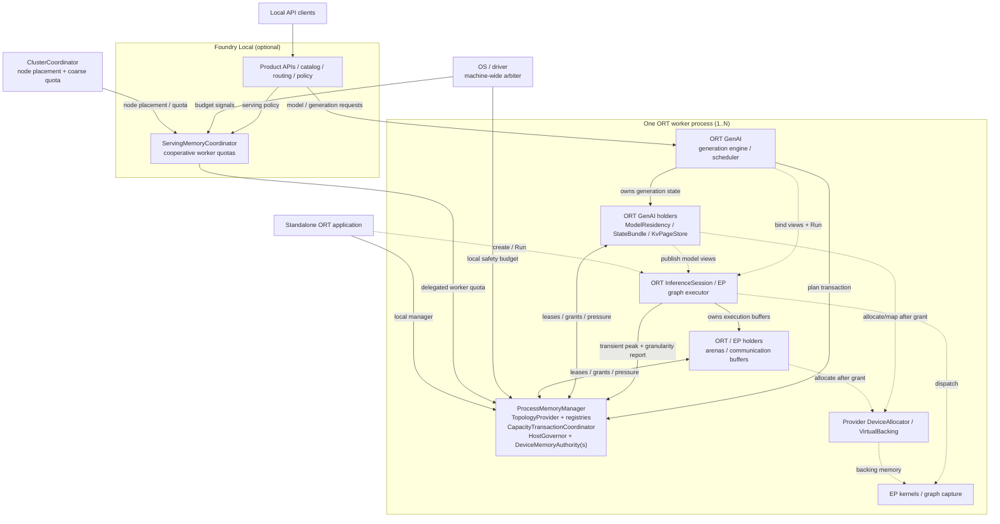

# Unified Memory Management for ONNX Runtime and ONNX Runtime GenAI

**Status:** Design proposal  
**Date:** 2026-08-13  
**Scope:** Local inference memory: one ORT process through optional
Foundry-managed multi-process and multi-node coordination
**Supporting detail:** [design appendix](./MEMORY_MANAGEMENT_MODEL_DESIGN_APPENDIX.md)

## Motivation

The goal is to make ORT and ORT GenAI execute one or more models efficiently on
a local machine across heterogeneous CPUs, GPUs, and NPUs. A model should still
run when its weights and generation state do not fit in VRAM; a small workload
should consume only what it needs; multiple models and requests should share
available capacity; and operators should be able to preserve enough headroom
for the desktop and other applications.

### Why this is not an arena-tuning problem

The first reasonable objection from anyone who knows ORT's memory model is that
these are configuration knobs: set `gpu_mem_limit`, choose an arena extend
strategy, size `OrtArenaCfg`, share allocators through `OrtEnv`. That is worth
answering directly, because the limitation is structural rather than a matter of
sizing.

ORT today gives each pool a *bound*. What it does not give is a way for one
holder to *lend* capacity to another, or for the runtime to *reclaim* capacity
from a holder that is currently holding more than it needs. Concretely, in a
process running one generative model:

- the device BFC arena grows to its high-water mark and, absent an explicit
  end-of-`Run` shrinkage request, keeps that memory for the rest of the run;
  and even with shrinkage the decision is scheduled by the caller at a `Run`
  boundary rather than driven by another holder's demand, so it cannot answer
  pressure arriving mid-generation;
- weight residency, KV/recurrent state, prefix caches, and collective staging
  each size themselves independently, and none can see what the others left
  unused;
- a custom device allocator registered through `OrtEnv` is **not** wrapped in
  BFC, so an EP-side integration must bring its own suballocator — the governed
  path and the arena path are separate implementations today, not one policy;
- `RegisteredAllocator` cannot be retired safely because ORT does not expose the
  last session user, so it conservatively leaks;
- limits describe individual pools, so no component can answer "what is this
  process actually costing the machine right now?" — which is the question an
  operator, a serving host, and the OS all ask.

The result is stranded memory, avoidable offload or allocation failure, poor
multi-model utilization, and reported limits that do not describe the runtime's
true pressure on the machine.

### The harm is measurable, not hypothetical

This proposal is written against measurements from a working implementation, not
from first principles. Three of them are worth stating up front because each is
a class of bug the current structure invites rather than a one-off defect:

- **A pool sized once, at load, from a declared maximum.** A weight budget
  computed as `device_budget - kv_bytes_per_token x max_context` stranded
  1.611 GB from the first token while weights streamed from host memory every
  step. Making that split elastic against actual occupancy — while keeping a
  guaranteed path to full context — cut streamed bytes **1.68x** (#857/#866).
- **A number that no component owned.** Total weight bytes were measured from
  the external-data file rather than from the extents the graph references. For
  one 14B model half that blob was orphaned, so the runtime believed the model
  was **2.00x** larger than it is and every derived budget was wrong (#853/#856).
- **Managing bytes that should not have been managed.** For a model over budget,
  copying single-touch weights into VRAM ourselves measured **30x slower** than
  letting the OS demand-page them, because a weight read once per step has no
  reuse to amortize the copy against. Deferring to the platform recovered
  roughly **100x** end-to-end (#864/#874).

The first two are accounting failures that a single authority prevents by
construction. The third is the reason this design must also say *when not to
manage* — see [Should the runtime manage these bytes at all?](#should-the-runtime-manage-these-bytes-at-all).

### What the runtime therefore needs

- use weight offload, tiered state, and demand commitment when a model exceeds
  one device's memory;
- avoid maximum-context and per-model worst-case reservations when actual demand
  is smaller;
- coordinate weights, KV/recurrent state, activations, workspaces, prefix
  caches, and runtime overhead under one resource envelope;
- support prompt reuse, continuous batching, and fast local model switching
  without each subsystem hoarding an isolated pool; and
- adapt placement and accounting to discrete, unified, multi-device,
  multi-process, and multi-node topologies.

This proposal defines the contracts that let those specialized components share
one coordinated control plane **without replacing their allocators, kernels, or
state-specific policies**. Existing EPs, kernels, graphs, and arena
implementations keep working; what changes is that they acquire capacity through
a grant and can be asked to give some back.

## Contracts

**Definitions**

- An **authority** is the canonical accounting identity for one physical pool in
  one accounting scope.
- A **governor** is the lease/pressure interface and may front multiple
  authorities/tiers; every grant names the exact authority.
- An **accounting scope** is one ORT process and its local/delegated quota.
- Physical backing receives a process-unique, never-reused
  `PhysicalAllocationId`; views are identified by
  `(PhysicalAllocationId, MappingGeneration)`.

| ID | Contract |
|---|---|
| **C1 Resource authority** | Each physical pool has one canonical authority per scope. UMA views alias one authority; mismatched identities fail before use. |
| **C2 Lease and allowance** | Reservation precedes allocation. Commit creates a lease over `(authority, allocation ID, tier, bytes, role, holder)`. Mapped/residency allowances are non-owning and separately accounted. |
| **C3 Allocator and provider lifetime** | ORT defines allocator/backing ABIs; EP/host/embedder supplies implementations. `ProcessMemoryManager` pins provider/context while handles, leases, or views remain. Device loss invalidates affected views and initiates worker termination; delegated quota remains charged until process exit is observed. |
| **C4 Capacity transaction** | State-visible or cross-holder/tier/device change uses `plan -> reserve -> provisional view -> execute -> commit`. Delegated-quota negotiation and waiting happen before open. Open transactions acquire authorities in stable order with try-only reservation and release all on failure; a retry retains its original arbitration identity without holding capacity. |
| **C5 Reclaimable holder** | Pressure is a cancellable ticket with bytes, priority, deadline, and generation. The holder chooses safe victims and may release zero. |
| **C6 Model memory view** | A backend exposes contiguous, blocks-plus-table, indexed, or opaque views valid for the consuming execution. |
| **C7 Topology and capability** | The platform reports physical/aliased pools, capacity, granularity, links, allocator capabilities, and supported model views. It must also report the two quantities a tiering decision needs but cannot infer: **resident-vs-host read bandwidth** for the access pattern in question, and the **aggregate host-mapped read capacity** — the total distinct host-mapped bytes a device may read per execution before results stop being trustworthy. The second is not a theoretical limit; it was measured at ~0.44–0.65 GB/step on one consumer WDDM GPU, above which reads silently returned stale data (#912). A platform that cannot report it must be treated as having a capacity of zero rather than unbounded. |
| **C8 Reconfiguration and observability** | Authorities report used, available, oversubscribed, role, reclaimable, and unattributed bytes. Every one of these is a statement about **charge**, not physical residency (I8b); a report that conflates them is worse than no report, because it will be believed. Rates reported for policy decisions must be byte-weighted — a count-based hit rate over a population whose members differ by orders of magnitude in size can rise while the byte gap widens, which is exactly what happened here (57.09% -> 81.31% while the gap grew 1.78x -> 2.30x, #869). Lowering uses prepare/reclaim/commit; failure preserves the old limit and reports completed actions. |
| **C9 Persistent state bundle** | Managed mode requires declarations for all loop-carried state and its lifetime, growth/update pattern, view, and checkpoint/fork/migrate/recompute capabilities. Missing declarations are rejected or enter reported conservative compatibility: inferred/enveloped bytes are unattributed and prefix reuse/migration is disabled. |
| **C10 Cooperative hierarchy** | Foundry delegates quotas only to authenticated workers it spawned/authorized. Workers never hold local reservations while awaiting quota and return uncommitted delegated capacity on defer. The coordinator retains submit identity, priority, and bounded aging as a non-owning retry intent. Heartbeat failure fences/terminates the worker; quota stays charged until exit. |

## Invariants

| ID | Invariant |
|---|---|
| **I1 Single charge per scope** | Physical bytes are charged once in each scope. Parent quota and child lease are linked attribution, not independently grantable copies. |
| **I2 Charge before commit** | Allocation/mapping follows a grant. Accomplished allocations are recorded even when that reveals oversubscription. |
| **I3 Honest compatibility** | Managed mode never silently escapes authority. Capability-inferred compatibility (including the WDDM default) must report that hard managed limits no longer apply. The WDDM case is concrete and shipping: when a model does not fit the resolved device budget on Windows, the runtime **stops managing weight residency and lets the platform demand-page**, because managing it was measured 30x slower (#864/#874). That is a correct choice and a reportable one — the runtime must not keep advertising a bound it has just handed to the OS. |
| **I4a Physical ownership** | A reservation/allocation identity is provisional, committed to one holder, or terminally released; allocation IDs are never reused. |
| **I4b Allowance ownership** | Allowances have independent free/reserved/committed state, never exceed charged capacity, and transfer without moving the physical charge. |
| **I5 Transaction/failure scope** | Pre-commit failure restores all cooperating state. Post-commit disagreement poisons the smallest rebuildable unit; shared-ledger corruption poisons the worker. |
| **I6 Live-state safety** | The authority never takes bytes directly. Holders cannot reclaim pinned or in-flight data. |
| **I7 Non-blocking governance** | No lock is held while waiting. Allocator callbacks fail fast; cancellation/timeout returns any grant exactly once. |
| **I8 Bytes are authoritative** | Admission derives exact bytes from model geometry and queried granularity, including rounding and transient peaks. Bytes are the **referenced** extents of the model, not the size of the file or external-data blob that contains them: a blob may carry orphaned or superseded regions that no initializer references. Measuring the container rather than the references overstated one model's weights by exactly 2.00x and made every derived budget wrong (#853/#856). |
| **I8b Charge is not residency** | An authority accounts **charged** bytes, not physically resident bytes. On virtualized-memory platforms the two diverge without notification: WDDM may demote granules the ledger still counts as committed, and the ledger cannot observe it (#863). Observability (C8) must therefore label its numbers as charge, and any statement about physical residency must name its measurement source (for example `nvidia-smi`) and the conditions under which it was verified. A design that treats the ledger as physical truth will be correct on TCC and quietly wrong on every consumer Windows machine. |
| **I8c Reservations are elastic against occupancy** | Capacity set aside for future state is sized against **current** occupancy plus a guaranteed path to the declared maximum, not against the declared maximum from the start. A one-shot split — reserve `bytes_per_token x max_context` at load and never revisit it — is charged in full from the first token and strands everything the model has not yet used; correcting one such split cut streamed bytes 1.68x with the max-context guarantee preserved (#857/#866). The guarantee is the hard part and must be tested through the production reclaim path, not asserted. |
| **I9 Mapping synchronization** | Mapping changes fence all users and are keyed by allocation ID plus mapping generation. |
| **I10 State-complete commit** | KV, recurrent/conv state, sampler/search state, and request progress commit or roll back together. |
| **I11 Honest enforcement scope** | Hard guarantees cover participating workers and delegated quotas only. External programs are OS-observed pressure, never reclaimable holders. |
| **I12 Completion-feasible admission** | Admitted requests/models retain a path to their next release/completion point; waiting work holds no scarce state. |
| **I13 Starvation-free arbitration** | In each process and serving-coordinator scope, deferred work keeps submit identity, priority, and bounded aging as a non-owning intent. New equal/lower-priority work cannot barge indefinitely. |

I12 is the design obligation represented by
[`KvAdmission.tla`](../specs/tla/KvAdmission.tla) and
[`CoResidency.tla`](../specs/tla/CoResidency.tla).

## Architecture

The diagram keeps the process manager as one component and expands its internal
entities in the label rather than routing edges through each of them. Solid
edges are **control plane** (requests, grants, pressure, reports); dotted edges
are **data plane** (where bytes are bound or read). The distinction matters for
reviewers: only the control plane is new work, and no data-plane edge changes.

The only bidirectional edges are the lease protocol: holders request capacity;
the governor returns grants or pressure. All allocation happens after a grant.
Standalone ORT enters directly at `ProcessMemoryManager` and
`InferenceSession`, bypassing Foundry and ORT GenAI.

`InferenceSession`/EP is a **reporter, not a holder**: it does not take leases
itself — its buffers are held by the arenas in `OrtHolders` — but admission
cannot be correct without it. I8 requires exact bytes including transient peaks,
and the transient peak of a graph is a property only the session's plan knows;
mapping granularity likewise comes from the EP through `TopologyProvider`. This
is the main ORT-side integration point, and it is a reporting interface rather
than an ownership change.

### Responsibility boundaries

| Layer | Owns | Does not own |
|---|---|---|
| **Foundry Local** | Product/service lifecycle, model catalog/packages, multi-model routing, policy, observability, cooperative worker quota. | Physical allocation, unrelated processes, per-token state, kernels. |
| **ORT GenAI** | Generation semantics, tokenization/sampling, scheduling, state/prefix cache, residency victim policy, model-switch mechanics. | Physical capacity, allocator implementation, graph kernels. |
| **ORT** | `ProcessMemoryManager`, allocator/provider contracts, `OrtEnv`, `InferenceSession`, graph planning/execution, EPs, kernels, capture. | Product policy, catalog, service routing. |

Plain ORT creates a default local manager. Foundry owns only the optional serving
coordinator; the OS/driver remains the whole-machine authority. If ORT GenAI
merges into ORT, the logical Generation API and contracts remain unchanged.

## Should the runtime manage these bytes at all?

Every contract above describes how to manage memory. The prior question is
whether managing a given class of bytes beats leaving it to the OS or driver,
and the honest answer is that **sometimes it does not**. This is not a caveat;
it is the decision rule that determines when the rest of this design pays for
itself.

**Copying data into device memory only pays when the data is re-read from
device memory before it is evicted.** A weight that a decode step reads exactly
once has no intra-step reuse to amortize against, so moving it ourselves costs
the same PCIe bytes the OS would have moved, *plus* a host copy, a device
allocation, a mapping, an eviction and a synchronization. On a 14B model whose
weights exceed VRAM, that arithmetic produced a **30x slowdown** against simply
letting WDDM demand-page the same bytes (0.18 vs 5.53 tok/s); changing the
platform default to stop managing recovered roughly **100x** on end-to-end
decode (#864, #874). The runtime was not losing to a better algorithm — it was
losing to *not being in the path at all*.

The rule generalizes past that one measurement:

| Condition | Who should move the bytes |
|---|---|
| Data is re-read from device memory before eviction (weights under batching, hot experts, prefix-shared KV). | The runtime. Reuse amortizes the transfer, and only the runtime knows the reuse pattern. |
| Data is read once per execution and the working set exceeds capacity. | The platform. Managing it adds cost to the identical transfer and buys no reuse. |
| Capacity is sufficient and residency is stable. | Either; prefer the runtime for predictability and to keep accounting honest. |
| Correctness depends on the bytes being where the ledger says (fences, capture, IPC). | The runtime, unconditionally — this is not a performance decision. |

Two obligations follow, and they are contracts, not advice:

1. **A governor must be able to decline.** Choosing not to manage a class of
   bytes is a legitimate, reportable outcome, not a fallback or a failure. It is
   what I3 (honest compatibility) exists to make visible: when the runtime steps
   out of the path, hard managed limits no longer apply and the runtime must say
   so rather than continue reporting a bound it is not enforcing.
2. **The comparison must be measured, not assumed.** The 30x above was
   discovered only by running the platform path as an explicit A/B arm against
   our own. Any implementation of this design should keep that arm runnable —
   an unmanaged control is the only thing that can tell you the control plane is
   costing more than it saves.

Batching is what moves data across the first row of that table: `N` sequences
sharing one fused forward read each weight once for `N` tokens instead of once
per token, which is why multi-request batching and weight offload are the same
lever rather than two features. That amortization is measured at `1/N` with a
ceiling of roughly `N_max ~ 19` at 2048 context on this hardware (#884/#891).

## Do we still need PagedAttention?

**VMM lets us keep non-paged attention kernels while committing physical memory
on demand.** Dense MHA/GQA continues to see flat stable pointers, so existing ORT
graphs/kernels work without block-table plumbing. This is the preferred native
path for broad compatibility, graph capture, low local concurrency, and models
whose VMM quantum is reasonable.

PagedAttention remains an optional model view, not the control plane:

| Condition | Selected view |
|---|---|
| Graph declares flat state; platform supports efficient VMM; kernel compatibility/stable pointers dominate. | Flat VMM |
| Graph and EP support block tables; high concurrency, fine-grained prefix COW, or VMM granularity favors small blocks. | Blocks-plus-table |
| Neither VMM nor block-table support is available. | Static contiguous mode: reserve/charge worst-case bytes at admission; dynamic reclaim and elastic lending are unavailable. |

The mechanisms compose: a paged block pool may allocate from VMM. The current
repository has no native CUDA block-table attention path, so flat VMM remains
the implemented plan. Captured paged attention with bucketed table shapes is an
assumption requiring validation, not current evidence. Detailed state/view and
quantum analysis is in the appendix.

## Core runtime flows

### Allocation

The EP/host/embedder constructs allocator/backing implementations during
bootstrap. `ProcessMemoryManager` owns shared handles and pins the provider
while any lease/view is live. A holder reserves first, then allocates/maps, and
keeps the lease until the allocation/view is released.

Registered ORT allocators have two distinct performance paths:

- host allocation may use the measured header-contained per-allocation lease;
- device registration bypasses ORT's BFC wrapper, so the adapter must provide
  its own arena/VMM suballocation. Integrating governance into ORT's own BFC
  arena is a separate upstream ORT change.

### Transaction and pressure

All waiting/reclaim occurs before a transaction owns partial reservations.
`CapacityTransactionCoordinator` then try-reserves every authority in stable
identity order. Failure releases all grants and returns defer/retry.

The engine prepares the transaction, but each holder owns its lease:
weight residency owns weight leases, `StateBundle` owns state leases, and
arenas/communication staging own bulk leases. Pressure asks; the holder chooses
safe victims.

### Multi-process and multi-node

- Standalone ORT enforces a conservative local budget from configuration and
  OS/driver signals.
- Foundry delegates child quotas and guarantees only
  `sum(worker quotas) <= serving quota`.
- A participating worker's effective budget is
  `min(delegated quota, local OS-derived ceiling)`.
- Normal serving-policy reclaim originates at the coordinator. A worker uses
  local OS signals as a safety floor to stop admission and notify the
  coordinator, avoiding duplicate independent reclaim.
- Raw CUDA contexts/allocators remain per process.
- Observed worker process exit returns its quota. Heartbeat/epoch failure fences
  future claims and initiates termination; the quarantined quota remains charged
  until exit.
- Multi-GPU admission reserves every device, host, communication, and transient
  peak before commit.
- Cluster coordination handles node placement/quota; allocation, paging, and
  step transactions remain local.

## Required architecture changes

1. Add the GenAI-independent `ProcessMemoryManager`, authority/provider/allocator
   registries, and ordered transaction coordinator.
2. Add EP/provider registration before sessions allocate; pin providers until
   all leases/views retire and define terminal device-loss behavior.
3. Route ORT environment allocators and native sessions through manager-backed
   handles; eliminate the governed allocator's lifetime leak.
4. Share host/disk authorities within a process and expose exact
   persistent/transient/unattributed bytes.
5. Add authenticated Foundry worker registration, delegated quotas,
   heartbeat/epoch fencing, process-exit reclamation, and aggregate snapshots.
6. Extend model metadata/runtime APIs to declare complete C9 state bundles and
   C6 model views.
7. Add communication/collective staging as a named lease holder.
8. Add an `InferenceSession`/EP **reporting** interface for per-run transient
   peaks and EP mapping granularity, so admission can satisfy I8 with measured
   graph geometry instead of an envelope. This is the smallest ORT-side change
   in the list and the one the rest of admission depends on.
9. Implement completion-feasible request admission in the GenAI scheduler and
   eviction-progress protection in model residency.
10. Extend formal/refinement coverage from one HostGovernor to ordered,
   starvation-free multi-authority transactions and completion-feasible
   admission.

## Major risks and mitigations

| Risk | Mitigation / exit condition |
|---|---|
| **Dynamic weight lending corrupts output** | **Blocked.** Large stable-slot eviction/re-admission must be isolated and pass token-identity stress. Until then use a static hot set and lend only never-retained capacity. **Do not spend the fix on eviction policy:** correctness does not depend on eviction order (default, MRU and smallest-first are all byte-identical, the last driven to 10,816 page-ins, #892), and an eviction-order change can reach at most ~10% of the recoverable gap because eviction cannot admit a tensor that admission already refused (#901). Roughly 90% of the gap is *admission* — weights bypassed on arrival-order first fit, 11% of events but 44.6% of streamed bytes. |
| **Host-mapped cold reads silently return stale data** | **Measured, bounded, opt-in only.** Above ~0.44–0.65 GB of distinct host-mapped bytes read per step, results are wrong with no error raised (#912). Any implementation must treat C7's host-mapped read capacity as zero unless the platform reports otherwise, and must gate the path on byte-identical output rather than on absence of failures. |
| Incomplete accounting | Fix #628 byte geometry; account activations/runtime/ORT VMM or reserve visible unattributed headroom. |
| Cross-authority deadlock/starvation | Pre-negotiate delegated quota; ordered try-only reservation; persistent non-owning intents with bounded aging; model-check/fault-test schedules. |
| Incomplete hybrid state | Cache hits require exact state-schema identity and complete-bundle restore; otherwise recompute. |
| Provider/device loss | Provider pinning, authority generation invalidation, terminal views, and explicit engine/worker blast radius. |
| VMM granularity | Query geometry/granularity and select view by committed/useful byte ratio. Token-major's measured reduction is not implemented. |
| External programs | Best-effort coexistence via OS budgets and safety reserve; no machine-wide hard guarantee. |
| Serving coordinator failure | Authenticate spawned workers; fence on heartbeat/epoch failure; keep quota charged until process exit; use idempotent return and restart reconciliation. |

## Relationship to existing design

If accepted, this proposal refines or supersedes these statements in
[`MEMORY_ARCHITECTURE.md`](./MEMORY_ARCHITECTURE.md):

| Existing design | Proposed refinement |
|---|---|
| `MachineRuntime` is the process-level ownership object (§4.0). | `ProcessMemoryManager` is the GenAI-independent ORT process service; product/generation responsibilities stay above it. |
| One `HostGovernor` is the machine authority (§5.1, D1, D7). | A process governor enforces its child quota; optional Foundry coordination bounds cooperative workers, while the OS remains global arbiter. |
| `ClusterCoordinator` owns single-machine sharing and cross-node coordination (§6.1, D5). | `ServingMemoryCoordinator` owns Foundry worker quotas on one node; `ClusterCoordinator` owns placement/coarse node quota. |
| Device authorities are effectively server-owned ([`ServerMemoryAuthorities`](../crates/onnx-genai-server/src/state.rs)). | The server object becomes the serving quota coordinator; each process owns local authority/provider/allocator registries. |
| PagedAttention is “[not built, and not the plan](./MEMORY_ARCHITECTURE.md#implementation-status)” for native CUDA. | Flat VMM remains native/default; blocks-plus-table is optional for compatible exported models and EPs. |

On acceptance, the canonical document must point to this proposal and mark the
superseded statements.

Detailed evidence, topology examples, WDDM behavior, state mechanisms, related
work, and current implementation gaps are in the
[appendix](./MEMORY_MANAGEMENT_MODEL_DESIGN_APPENDIX.md).

## Non-goals

- Enrolling or reclaiming arbitrary non-Foundry applications
- Distributed page allocation or token-step transactions
- One allocator implementation for every lifetime/device
- Moving generation/product policy into `ProcessMemoryManager`
- Cross-process shared physical backing/dedup in the first implementation
