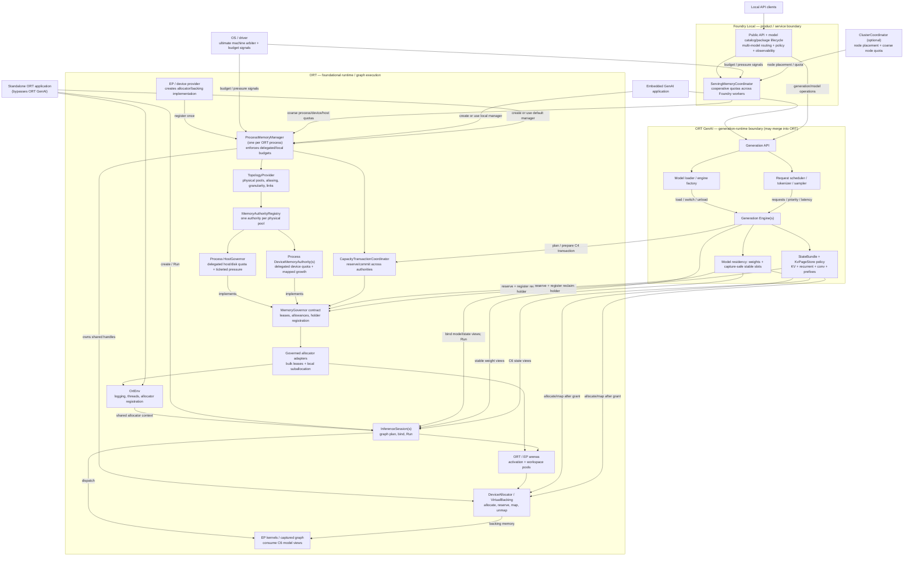

# Unified Memory Management for ONNX Runtime and ONNX Runtime GenAI

**Status:** Design proposal  
**Date:** 2026-08-13  
**Scope:** Local inference memory, from per-process enforcement through optional Foundry-managed multi-process and multi-node coordination

## Summary

Today, memory is held independently by ORT execution-provider arenas, model
weights, KV caches, and backend runtime state. Each component manages its own
pool and cannot safely lend unused capacity to, or reclaim capacity from,
another. This strands memory, encourages worst-case reservation, and makes the
configured limit an incomplete view of actual machine pressure.

We want one or more models to use the machine efficiently across heterogeneous
devices: offload when VRAM is insufficient, commit only what the workload uses,
share spare capacity across models and sessions, and preserve headroom for
other applications. A unified control plane coordinates these existing memory
mechanisms; it does not replace their specialized allocation and caching
strategies.

The design introduces one shared memory control plane while retaining
specialized allocation and caching data planes.

**Decision:** place a GenAI-independent `ProcessMemoryManager` in each ORT
process. Foundry Local optionally owns a `ServingMemoryCoordinator` that
delegates coarse quotas to its participating processes; the OS/driver remains
the ultimate arbiter for the whole machine. ORT GenAI owns generation/state
policy, while sessions, residency holders, state, and arenas lease locally.

## Contracts

| ID | Contract | Responsibility |
| --- | --- | --- |
| **C1** | Resource authority | Within one accounting scope, each distinct physical pool has one canonical authority identity. Devices sharing physical memory alias the same authority and mismatched identities fail before use. |
| **C2** | Lease and allowance | Before retaining physical memory, a holder acquires an RAII lease identifying authority, tier, bytes, role, and holder. Mappings or OS residency budgets use authority-scoped allowances, not a second physical charge. |
| **C3** | Allocator and backing | ORT defines `DeviceAllocator`/`VirtualBacking`; an EP, host backend, or embedder supplies implementations; `ProcessMemoryManager` holds shared handles. Holders borrow them after admission, and neither mechanism decides policy. |
| **C4** | Capacity transaction | An operation that changes committed model/request state, transfers capacity between holders/tiers, or changes a model-visible mapping follows `plan -> reserve -> expose provisional view -> execute -> commit`. Suballocation within an existing lease does not. |
| **C5** | Reclaimable holder | Pressure is a non-blocking, cancellable ticket carrying target bytes, priority, deadline, and configuration generation. The holder selects safe victims and may legitimately release zero. |
| **C6** | Model memory view | A backend exposes contiguous, blocks-plus-table, indexed, or opaque state views. The view remains valid for the execution that consumes it. |
| **C7** | Topology and capability | The platform reports capacity, tier aliasing, mapping granularity, transfer paths, and supported model views. Selection is capability-driven. |
| **C8** | Reconfiguration and observability | Authorities expose used, available, oversubscribed, and role-attributed bytes. Lowering a limit uses prepare/reclaim/commit; if the target cannot be met, the old limit remains and completed actions are reported. |
| **C9** | Persistent state bundle | Every model declares all loop-carried state and its lifetime, growth/update pattern, model view, and checkpoint/fork/migrate capabilities. The engine transacts the complete bundle, not only attention KV. |
| **C10** | Cooperative hierarchy | A Foundry-owned `ServingMemoryCoordinator` may delegate coarse per-process/device/host quotas to participating `ProcessMemoryManager`s. Non-participating programs remain outside the hierarchy; cross-node coordination grants node quotas and placement, never page-level allocations. |

These contracts must preserve the following invariants:

| ID | Invariant |
| --- | --- |
| **I1 — Single accounting authority** | Within each scope, every managed physical byte is charged once. Parent quota and child process leases are linked hierarchical attribution, not independently grantable copies of the same capacity. |
| **I2 — Charge before commit** | Physical allocation or mapping is preceded by a lease or transactional grant/allowance. Already-committed bytes are recorded even when that reveals oversubscription. |
| **I3 — Fail closed** | Managed mode never silently escapes the authority after denial, mismatch, or initialization failure. An explicit compatibility mode may delegate to the OS, but must report that hard limits no longer apply. |
| **I4 — Exclusive ownership state** | At the authority level, physical capacity and allowances are exactly one of free, transaction-reserved, or committed to a holder; an arena may suballocate inside its committed lease. |
| **I5 — Transaction consistency** | A pre-commit failure restores the prior request, complete state bundle, and capture state. If components can diverge after commit begins, the engine becomes unhealthy rather than continuing. |
| **I6 — Live-state safety** | The authority never takes memory directly. The holder may release it, but cannot select pinned or in-flight data for reclaim. |
| **I7 — Non-blocking governance** | No thread waits while holding an authority lock. Allocator callbacks treat pending pressure as `WouldBlock`/denial; wait-capable callers wake only after reservation, and cancellation/timeout releases any grant exactly once. |
| **I8 — Bytes are authoritative** | Tokens, blocks, and pages are derived from exact model geometry and queried platform granularity; admission includes rounding and transient migration peaks. |
| **I9 — Remap synchronization** | A virtual mapping is not changed while a kernel, transfer, or captured graph may access it. |
| **I10 — State-complete commit** | KV, recurrent state, convolution state, sampler/search state, and request progress commit or roll back at the same logical step. |
| **I11 — Honest enforcement scope** | Hard guarantees cover only participating processes and delegated quotas. External programs are observed through OS/driver budgets and safety margins, never represented as reclaimable holders. |

## Proposed design



The holders do go through the authorities. The engine prepares the aggregate C4
transaction, but the component that retains bytes owns the resulting lease:
weight residency owns weight leases, `StateBundle` owns state leases, and ORT/EP
arenas own their bulk leases. Policy never allocates first and accounts later.

```mermaid
sequenceDiagram
    participant H as WeightResidency / StateBundle / Arena
    participant G as MemoryGovernor
    participant A as DeviceAllocator / VirtualBacking
    participant S as InferenceSession / EP

    H->>G: reserve or prepare mapped growth
    alt granted
        G-->>H: MemoryLease / MappedGrowthGrant
        H->>A: allocate or map using the grant
        A-->>H: stable allocation / model view
        H->>S: bind or publish C6 view
        Note over H,S: Holder keeps the lease while bytes and view remain live
    else pending or denied
        G-->>H: WouldBlock / Denied
        Note over H,G: Allocator fails fast; scheduler may await a pressure ticket
    end
    opt later pressure against a live holder
        G->>H: notification outside allocator locks
        H->>A: fence work and release a safe victim
        H-->>G: shrink/drop lease and report released bytes
    end
```

| Diagram node | Responsibility | Contract / invariant coverage |
| --- | --- | --- |
| OS / driver | Arbitrates the whole machine, including non-participating programs, and exposes changing budget/pressure signals. | I11 |
| `ClusterCoordinator` | Chooses node/model placement and coarse node quotas; never handles token/page allocations. | C10; I11 |
| Foundry Local | Hosts product APIs, packages, multi-model routing, resource policy, and observability. | C8, C10; I3, I8, I11 |
| `ServingMemoryCoordinator` | Coordinates quotas only across Foundry-managed workers on one node and reclaims abandoned process quotas. | C10; I1, I7, I8, I11 |
| ORT GenAI | Implements generation semantics, scheduling, model/state residency policy, and C4 transactions. | C2, C4-C9; I3-I10 |
| `ProcessMemoryManager` | Enforces local or delegated quotas and owns the resource/allocator registries for one ORT process. | C1, C7, C8, C10; I1, I8, I11 |
| `TopologyProvider` | Reports distinct/aliased pools, capacities, mapping granularity, and transfer paths. | C7; I8 |
| `MemoryAuthorityRegistry` | Resolves each physical pool to exactly one stable authority. | C1; I1 |
| Process `HostGovernor` | Enforces the process's host/disk quota and arbitrates ticketed pressure across its sessions/devices. | C1, C2, C5, C8, C10; I1-I3, I6, I7 |
| Process `DeviceMemoryAuthority` | Enforces one delegated/local device quota and coordinates leases, mapped allowances, and growth. | C1, C2, C5, C8, C10; I1-I3, I6-I9 |
| `MemoryGovernor` | Common lease/allowance/reclaim interface; every grant names the exact underlying authority even when one governor exposes several tiers. | C2, C5, C8; I2, I3, I6, I7 |
| `CapacityTransactionCoordinator` | Reserves all participating authorities before publishing a cross-tier/device state change. | C4; I4, I5, I7, I8, I10 |
| Governed allocator adapters | Convert bulk grants into fast ORT/EP-local suballocation. | C2, C3; I2, I3, I7 |
| EP / device provider | Creates the platform allocator/backing implementation and registers it before sessions allocate. | C3, C7; I2, I3, I8, I9 |
| `OrtEnv` | Provides ORT process context and registers shared allocator adapters; owns no resource policy. | C3, C8; I3, I7 |
| `InferenceSession` | Plans and executes one graph, binds C6 views, and reports persistent/transient needs. | C4, C6, C8; I5, I8-I10 |
| Model residency | Chooses hot/warm/cold weights and capture-safe stable slots; releases only safe victims. | C2, C4-C6; I2, I5, I6, I9 |
| `StateBundle` / `KvPageStore` | Owns KV, recurrent/conv, prefix, fork, checkpoint, and migration semantics. | C2, C4-C6, C9; I2, I4-I6, I9, I10 |
| ORT/EP arenas | Pool activations/workspace under bulk leases and return reclaimable regions. | C2, C3, C5, C8; I2-I4, I6, I7 |
| `DeviceAllocator` / `VirtualBacking` | Process/device-scoped mechanism held by `ProcessMemoryManager` and borrowed by holders to allocate or reserve/map/unmap after admission. | C3; I2, I3, I9 |
| EP kernels / capture | Consume declared model views; captured work pins compatible addresses/shapes. | C6, C9; I5, I9, I10 |

| Logical boundary | Owns | Does not own |
| --- | --- | --- |
| **Foundry Local** | Product/API lifecycle, model catalog and package acquisition, process/service lifecycle, multi-model routing, user policy, observability, and cooperative worker quotas. | Physical allocation, non-Foundry processes, per-token state, generation semantics, or graph execution. |
| **ORT GenAI** | Model/pipeline interpretation, tokenization and sampling, request scheduling, continuous batching, C9 state, prefix caching, residency victim selection, and model-switch mechanics. | Physical capacity or EP/kernel implementation. |
| **ORT** | `ProcessMemoryManager`, `OrtEnv` allocator integration, graph planning/execution, `InferenceSession`, EP allocators, kernels, and capture. | Product policy, model catalog, or service routing. |

**Authority ownership.** Each ORT process owns one GenAI-independent
`ProcessMemoryManager`. Standalone ORT derives a conservative local budget from
operator configuration and OS/driver signals. Under Foundry, a
`ServingMemoryCoordinator` owns only the cooperative Foundry domain: it delegates
coarse quotas to registered workers and reclaims those quotas on process exit or
heartbeat/epoch failure. It does not own raw allocators or memory from unrelated
programs. The OS/driver remains the final machine-wide arbiter.

`OrtEnv` is ORT's process-level environment for logging, shared thread pools, EP
setup, and environment-registered allocators. It is not the graph executor and
does not own placement or eviction policy. It receives allocator adapters backed
by `ProcessMemoryManager`; `InferenceSession` remains the graph executor, and
multiple sessions allocate through those shared adapters.

ORT GenAI is not a second graph executor. It owns generation semantics and
model/request orchestration, leases external weights and state from the manager,
binds them to sessions, and calls `Run`. Thus ORT works with or without ORT
GenAI, while both paths use the same physical accounting when GenAI is present.

This repository currently combines Foundry-like service surfaces and ORT
GenAI-like generation runtime in one implementation. The diagram shows the
target logical boundaries, not required package boundaries. If ORT GenAI merges
into ORT, the `Generation` subgraph moves into the ORT distribution; Foundry
still calls the Generation API, and the generation module still uses
`ProcessMemoryManager` and `InferenceSession` only through these contracts.

The diagram intentionally shows only dependency and request direction. Pressure
notifications, lease results, and metrics flow back over the same contracts;
they are responses/callbacks, not reverse ownership dependencies.

The ORT GenAI model runtime takes model-level leases before constructing
engines/sessions and returns them on unload or demotion. Foundry supplies
cross-model routing and product policy; its resource API configures the serving
quota and aggregates worker snapshots. ORT GenAI schedulers perform C4 admission
inside each delegated process quota.

**Control plane.** Within a process, `DeviceMemoryAuthority` owns the child
ledger for one device quota; shared physical memory resolves to the process
host/unified authority. A process `HostGovernor` covers all sessions and devices
in that process. Across Foundry workers, `ServingMemoryCoordinator` enforces
`sum(process quotas) <= serving quota`. External consumers are not charged to
this hierarchy; observed OS pressure can only shrink future admission and
trigger cooperative reclaim.

**Allocator ownership.** ORT owns the allocator ABI, while the active EP,
host backend, or embedder constructs the implementation. It registers the raw
allocator/backing with `ProcessMemoryManager`, which owns the shared handle for
that device and memory class. Sessions may own local arenas, but only as
suballocators backed by that shared handle; model residency and state holders
borrow the same handle after receiving a lease. Multiple mechanisms may serve
one pool (for example device, pinned, and VMM allocators), but C1 gives their
physical bytes one accounting authority.

**Fast path.** Governance is not a callback on every tensor or kernel.
Device/ORT arenas bulk-lease regions and suballocate locally; direct host
allocation may use a cheap header-contained lease or a precharged envelope.
Persistent weights/state lease on growth. Admission and reclaim run at model,
request-step, arena-growth, and limit-change boundaries, never per kernel.

**Data plane.** `DeviceAllocator` answers *where bytes come from*;
`MemoryGovernor` answers *whether they may be retained*. `VirtualBacking`
implements reserve/map/unmap, while `VirtualBuffer` keeps a stable base address
and leases committed granules. A paged KV backend reserves blocks and publishes
a block table. Both use the same capacity transaction.

**ORT integration.** ORT-owned allocations are made visible by registering a
`GovernedAllocator` and enabling `session.use_env_allocators`; refusal returns
allocation failure rather than escaping the budget. Runtime-owned KV uses
external `OrtValue`s and I/O binding: a flat tensor binds stable VMM addresses;
a paged model binds its cache pool and block table. ORT's arena and planner
continue to optimize transient reuse.

### Required ORT and ORT GenAI changes

| Surface | Proposed change |
| --- | --- |
| Process foundation | Add a GenAI-independent `ProcessMemoryManager`, with a default for standalone ORT and injection for hosts such as Foundry Local. |
| Foundry coordination | Add an optional `ServingMemoryCoordinator` with worker registration, delegated per-pool quotas, heartbeat/epoch cleanup, and aggregate snapshots. |
| OS/driver integration | Treat DXGI/NVML/host-memory budgets as changing external ceilings and preserve operator-selected headroom for non-participating applications. |
| Cluster integration | Delegate only coarse node/model quotas and placement; keep allocation, paging, and step transactions node/process-local. |
| `OrtEnv` | Register shared allocator adapters backed by that manager; keep logging/thread/EP responsibilities separate from resource policy. |
| EP / device registration | Construct the raw allocator/backing and register its shared handle and capabilities with the manager before any session allocates. |
| Session creation | Inject manager-backed allocator/authority handles before arenas, initializers, or state allocate; late adoption only records accomplished allocations. |
| ORT arenas | Bulk-lease regions; report in-use, cached/reclaimable, pinned, and opaque bytes; add soft limits and `release_to(target)`. |
| Planning | Report persistent and bounded activation/workspace peaks for model and request admission. |
| Persistent state | Replace KV-specific ownership with C9 `StateBundle`, using external `OrtValue`/I/O Binding or the same EP-private contract. |
| Weights | EP-visible stable slots with `ensure_resident` and reclaim; I/O Binding alone cannot page internal initializers. |
| Graph capture | Bind capture to addresses, shapes, view kind, and backing compatibility. Track mapping generations for fencing; compatible same-VA remap need not invalidate capture. |
| Windows | Feed DXGI local/non-local budgets and change events into C7/C8; `gpu_mem_limit` remains only an arena limit. |

The minimal integration can live above ORT using registered allocators and
external state tensors. The durable design requires EPs to report auxiliary
memory and participate in reclaim; otherwise the authority must reserve
conservative unattributed headroom.

### State and attention mechanisms

**VMM removes paging from a flat kernel's addressing contract; it does not
eliminate paging-aware kernels.** Dense MHA/GQA can keep flat pointers.
PagedAttention remains useful for block-table exports, finer allocation
quantums, or platforms without remapping. Windowed, sparse, compressed/latent,
quantized, and recurrent kernels still implement their semantic indexing.

| State form | Growth/update | Required model view and state operations |
| --- | --- | --- |
| Dense KV | Append | Flat VA or blocks/table; truncate, fork, share, migrate. |
| Windowed/sparse/compressed/latent KV | Windowed/indexed append | Kernel metadata; reclaim only unreachable ranges. |
| Linear attention / retention | Fixed recurrent summary | Checkpoint, clone, restore, migrate; no token paging. |
| SSM + causal convolution | Fixed SSM state + convolution ring | Atomic update and prefix snapshot of both. |
| Hybrid layers | Growing KV + fixed recurrent state | One C9 bundle and C4 transaction. |
| Speculative/MTP branches | Tentative forked state | COW fork, branch commit/abort, recompute. |

The descriptor declares lifetime, extent, view, mutation, and supported
checkpoint/fork/restore/migrate/recompute operations; it is not a list of model
names.

For capture and weight offload, stable VA preserves pointers, but shapes,
strides, launch geometry, block-table buffers, and all C9 views must also remain
compatible. Remap/page-in occurs outside replay. Paged attention is capturable
with a stable pool/table buffer and bucketed table shapes.

### Capacity transaction

`ProcessMemoryManager`'s transaction coordinator first reserves every source,
destination, and transient peak across the participating authorities. It then
hands scoped grants to the holders. Every C9 state bundle—including paged or
VMM-backed KV—uses the same step protocol:

```text
plan -> reserve bytes and pages -> expose provisional model view -> execute
     -> commit all cooperating state
     \-> on recoverable failure: rollback state and release reservation
```

For VMM growth, `prepare_mapped_growth` may transfer allowance from a registered
reclaimable weight holder before any new granule is mapped. For paged attention,
the reservation owns blocks before they appear in a committed request table.
Fixed recurrent/conv state is checkpointed or written to provisional storage.
If collaborators disagree after commit begins, the engine fails terminally
rather than continue with divergent state.

### Extensibility and backend selection

Implementations extend the contracts, not the engine: custom
`MemoryGovernor`/`LeaseAccounting` policy, host-supplied
`MemoryAuthorityProvider`, platform `DeviceAllocator`/`VirtualBacking`,
device-specific `KvPageStoreFactory`, and holder-specific reclaim policy all
remain replaceable.

Model-view and allocator selection are independent and capability-driven:

1. Use a blocks-plus-table view when the graph and EP implement paged attention.
   Its block pool may still allocate from VMM.
2. Use a flat contiguous-VA view when the graph expects flat state tensors and
   the EP can reserve/remap virtual memory.
3. Use static/shared buffers when neither dynamic view is available.

Granularity and topology are capabilities too. A 2 MiB CUDA granule can be
efficient for large, low-concurrency contexts but wasteful for many short
sequences; small block-table pages may win there. Unified-memory systems must
report that host and device tiers alias the same physical pool so two governors
do not double-admit it.

### Topology scenarios

| Scenario | Authority layout | Expected behavior |
| --- | --- | --- |
| **CPU only** | One host authority covers weights, KV, ORT arenas, and workspace; mmap/disk is colder backing. | Reserve KV and peak execution bytes. Reclaim allocator caches and derived/prepacked weights before live KV; deny work rather than force system paging. |
| **CPU + discrete NVIDIA GPU + Intel NPU** | The GPU has a device authority. The NPU uses another only if it has private memory; otherwise it aliases the host authority. All share host staging/offload. | C7 reports paths and views. Place partitions, then atomically lease every resource/allowance; reserve host capacity before demotion. State stays fixed on an EP that cannot migrate it. |
| **CPU + GPU with unified memory** | Host and GPU views alias one physical authority; their limits are not additive. Track wired/resident and pageable/reclaimable bytes separately. | CPU/GPU movement is a residency change, not a second allocation. Admission protects machine headroom; reclaim respects wired GPU work and bandwidth. Apple Silicon/Metal is the primary example. |
| **One GPU, multiple Foundry ORT processes** | `ServingMemoryCoordinator` holds one cooperative serving quota and delegates child quotas; each process owns its CUDA context, allocator, and local authority. | The sum of delegated quotas stays bounded. Worker exit/heartbeat failure returns its quota. External processes remain OS-managed and reduce effective headroom. |
| **Multi-GPU node** | One physical-pool quota per GPU plus one shared host quota. Each worker receives only the device/host subleases needed by its placement. | Model/tensor/pipeline-parallel admission reserves all participating device, host, and communication peaks before load or step commit. |
| **Multi-node Foundry deployment** | Each node has a `ServingMemoryCoordinator`; a `ClusterCoordinator` assigns node/model placement and coarse node quotas. | Page allocation, reclaim, and token-step transactions stay local. Node failure invalidates its epoch and triggers placement/recovery, not distributed allocator rollback. |

These scenarios are selected from C7. The upper layers use the same leases and
transactions; only the authority graph, allocation mechanism, and legal
transitions change.

### Prefix caching, continuous batching, and model switching

| Behavior | What the design enables | Additional requirement |
| --- | --- | --- |
| **Prefix caching** | A committed prefix is an immutable C9 bundle. Blocks/VMM granules share physical backing; recurrent/conv state snapshots at the same token boundary. | Key by model, tokenizer, adapter, positions, dtype/layout, and state schema. Hybrid models reuse only complete bundles; divergence uses COW. |
| **Continuous batching** | Requests lease state independently; each step reserves all selected state deltas and transient peaks before execution. | Variable packing, byte admission/fairness, I10 rollback, and capture buckets covering every view shape. |
| **Local model switching** | Demote/discard reconstructible weights, graph pools, and prefixes, then lend capacity to another model without destroying the process. | Model leases, hysteresis/load-cost policy, stable weight slots, and protection for active request state. |

Evidence is uneven: VMM prefix sharing and native recurrent-prefix restoration
have parity/accounting tests, and paged KV has transactional batching. ORT
hybrid-prefix restore correctly falls back to recompute because full C9 restore
is not wired. Stable weight slots and offload exist, but cross-model residency
policy and model-switch latency gates remain design work.

This turns model switching from session destruction/recreation into residency
management. It also makes the failure mode explicit: if two active working sets
cannot coexist and neither holder can reclaim, the new admission waits or fails
instead of causing an unpredictable device OOM.

### WDDM implications

WDDM is **virtualized discrete memory, not Apple-style unified physical
memory**. GPU virtual addresses remain stable while VidMm may back them with
local VRAM or system memory. DXGI local/non-local budgets change with system
pressure; `SharedSystemMemory` is a maximum, not free capacity.

The serving coordinator and each process manager treat those budgets as
external ceilings: preserve headroom, react to budget events, and track
non-local residency, host RAM, and pinned memory separately.
A host-backed GPU allocation takes one host physical lease plus a non-local
residency allowance, not two physical leases. WDDM is address-stable but
placement and latency are opaque. The preferred policy is a governed resident
hot set plus host-mapped cold, single-touch weights—not copy-map-evict churn.
Managed no-spill CUDA VMM pools remain hard bounds and cannot assume WDDM spill.
CUDA managed memory is distinct and reports limited support on Windows, so all
behavior is capability-queried.

Hard cross-product enforcement and distributed page allocation remain out of
scope. The first increment is one process; Foundry multi-process/node
coordination layers coarse quotas above the same local contracts.

## Related work

| Reference | Relevant precedent | Design implication |
| --- | --- | --- |
| [**vLLM**](https://github.com/vllm-project/vllm/blob/main/vllm/v1/core/block_pool.py) | Per-engine fixed-block KV pool with sharing and eviction; its utilization limit is per instance. | Keep block ownership below the shared authority. |
| [**TensorRT-LLM**](https://github.com/NVIDIA/TensorRT-LLM/blob/main/docs/source/features/kvcache.md) | Paged KV, reuse, and host offload; geometry-specific pools are statically split. | Let specialized pools borrow and return C2 leases. |
| [**llama.cpp**](https://github.com/ggml-org/llama.cpp/blob/master/common/fit.cpp) | `--fit` estimates model, KV, and compute memory across heterogeneous backends before load. | Use whole-model fit as admission input, then maintain runtime leases. |
| [**Hugging Face Accelerate**](https://huggingface.co/docs/accelerate/concept_guides/big_model_inference) | `device_map` places weights on GPU, CPU, or disk under static limits. | Validate placement proposals against runtime KV and execution leases. |
| [**MLX**](https://ml-explore.github.io/mlx/build/html/usage/unified_memory.html) | CPU and GPU arrays share Apple unified memory under a process allocator. | Use one physical authority with residency classes. |
| [**vAttention**](https://arxiv.org/abs/2405.04437) | Reserves contiguous KV VA and maps physical pages on demand, preserving flat kernel pointers. | Implements C3/C6 alongside, not above, governance. |
| **PyTorch / ORT allocators** | Process/session pools and external allocator hooks; ORT's `gpu_mem_limit` covers only its EP arena. | Feed allocator statistics into C8; account or reserve for the remainder. |

No surveyed stack provides the complete target: a machine-aware authority that
coordinates weights, KV, execution memory, heterogeneous devices, multiple
models, and host headroom. The proposal composes their proven data-plane ideas
under explicit cross-component contracts.

## Alternatives considered

| Alternative | Why not the primary design |
| --- | --- |
| Independent fixed budgets for ORT, weights, and KV | Simple and predictable, but strands capacity and requires the user to guess the right split before load. One model can fail while another pool retains unused bytes. |
| One global allocator | Conflates policy with mechanism. Activations, KV, weights, shared prefixes, and virtual mappings have different lifetimes and ownership rules; some ORT and EP allocations also occur behind specialized arenas. |
| Universal machine memory broker | Cannot enroll or reclaim arbitrary applications and would overstate its authority. The OS/driver remains global arbiter; Foundry coordinates only registered workers. |
| GenAI-owned authority | Coordinates generation state, but excludes standalone ORT and couples physical accounting to generation semantics. Foundry/GenAI should configure and consume the authority, not define it. |
| `OrtEnv`-owned policy | Gives sessions a shared lifetime but mixes machine policy with logging/thread/EP environment responsibilities. `OrtEnv` should register adapters backed by the independent manager. |
| Paged attention only | Efficient for high concurrency, but requires exported block-table inputs and a compatible attention operator. It cannot transparently serve existing ORT graphs that declare flat past/present tensors. |
| Contiguous-VA VMM only | Preserves existing tensor contracts, but coarse device granularity can waste memory for many short sequences, and not every platform exposes equivalent remapping. |
| Rely on OS or driver oversubscription | Can make an oversized model run, especially under WDDM, but placement, eviction, and latency are opaque and the runtime cannot reserve headroom for other applications. |

Paged attention and VMM are therefore complementary data planes selected by C7,
not competing control planes.

## Risks

Confidence below is confidence in the **mitigation**, not confidence that the
risk exists. Evidence refers to the current repository implementation, tests,
and hardware measurements summarized in `MEMORY_ARCHITECTURE.md`.

| Risk | Confidence | Evidence and remaining work |
| --- | --- | --- |
| **Incomplete accounting** | **Medium** | Governed ORT allocation and CUDA weight/KV/workspace leases share one ledger; activation/overhead and ORT VMM KV remain incomplete. Reconcile telemetry and reserve unattributed headroom. |
| **Governance overhead** | **Medium** | Header-based host governance measured about 15 ns in the repository and VMM charges at granule growth, not per tensor. Multi-session contention and ORT device-arena adapter overhead still need measurement; keep suballocation local and policy off kernel paths. |
| **VMM granularity waste** | **Medium-high** | Tests measure a 2 MiB CUDA granule and layout crossovers; token-major cut one floor by 768x. Automatic cross-device selection remains. |
| **Unsafe remap/commit** | **Medium end to end** | Same-VA graph replay, stable weight slots, prefix multi-map/refcounts, and mapped-growth transactions pass GPU tests. In-flight unmap and multi-model/multi-stream stress remain unsupported. |
| **Offload thrash/corruption** | **Low-medium** | Cyclic LRU measured 0% hits versus 74.18% for a stable set; WDDM cold reads beat managed churn. Dynamic stable-slot re-admission has unresolved corruption. Ship static hybrid first; gate dynamic policy on token identity, bytes/token, and tail latency. |
| **Pressure deadlock/starvation** | **Medium-high for host protocol; medium end to end** | Ticketed `HostGovernor` has TLA/refinement, priority aging, cancellation, and conformance tests. Cross-tier device/host reclaim with real holders still needs stress and fault campaigns. |
| **Coordinator quota leak** | **Medium-low** | A crashed or partitioned Foundry worker can leave delegated capacity unavailable. Use process handles plus heartbeat/epoch fencing, idempotent quota return, and conservative re-admission after coordinator restart. |
| **Incomplete state bundle** | **Medium** | Native recurrent-prefix parity and KV transaction tests exist, while ORT hybrid reuse deliberately recomputes because full C9 restore is absent. Require state-schema identity and complete-bundle commit before enabling a cache hit. |
| **Host pressure** | **Medium-low** | Ticketed `HostGovernor` has TLA/refinement and conformance tests; RSS, pinned, disk, and WDDM non-local pressure are not yet one physical authority. |
| **Topology errors** | **Low-medium** | CUDA/WDDM are measured; Intel NPU and true UMA graphs need capability/admission conformance. |
| **External consumers** | **Low** | Neither process nor Foundry coordinators can reclaim unrelated programs. OS/driver telemetry and safety reserve provide best-effort coexistence, never a hard machine-wide guarantee. |

## References

- [`MEMORY_ARCHITECTURE.md`](./MEMORY_ARCHITECTURE.md)
- [`PRESSURE_PROTOCOL_IMPL.md`](./PRESSURE_PROTOCOL_IMPL.md)
- [`native-ort-kv-capacity.md`](./native-ort-kv-capacity.md)
- [ORT memory consumption](https://onnxruntime.ai/docs/performance/tune-performance/memory.html)
- [ORT C API shared allocators and arena shrinkage](https://onnxruntime.ai/docs/get-started/with-c.html#features)
- [ORT CUDA EP options](https://onnxruntime.ai/docs/execution-providers/CUDA-ExecutionProvider.html)
- [ORT device tensors](https://onnxruntime.ai/docs/performance/device-tensor.html)
- [GenAI past/present shared buffer](https://onnxruntime.ai/docs/genai/howto/past-present-share-buffer.html)
- [GenAI paged-attention engine](https://github.com/microsoft/onnxruntime-genai/blob/main/docs/paged_attention_engine.md)
- [WDDM 2.0 GPU virtual memory](https://learn.microsoft.com/en-us/windows-hardware/drivers/display/gpu-virtual-memory-in-wddm-2-0)
- [DXGI video-memory budgets](https://learn.microsoft.com/en-us/windows/win32/api/dxgi1_4/ns-dxgi1_4-dxgi_query_video_memory_info)
- [CUDA Unified Memory paradigms](https://docs.nvidia.com/cuda/cuda-programming-guide/02-basics/understanding-memory.html#unified-memory)
- [Transformers Mamba state](https://huggingface.co/docs/transformers/model_doc/mamba)
