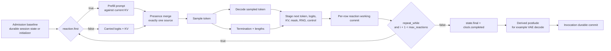

## Design checkpoint: synchronous reactive dataflow v8

This is a work-in-progress checkpoint from applying the proposed cyclic dataflow model to the published Qwen 2.5 package. It is not a final schema proposal yet.

### Core model

- The IR is **single-clock synchronous reactive dataflow**, not structured `sequence` / `branch` / `loop`.
- Components and generic scalar/bundled state are nodes.
- A component instance declares only inputs. Its outputs are the authoritative ONNX `ValueInfo` outputs, or the explicit signature of a runtime binding, and are referenced as `node_id.output_port`.
- ONNX dtype/rank/shape declarations are not repeated in YAML. Graph-visible ONNX I/O must have sufficient `ValueInfo` for static checking.
- Non-ONNX batching facts remain explicit: request-aligned axes, row selection/expansion, and other row-mapping behavior.
- A cycle is legal only when it crosses state. Removing state-delay edges must leave an instantaneous DAG.
- State carries no model-semantic `kind`. It declares only behavior that changes execution: transition, ownership, lifetime, aliasing, reuse, rollback, snapshot, and fork.
- State may be bundled. Qwen's 48 K/V tensors are one state node with 48 explicit members.
- An optional versioned interface may label canonical members to prove that a paged/native implementation substitution is legal. It cannot add or override graph edges.

### Execution shape



The important distinction is:

1. A **reaction working commit** atomically advances one row's working state for the next reaction.
2. An **invocation durable commit** persists final session state, effects, and output heads only after the clock and postlude succeed.

Failure or cancellation can therefore restore the admission baseline even after several internal reactions. Early externally visible output requires the provisional-revision protocol and an `abort_to_baseline` outcome.

### Presence replaces authored branch structure

- A scalar `node.when` controls whether a node fires.
- A false gate produces an absent value, not zero, stale data, or implicit state retention.
- `bool[batch]` remains ordinary tensor data; it never implicitly changes graph firing or row compaction.
- Maybe-present values meet at an explicit typed `merge` requiring exactly one present input.
- Dynamic firing is valid. Every runtime must lower it to precompiled blocks/a finite state machine rather than interpret YAML in the hot path.

For Qwen, the compiler can produce one prefill block and one branch-free steady-state block:

```yaml
graph:
  clock:
    kind: synchronous
    max_reactions: request.max_iterations
    index: reaction.index
    first: reaction.first
    repeat_while: termination.continue
    sample_repeat: after_working_commit

  nodes:
    prefill:
      kind: component
      component: model
      when: {value: reaction.first, equals: true}
      inputs:
        input_ids: request.input_ids
        past_key_values.0.key: decoder_cache.current.key.0
        # ...

    carried_logits:
      kind: gate
      when: {value: reaction.first, equals: false}
      value: logits.current

    effective_logits:
      kind: merge
      inputs: [prefill_logits.last_logits, carried_logits.value]
      require: exactly_one_present

    sample:
      kind: component
      component: token_sampler
      inputs:
        logits: effective_logits.value
        counter: rng_counter.current
        active: active.current
        done: done.current

    decode:
      kind: component
      component: model
      inputs:
        input_ids: token_update.next
        past_key_values.0.key: effective_cache.value.key.0
        # ...

    logits:
      kind: state
      initial: absent
      next: decode_logits.last_logits
      transition: {kind: replace}
```

Initially absent state is allowed when presence analysis proves that reaction 0 cannot read it before the first successful write.

### State transitions

Candidate production and commit selection are separate:

```yaml
# Ordinary replacement
transition: {kind: replace}

# Linear speculative append
transition:
  kind: append
  axis: 2
  candidate_increment: verifier.evaluated
  commit: {kind: prefix, length: acceptance.length}
  bound: package.max_context

# Candidate tree / beam path selection
transition:
  kind: append
  axis: 2
  candidate_increment: tree.evaluated
  commit:
    kind: gather
    indices: acceptance.path_indices
    length: acceptance.length
  bound: package.max_context
```

Candidate trees remain ordinary tensor/component dataflow. State still has one candidate `next`; unselected candidates never become committed state, so v1 does not need first-class state-version fork nodes.

### Lifecycle without authored phases

Availability is inferred:

- `stable`: request/package inputs and pure closures that depend only on them;
- `reaction`: `reaction.index`, `state.current`, and dependent values;
- `final`: `state.final`, `clock.completed`, and dependent values.

This lets a diffusion VAE run once after the loop without an authored finalize region:

```yaml
vae:
  kind: component
  component: vae_decoder
  inputs:
    latent: latent.final
```

If `max_reactions` is zero, no reaction runs; initialized state becomes final immediately. For a Qwen package that must durably ingest a prompt, zero-output-budget behavior still needs an explicit package/admission rule.

### Output and effects

Each logical output stream has one binding to an ordered typed publication batch rather than multiple independent `emit` statements:

```yaml
outputs:
  tokens:
    publication:
      operations:
        - kind: append
          value: acceptance.tokens
          valid_length: acceptance.length
        - kind: append
          value: grammar.token
          valid_length: grammar.forced_length
```

Effects use typed linear tokens. Their commit behavior is independent from retry and speculation safety:

```yaml
effects:
  external_store:
    commit_behavior: transactional  # pure | transactional | after_invocation_commit
    retry: idempotent
    speculation_safety: {...}
```

`transactional` effects join working savepoints and final commit/abort. `after_invocation_commit` effects cannot influence state or the repeat predicate, and their failure cannot roll back durable state.

### Batching and performance

- Transactions are atomic per request-aligned row, not per physical batch.
- Mutable non-row-aligned state explicitly couples dependent rows.
- Stable nodes are hoisted and stable gates specialized at admission.
- Static reactions lower to a fixed prebound schedule and remain eligible for fusion/CUDA graph capture.
- Dynamic reactions lower to precompiled blocks/FSM transitions.
- The hot path has no YAML traversal, string/hash lookup, dependency discovery, or per-reaction heap allocation.
- State snapshots are handles/descriptors, not copied tensors.

Performance parity remains a measurement requirement: zero additional tensor copies, no device-wide synchronization across unrelated work, capture preserved where supported, and identical generated token IDs.

### Known gaps to resolve next

1. The concrete Qwen sketch still abbreviates several required policy nodes: termination configuration, generated/emitted length, cache length, and accepted length updates.
2. Reaction 0's cache candidate contains **prompt positions plus the sampled token**, so its `candidate_increment` and commit length cannot be the steady-state value `1`; the transition needs a first-reaction count derived from valid prompt length.
3. Session continuation must restore/advance cache logical lengths and mask state consistently with KV, not restore KV alone.
4. Zero-output-budget prompt persistence needs a deliberate package/admission rule.

The current direction is therefore coherent at the IR level, but the Qwen instance is not yet a complete replacement document.
