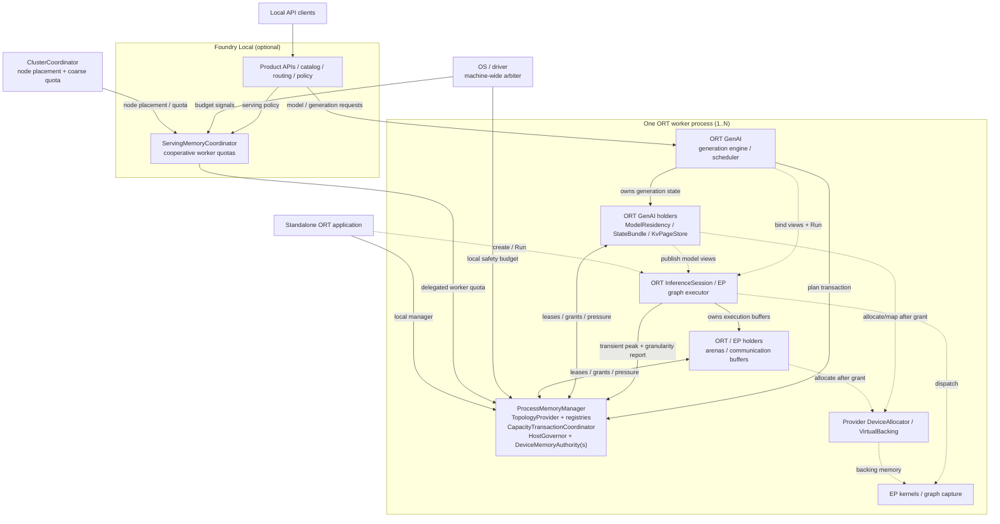

# Unified Memory Management for ONNX Runtime and ONNX Runtime GenAI

**Status:** Design proposal  
**Date:** 2026-08-13  
**Scope:** Local inference memory for a machine running several models at once —
one ORT process through optional Foundry-managed multi-process and multi-node
coordination
**Supporting detail:** [design appendix](MEMORY_MANAGEMENT_MODEL_DESIGN_APPENDIX.md)

## Motivation

### The workload

Picture a developer laptop at three in the afternoon. A coding assistant has
been loaded since morning and answers in bursts between long idle stretches,
its context growing all day. The developer talks to it, so a Whisper-class
model wakes up for a few seconds at a time and needs to answer immediately.
Once an hour they generate an image, which briefly wants more memory than
everything else combined. Meanwhile an editor extension, a shell tool and a
background indexer each hold their own ORT session, and a compiler and a
browser are competing for the same GPU and the same RAM.

Each of these puts a different kind of pressure on memory.

**The coding agent** holds capacity it is not using. Memory reserved for a
context length it has not reached yet is charged from the first token, and
memory it holds while idle stays out of reach, since nothing can lend it and
nothing can ask for it back.

**Speech-to-text** is small, urgent and intermittent — the shape that loses
under first-come-first-served allocation. It needs a modest amount of memory
*now*, from a neighbour that is holding more than it needs. "The arena is
already at its high-water mark" fails this case while the bytes sit physically
available.

**Image generation** has a memory profile shaped nothing like decode: a large
transient activation peak, short-lived, rare. Sizing a pool for that peak and
keeping it wastes memory the other 99% of the time, and refusing to run because
a resident LLM holds the VRAM wastes the machine. This is where transient-peak
accounting earns its keep, and the peak is a property of the graph, which only
the session's plan knows.

**Several applications** mean several processes, each blind to the others. Every
one sizes for its own worst case, and the total can exceed the device while each
process behaves correctly on its own terms.

One property runs through all of them: **the bytes are usually there, sitting in
the wrong holder's pool at the wrong moment.**

| Use case | What breaks today | Contracts it drives |
|---|---|---|
| Long-lived coding agent, growing context | Reservation sized at load from the declared max context is charged from the first token | I8c elastic reservation, C5 reclaimable holder |
| Idle-but-resident large model | No holder can lend, no authority can ask | C2 lease, C5 pressure, C8 observability |
| Concurrent latency-critical STT | Small urgent request loses to a large incumbent that is over-provisioned right now | I12 completion-feasible admission, I13 starvation-free arbitration |
| Occasional image generation | Transient activation peak is unknown to admission; pool sized for a peak that is rare | I8 exact bytes incl. transient peaks, session reporting edge |
| Several apps, several processes | Each sizes for its own worst case; the sum exceeds the device | C10 cooperative hierarchy, delegated quota |
| Model does not fit VRAM at all | All-or-nothing load | Weight offload, tiered state, demand commitment |
| User still wants to use the machine | Runtime cannot describe or bound its own pressure | I11 honest enforcement scope, OS safety budget |

### Where per-pool bounds run out

ORT already offers plenty of control over size: `gpu_mem_limit`, arena extend
strategy, `OrtArenaCfg`, allocators shared through `OrtEnv`. Every one of these
sets a **bound** on a pool. What none of them provides is a way for one holder
to **lend** capacity to another, or for the runtime to **reclaim** capacity from
a holder that is sitting on more than it needs.

The simplest possible configuration already shows it — one process, one
generative model:

- the device BFC arena grows to its high-water mark and, absent an explicit
  end-of-`Run` shrinkage request, keeps that memory for the rest of the run;
  even with shrinkage the caller schedules it at a `Run` boundary, so it arrives
  too late for pressure that appears mid-generation;
- weight residency, KV/recurrent state, prefix caches, and collective staging
  each size themselves independently, and none can see what the others left
  unused;
- a custom device allocator registered through `OrtEnv` bypasses ORT's BFC
  wrapper, so an EP-side integration must bring its own suballocator — the
  governed path and the arena path are two implementations today rather than one
  policy;
- `RegisteredAllocator` conservatively leaks, because ORT does not expose the
  last session user;
- limits describe individual pools, leaving no component able to answer "what is
  this process costing the machine right now?" — the question an operator, a
  serving host, and the OS all ask.

Stranded memory, avoidable offload or allocation failure, poor multi-model
utilization, and reported limits that understate the runtime's real pressure all
follow from that.

### What it costs today, measured

Three measurements from a working implementation. Each is a class of bug the
current structure invites, so each recurs until the structure changes:

- **A pool sized once, at load, from a declared maximum.** A weight budget
  computed as `device_budget - kv_bytes_per_token x max_context` stranded
  1.611 GB from the first token while weights streamed from host memory every
  step. Sizing that split against actual occupancy — while keeping a guaranteed
  path to full context — cut streamed bytes **1.68x** (#857/#866).
- **A number that no component owned.** Total weight bytes came from the
  external-data file rather than the extents the graph references. For one 14B
  model half that blob was orphaned, so the runtime believed the model was
  **2.00x** larger than it is, and every derived budget inherited the error
  (#853/#856).
- **Managing bytes that the platform handles better.** For a model over budget,
  copying single-touch weights into VRAM measured **30x slower** than letting
  the OS demand-page them: a weight read once per step offers no reuse to
  amortize the copy against. Deferring to the platform recovered roughly **100x**
  end-to-end (#864/#874).

A single authority prevents the first two by construction. The third is why this
design also has to say *when to stay out of the way* — see
[Should the runtime manage these bytes at all?](#should-the-runtime-manage-these-bytes-at-all).

### What the runtime therefore needs

- use weight offload, tiered state, and demand commitment when a model exceeds
  one device's memory;
- avoid maximum-context and per-model worst-case reservations when actual demand
  is smaller;
- coordinate weights, KV/recurrent state, activations, workspaces, prefix
  caches, and runtime overhead under one resource envelope;
- support prompt reuse, continuous batching, and fast local model switching
  without each subsystem hoarding an isolated pool; and
- adapt placement and accounting to discrete, unified, multi-device,
  multi-process, and multi-node topologies.

This proposal defines the contracts that let those specialized components share
one coordinated control plane **without replacing their allocators, kernels, or
state-specific policies**. Existing EPs, kernels, graphs, and arena
implementations keep working; what changes is that they acquire capacity through
a grant and can be asked to give some back.

## Contracts

**Definitions**

- An **authority** is the canonical accounting identity for one physical pool in
  one accounting scope.
- A **governor** is the lease/pressure interface and may front multiple
  authorities/tiers; every grant names the exact authority.
- An **accounting scope** is one ORT process and its local/delegated quota.
- Physical backing receives a process-unique, never-reused
  `PhysicalAllocationId`; views are identified by
  `(PhysicalAllocationId, MappingGeneration)`.

| ID | Contract |
|---|---|
| **C1 Resource authority** | Each physical pool has one canonical authority per scope. UMA views alias one authority; mismatched identities fail before use. |
| **C2 Lease and allowance** | Reservation precedes allocation. Commit creates a lease over `(authority, allocation ID, tier, bytes, role, holder)`. Mapped/residency allowances are non-owning and separately accounted. |
| **C3 Allocator and provider lifetime** | ORT defines allocator/backing ABIs; EP/host/embedder supplies implementations. `ProcessMemoryManager` pins provider/context while handles, leases, or views remain. Device loss invalidates affected views and initiates worker termination; delegated quota remains charged until process exit is observed. |
| **C4 Capacity transaction** | State-visible or cross-holder/tier/device change uses `plan -> reserve -> provisional view -> execute -> commit`. Delegated-quota negotiation and waiting happen before open. Open transactions acquire authorities in stable order with try-only reservation and release all on failure; a retry retains its original arbitration identity without holding capacity. |
| **C5 Reclaimable holder** | Pressure is a cancellable ticket with bytes, priority, deadline, and generation. The holder chooses safe victims and may release zero. |
| **C6 Model memory view** | A backend exposes contiguous, blocks-plus-table, indexed, or opaque views valid for the consuming execution. |
| **C7 Topology and capability** | The platform reports physical/aliased pools, capacity, granularity, links, allocator capabilities, and supported model views. It must also report the two quantities a tiering decision needs but cannot infer: **resident-vs-host read bandwidth** for the access pattern in question, and the **aggregate host-mapped read capacity** — the total distinct host-mapped bytes a device may read per execution before results stop being trustworthy. That figure is now measured on two platforms and they differ by more than an order of magnitude: **~0.44–0.65 GB/step** on one consumer WDDM GPU, above which reads silently returned stale data (#912), against **no ceiling observed up to 6.795 GB/step** on an H200 under Linux (#925). The gap is worth ~8× end-to-end, so treating it as a constant rather than a reported capability leaves that on the table on one platform and corrupts output on the other. A platform that cannot report it must be treated as having a capacity of zero, and the figure must be obtained per platform rather than carried across. |
| **C8 Reconfiguration and observability** | Authorities report used, available, oversubscribed, role, reclaimable, and unattributed bytes. Every one of these is a statement about **charge**, not physical residency (I8b); a report that conflates them is worse than no report, because it will be believed. Rates reported for policy decisions must be byte-weighted — a count-based hit rate over a population whose members differ by orders of magnitude in size can rise while the byte gap widens, which is exactly what happened here (57.09% -> 81.31% while the gap grew 1.78x -> 2.30x, #869). Lowering uses prepare/reclaim/commit; failure preserves the old limit and reports completed actions. |
| **C9 Persistent state bundle** | Managed mode requires declarations for all loop-carried state and its lifetime, growth/update pattern, view, and checkpoint/fork/migrate/recompute capabilities. Missing declarations are rejected or enter reported conservative compatibility: inferred/enveloped bytes are unattributed and prefix reuse/migration is disabled. |
| **C10 Cooperative hierarchy** | Foundry delegates quotas only to authenticated workers it spawned/authorized. Workers never hold local reservations while awaiting quota and return uncommitted delegated capacity on defer. The coordinator retains submit identity, priority, and bounded aging as a non-owning retry intent. Heartbeat failure fences/terminates the worker; quota stays charged until exit. |

## Invariants

| ID | Invariant |
|---|---|
| **I1 Single charge per scope** | Physical bytes are charged once in each scope. Parent quota and child lease are linked attribution, not independently grantable copies. |
| **I2 Charge before commit** | Allocation/mapping follows a grant. Accomplished allocations are recorded even when that reveals oversubscription. |
| **I3 Honest compatibility** | Managed mode never silently escapes authority. Capability-inferred compatibility (including the WDDM default) must report that hard managed limits no longer apply. The WDDM case is concrete and shipping: when a model does not fit the resolved device budget on Windows, the runtime **stops managing weight residency and lets the platform demand-page**, because managing it was measured 30x slower (#864/#874). That is a correct choice and a reportable one — the runtime must not keep advertising a bound it has just handed to the OS. |
| **I4a Physical ownership** | A reservation/allocation identity is provisional, committed to one holder, or terminally released; allocation IDs are never reused. |
| **I4b Allowance ownership** | Allowances have independent free/reserved/committed state, never exceed charged capacity, and transfer without moving the physical charge. |
| **I5 Transaction/failure scope** | Pre-commit failure restores all cooperating state. Post-commit disagreement poisons the smallest rebuildable unit; shared-ledger corruption poisons the worker. |
| **I6 Live-state safety** | The authority never takes bytes directly. Holders cannot reclaim pinned or in-flight data. |
| **I7 Non-blocking governance** | No lock is held while waiting. Allocator callbacks fail fast; cancellation/timeout returns any grant exactly once. |
| **I8 Bytes are authoritative** | Admission derives exact bytes from model geometry and queried granularity, including rounding and transient peaks. Bytes are the **referenced** extents of the model, not the size of the file or external-data blob that contains them: a blob may carry orphaned or superseded regions that no initializer references. Measuring the container rather than the references overstated one model's weights by exactly 2.00x and made every derived budget wrong (#853/#856). |
| **I8b Charge is not residency** | An authority accounts **charged** bytes, not physically resident bytes. On virtualized-memory platforms the two diverge without notification: WDDM may demote granules the ledger still counts as committed, and the ledger cannot observe it (#863). Observability (C8) must therefore label its numbers as charge, and any statement about physical residency must name its measurement source (for example `nvidia-smi`) and the conditions under which it was verified. A design that treats the ledger as physical truth will be correct on TCC and quietly wrong on every consumer Windows machine. |
| **I8c Reservations are elastic against occupancy** | Capacity set aside for future state is sized against **current** occupancy plus a guaranteed path to the declared maximum, not against the declared maximum from the start. A one-shot split — reserve `bytes_per_token x max_context` at load and never revisit it — is charged in full from the first token and strands everything the model has not yet used; correcting one such split cut streamed bytes 1.68x with the max-context guarantee preserved (#857/#866). The guarantee is the hard part and must be tested through the production reclaim path, not asserted. |
| **I9 Mapping synchronization** | Mapping changes fence all users and are keyed by allocation ID plus mapping generation. |
| **I10 State-complete commit** | KV, recurrent/conv state, sampler/search state, and request progress commit or roll back together. |
| **I11 Honest enforcement scope** | Hard guarantees cover participating workers and delegated quotas only. External programs are OS-observed pressure, never reclaimable holders. |
| **I12 Completion-feasible admission** | Admitted requests/models retain a path to their next release/completion point; waiting work holds no scarce state. |
| **I13 Starvation-free arbitration** | In each process and serving-coordinator scope, deferred work keeps submit identity, priority, and bounded aging as a non-owning intent. New equal/lower-priority work cannot barge indefinitely. |

I12 is the design obligation represented by
[`KvAdmission.tla`](../../specs/tla/KvAdmission.tla) and
[`CoResidency.tla`](../../specs/tla/CoResidency.tla).

## Architecture

The diagram keeps the process manager as one component and expands its internal
entities in the label rather than routing edges through each of them. Solid
edges are **control plane** (requests, grants, pressure, reports); dotted edges
are **data plane** (where bytes are bound or read). The distinction matters for
reviewers: only the control plane is new work, and no data-plane edge changes.



The only bidirectional edges are the lease protocol: holders request capacity;
the governor returns grants or pressure. All allocation happens after a grant.
Standalone ORT enters directly at `ProcessMemoryManager` and
`InferenceSession`, bypassing Foundry and ORT GenAI.

`InferenceSession`/EP is a **reporter, not a holder**: it does not take leases
itself — its buffers are held by the arenas in `OrtHolders` — but admission
cannot be correct without it. I8 requires exact bytes including transient peaks,
and the transient peak of a graph is a property only the session's plan knows;
mapping granularity likewise comes from the EP through `TopologyProvider`. This
is the main ORT-side integration point, and it is a reporting interface rather
than an ownership change.

### Responsibility boundaries

| Layer | Owns | Does not own |
|---|---|---|
| **Foundry Local** | Product/service lifecycle, model catalog/packages, multi-model routing, policy, observability, cooperative worker quota. | Physical allocation, unrelated processes, per-token state, kernels. |
| **ORT GenAI** | Generation semantics, tokenization/sampling, scheduling, state/prefix cache, residency victim policy, model-switch mechanics. | Physical capacity, allocator implementation, graph kernels. |
| **ORT** | `ProcessMemoryManager`, allocator/provider contracts, `OrtEnv`, `InferenceSession`, graph planning/execution, EPs, kernels, capture. | Product policy, catalog, service routing. |

Plain ORT creates a default local manager. Foundry owns only the optional serving
coordinator; the OS/driver remains the whole-machine authority. If ORT GenAI
merges into ORT, the logical Generation API and contracts remain unchanged.

### Who decides, who accounts, who moves bytes

Three roles share the work, and keeping them apart is what lets each be
replaced on its own.

| Role | In the diagram | What it does | What it must **not** do |
|---|---|---|---|
| **Mechanism** | `DeviceAllocator` / `VirtualBacking` | Reserve VA, create/map/unmap physical, set access, allocate/free. Knows nothing about what the bytes mean. | Decide what should be resident, or account for it. |
| **Accounting and arbitration** | `HostGovernor` / `DeviceMemoryAuthority` inside `ProcessMemoryManager` | Says whether capacity may be taken and by whom, keeps the ledger, issues pressure tickets. | Take bytes directly — see I6. It never chooses a victim. |
| **Policy** | the **holders**: `ModelResidency`, `StateBundle` / `KvPageStore`, arenas | Decides what is hot, warm or cold; picks victims under pressure; calls the mechanism to map or release. | Assume it can have capacity without a grant. |

**Kernels are holders too, and this is where the model kept leaking.** A kernel
that keeps a derived copy of a weight for the session — a dequantised expansion, a
packed buffer, a transpose — is a residency policy, whether or not it was written
as one. Three such buffers were found in the CPU path in a single day, all of them
invisible to the ledger:

| buffer | size | found in |
|---|---|---|
| resident f32 dequant cache | ~8× the packed weight | #971 / #979, governed since #987 |
| MLAS SQNBit packed buffer | ~2× the int4 bytes | #1027, governed by #1051 |
| weight transpose cache | 1× the f32 weight | #1035 widened its use; #1056 |

The rule, filed as #1056: **any allocation that outlives a single kernel call and
scales with weight size must be declared to the plan before it is allocated, in the
bytes actually allocated, and must be declinable.** Three consequences worth
stating separately, because each was learned by getting it wrong:

- **Declare, don't discover.** The plan admits or declines up front; declining must
  fall back to a path that works. For all three the fallback already existed
  (on-the-fly dequant, borrowed zero-copy int4, transpose-per-call), which is why
  governing them cost nothing in capability.
- **Account the bytes actually allocated, not a model of them.** Where prediction
  and allocation are separate pieces of code, a test must pin them to each other in
  one run. #1051's first attempt reported 40% of the truth because it modelled the
  allocation; the missing factors were an owned scale copy and the shape-keyed
  `KernelCache` instantiating prefill and decode separately. **Under-reporting is
  worse than not reporting** — zero is obviously blind and gets caught, 40% passes
  the admission check and then overruns the budget.
- **Test against footprint, never a proxy.** "This field stayed empty" is not "the
  process did not grow"; #1027 argued its invariant held that way while peak RSS
  tripled.

**Offloading is a holder concern.** For weights it belongs to `ModelResidency`:which tensors are pinned, which are streamed, which are evicted, and in what
order. The authority says "give me N bytes back" and leaves the choice of victim
to the holder. The allocator maps what it is told to map. A third party can
substitute its own residency policy while leaving the ledger and the VMM layer
untouched, and a new EP can supply a different `VirtualBacking` while knowing
nothing about KV caches.

**What VMM buys.** Separating the virtual address from the physical commitment
gives two properties this design depends on:

- **Stable pointers.** Kernels and captured CUDA graphs keep working while
  physical pages come and go underneath, which is what lets offload and graph
  capture run at the same time.
- **Commit on demand.** Capacity is charged when it is used rather than when it
  is declared, which is what makes I8c's elastic reservation implementable.

Contiguity is the means to those ends rather than the goal.

VMM and offload are **orthogonal**, and either works without the other. Offload
without VMM is the classic allocate-copy-free path. VMM without offload is a
model that fits, whose KV still grows on demand. Static contiguous mode has
neither, which is why it must charge worst-case bytes at admission.

**A fourth party: the platform.** On a virtualized-memory OS the driver moves
bytes too, with or without our involvement. Sometimes the best policy leaves a
class of bytes entirely to it — see
[Should the runtime manage these bytes at all?](#should-the-runtime-manage-these-bytes-at-all).
That remains a holder-level decision, and I3 requires it to be reported rather
than made silently.

## Should the runtime manage these bytes at all?

Every contract above describes how to manage memory. The prior question is
whether managing a given class of bytes beats leaving it to the OS or driver,
and the honest answer is that **sometimes it does not**. That answer is the
decision rule determining when the rest of this design pays for itself.

**Copying data into device memory only pays when the data is re-read from
device memory before it is evicted.** A weight that a decode step reads exactly
once has no intra-step reuse to amortize against, so moving it ourselves costs
the same PCIe bytes the OS would have moved, *plus* a host copy, a device
allocation, a mapping, an eviction and a synchronization. On a 14B model whose
weights exceed VRAM, that arithmetic produced a **30x slowdown** against simply
letting WDDM demand-page the same bytes (0.18 vs 5.53 tok/s); changing the
platform default to stop managing recovered roughly **100x** on end-to-end
decode (#864, #874). The runtime was not losing to a better algorithm — it was
losing to *not being in the path at all*.

The rule generalizes past that one measurement:

| Condition | Who should move the bytes |
|---|---|
| Data is re-read from device memory before eviction (weights under batching, hot experts, prefix-shared KV). | The runtime. Reuse amortizes the transfer, and only the runtime knows the reuse pattern. |
| Data is read once per execution, the working set exceeds capacity, **and the platform offers a demand-paging path**. | The platform. Managing it adds cost to the identical transfer and buys no reuse. |
| Data is read once per execution, the working set exceeds capacity, **and the platform offers no such path**. | The runtime, necessarily. Its competitor is failure to run, so the bar is correctness and progress rather than beating anything. |
| Capacity is sufficient and residency is stable. | Either; prefer the runtime for predictability and to keep accounting honest. |
| Correctness depends on the bytes being where the ledger says (fences, capture, IPC). | The runtime, unconditionally — this is not a performance decision. |
| **Host and device are the same physical memory (true UMA).** | **Neither — the question is malformed.** There is no second pool to move bytes into, so "offload" has no referent. See below. |

Rows two and three are the same workload on two operating systems, which is why
the platform capability belongs in C7 rather than in a policy constant. Windows
under WDDM demand-pages device-visible allocations from host RAM; Linux with a
discrete GPU has no equivalent, so an over-budget model that does not stream
fails outright. A measurement taken on one of these says nothing about the
other, and this design's own history contains that mistake twice: #783 (a TCC
conclusion carried onto WDDM) and #912 (a WDDM ceiling that must not be carried
onto Linux, #925).

### On unified memory the question changes shape

Offload is defined as moving weights from host memory into device memory. When
those are the same physical memory, that operation is either a no-op or a
RAM-to-RAM copy that buys nothing. The appendix's topology table already says
so — device-wired, host-pageable and shared-coherent are **residency classes,
not additive pools** — and a policy that models UMA as two pools will
manufacture an over-budget condition that does not exist.

What remains is a different question: *does the working set fit physical memory,
and if not, can we page better than the OS?* The second half is the same
argument as everywhere else in this section, with swap in place of PCIe, and it
resolves the same way for a single-touch access pattern.

### You can hide latency; you cannot hide bandwidth

A natural proposal is to keep layers resident at intervals so that computing on
a resident layer covers the fetch of the next non-resident one. The arrangement
is right, but it is worth being precise about what it buys.

If `f` is the resident fraction, `W` the per-step weight bytes and `B_link` the
bandwidth of whatever the non-resident bytes must cross, then `(1 - f) · W` must
cross **every step**, and no scheduling changes that:

```
step_time  >=  (1 - f) · W / B_link
```

Prefetching decides whether those bytes overlap compute or serialize with it. It
does not reduce them. For the transfer to stop being the bottleneck at all you
would need `(1 - f) < B_link / B_fast`, which on an NVMe-versus-unified-memory
pairing is on the order of 1% — a residency fraction at which offload was never
needed.

The floor model is corroborated by both arms measured here: managed streaming
moves the full ~8.33 GB/step at ~5 GB/s and lands at 0.11–0.86 tok/s, while the
WDDM path keeps ~7.7 GB resident, moves ~0.6 GB/step, and lands at 7.8–8.1 —
two orders of magnitude explained by streamed bytes alone, with no appeal to
scheduling quality.

Interval placement still matters for a *fixed* `(1 - f)`: clustered
non-resident layers stall a bounded prefetch depth, spread ones each get a
resident layer's compute time to arrive. That is the difference between a
badly pipelined implementation and a fully pipelined one, not a reduction in
the floor. Note also that lookahead prefetch over the known layer order is
already the default here (`ONNX_GENAI_WEIGHT_OFFLOAD_ASYNC_PAGEIN`), and the
managed path still lost to the OS by 30× — which is itself evidence that
overlap does not rescue a bandwidth-bound path.

### Dense has nothing to optimize; MoE does

The decision table's first row asks whether data is re-read before eviction.
For a dense decoder the answer is measured and uniform: **every one of 867
weight keys has `reads_per_step = 1.000`** (#944). There is no hot subset, so
no admission or eviction policy can prefer one weight over another on the
grounds of reuse — which is why #837's residency gap turned out not to be
recoverable by policy.

Mixture-of-experts is structurally different. Only `k` of `E` experts are read
per token and routing is data-dependent and skewed, so some experts genuinely
are re-read across tokens. That is real reuse, and it is the first case in which
a residency policy has something to be right or wrong about. The per-key trace
from #944 reports `reads_per_step` directly, so this is measurable rather than
assumed — and it should be measured before any MoE-specific residency policy is
designed.

For dense models the only thing that changes the floor is **batching**, because
it changes `W` per token rather than the bandwidth: `N` sequences sharing one
fused forward read each weight once for `N` tokens, measured at `1/N` with a
ceiling of `N_max ~ 19 @ 2048 ctx` (#884/#891). It is not a faster transfer; it
is the same transfer doing `N` times the work.

### Placement: move the computation to the data

Batching is not the only remaining lever for dense models. There is a second one,
and it is on a different axis from everything above: instead of asking how to move
weights more cleverly, ask **whether a given operation should run where its
weights already are.**

The extreme case is the embedding lookup. It is a gather: one row of `hidden`
values per token, and essentially no arithmetic. Running it on the device with
non-resident weights means moving the whole table — 389,283,840 B on the 14B, the
same tensor isolated as key 919 in #945 — to produce about 10 KB of output. At
the ~5 GB/s seen in streaming runs that is ~78 ms per token to do no work. No
prefetch, admission policy or residency scheme improves it, because the transfer
*is* the cost. The only correct answer is not to move the weights.

The general rule, which is the per-operation form of the bandwidth floor above:

> Place an operation where its weights already live when its arithmetic intensity
> is low enough that moving the weights costs more than computing on the slower
> device.

For weight bytes `W`, work `F`, link bandwidth `B_link` and device rates
`C_fast` / `C_slow`, prefer the slow device when

```
F / C_slow  <  W / B_link  +  F / C_fast
```

A gather has `F ~ 0`, so the condition holds whenever the weights are not
resident. A `lm_head` GEMV on the 14B is `2 x 5120 x 152064 ~ 1.557 GFLOP`
against 389 MB, which is close enough to the boundary that it must be measured
rather than argued. Anything compute-dense — attention, an MLP over many tokens —
fails the condition, and its weights should move.

Two consequences worth stating:

1. **This is the lever dense models still have.** Streaming has nothing to exploit
   there (`reads_per_step = 1.000` on all 867 keys) and lost to the OS by 30x when
   tried. Placement does not depend on reuse existing.
2. **It changes what the EP partition is for.** Today a graph is split between EPs
   by *op support*. This says the split should also consider *weight residency and
   arithmetic intensity* — which needs a per-op residency report added to the
   capability table in "What the EP must report".

**Unproven, and on the critical path:** interspersed CPU/GPU partitions are
exactly what this requires, and as of today the plugin-EP path hangs when it has
them (#982), which is why whole-graph-or-nothing claiming is the current default.
Placement also crosses a captured region — CUDA graph capture is load-bearing here
(#854/#867), and a per-token excursion to another device may break it. That
interaction is unknown and should be checked before anything is built, because it
could invalidate the approach on the native path entirely. Tracked in #994.

**Unmeasured:** every figure above comes from discrete GPUs — WDDM on an
RTX 4060 and Linux on an H200. True unified memory (Apple Silicon, an APU with
no discrete pool) has **not** been measured, so this subsection is a prediction
from the mechanism rather than a result. Given how the same reasoning fared on
Linux (#925 found the opposite of what the Windows measurement implied, worth
~8×), it should be measured before it is relied on.

The attempt to measure it (#951) did not produce a result, and the reason is
itself a finding: on a Windows ARM laptop with unified memory the run reported
`execution provider: cpu` and **emitted no weight-offload counters at all**.
The counter block is printed only when some counter is non-zero, so its absence
means every counter was zero — the offload path never executed. Weight offload
is a native-CUDA component, and on that machine there is no CUDA. Nothing above
has been confirmed or refuted on real UMA; the instrument was inert. See
"An EP either enforces the budget or declares that it cannot" below, which is
the contract defect that made this invisible until a user went looking.

Two obligations follow, both binding:

1. **A governor must be able to decline.** Choosing to leave a class of bytes to
   the platform is a legitimate outcome that the runtime reports. I3 (honest
   compatibility) exists to make it visible: once the runtime steps out of the
   path, hard managed limits stop applying, and the runtime says so instead of
   continuing to advertise a bound it has handed away.
2. **The comparison must be measured.** The 30x above surfaced only by running
   the platform path as an explicit A/B arm against our own. Any implementation
   of this design should keep that arm runnable — an unmanaged control is the
   one thing that can reveal a control plane costing more than it saves.

Batching moves data into the first row of that table: `N` sequences sharing one
fused forward read each weight once for `N` tokens instead of once per token,
which makes multi-request batching and weight offload one lever with two names.
That amortization is measured at `1/N` with a ceiling of roughly `N_max ~ 19` at
2048 context on this hardware (#884/#891).

## Platform and EP capability negotiation

Rows two and three of the table above are the same workload on two operating
systems with opposite correct answers. The runtime has to choose between them,
and today it chooses with `cfg!(windows)` — a compile-time proxy for "is this
WDDM", which is wrong for TCC-mode Windows and says nothing about a third EP.
That proxy is serviceable as an interim and indefensible as a design.

The general form of the problem: **policy needs facts about the platform that
only the EP knows, and those facts are quantities rather than flags.** A boolean
"supports host mapping" would not have prevented #912, because the finding was
about *how much* host-mapped data may be read before results stop being true.

### What the EP must report

Each row below exists because a policy decision measurably needed it, and each
names the measurement that established the need.

| Reported fact | Decides | Evidence | Status today |
|---|---|---|---|
| **Oversubscription behaviour** — demand-page / fail / unified | Whether "defer to the platform" is an option at all | WDDM demand-pages, 30x faster than managing it (#864/#874); TCC and Linux discrete fail at the physical limit (#783) | Inferred from `cfg!(windows)` |
| **Ledger truthfulness** — do charged bytes imply residency | Whether C8's numbers may be reported as physical, and whether no-spill is a guarantee (I8b) | WDDM demotes our own VMM granules invisibly (#863) | Absent; assumed true |
| **Aggregate host-mapped read capacity** | Whether zero-copy cold reads are usable, and at what budget (C7) | Silent corruption above ~0.44–0.65 GB/step on one WDDM GPU (#912); unmeasured on Linux (#925) | Absent; assumed unbounded, which corrupted output |
| **Virtual-memory capability and granule** | Flat VMM vs blocks-plus-table vs static contiguous | 2 MiB CUDA granule; committed/useful ratio drives the choice | Known to the allocator, not reported |
| **Resident vs host read bandwidth for the access pattern** | How much residency is worth, and therefore hot-set sizing | Sequential proxy 11.41 GB/s vs real strided GEMV ~5.6 GB/s — a 2x error in the sizing input (#877 → #880) | Absent |
| **Budget enforcement** — does this EP apply a memory limit, or only observe one | Whether `--vram-limit` is a bound or a suggestion, and whether the runtime may report it as binding | ORT accepts a limit and reports weights at 258.6% of it with no action, while native CUDA honours the same request (#955) | Absent; silently `advisory_only` on ORT |
| **Per-op weight residency** — where each operation's weights currently live | Whether an op should run here at all, or on the device its weights are already on (see "Placement: move the computation to the data") | An embedding gather moves 389 MB to produce ~10 KB; the transfer is the entire cost (#994) | Absent; placement is by op support only |
| **KV layout preference as a stride descriptor** | Which physical KV form to bind | EPs differ; a growing enum imposed by the runtime cannot express it (#783) | A runtime-side enum |
| **Reclaim capability** | Whether an EP-side holder can answer pressure at all (C5) | — | Absent; no pressure path into the EP |

Today's channel is `ExecutionProviderCapabilities`, a set of opaque string
flags carrying exactly one entry (`"nxrt"`). It can express *that* an EP pages
weights; it cannot express any quantity in the table.

### Which of these need new API

The reporting rows — everything above the KV layout row — want one extensible
record rather than six entry points: a versioned struct with a `struct_size`
prefix, negotiated the way the plugin ABI already negotiates major/minor. Adding
a capability later then costs a field, not an ABI break, and an EP that predates
a field is handled by the degradation rule below.

Two rows are different in kind:

- **KV layout is a negotiation, not a report.** The runtime must end up binding
  exactly one physical form per KV binding, so an EP that merely announces a
  preference leaves the runtime no way to resolve a disagreement. The shape that
  works is propose/accept/counter over a stride descriptor (#783), with the
  runtime holding the final choice and the EP free to decline to be fast.
- **Reclaim is behavioural.** C5's pressure ticket has to reach an EP-side
  holder, which means a callback rather than a field: `reclaim(target_bytes) ->
  released_bytes`, with the holder choosing victims (I6) and permitted to
  release zero.

### Rules that keep this from fragmenting

1. **EPs report facts; the runtime owns policy.** If each EP decides for itself
   when to offload, the policies diverge, and no single authority can account
   for the result — which defeats the reason for having one ledger.
2. **An unreported capability degrades to its most conservative reading, never
   its most convenient one.** Unknown host-mapped capacity is zero, not
   unbounded. Unknown oversubscription behaviour is "fails", not "demand-pages".
   #912 is the cautionary case: the optimistic default produced silently wrong
   tokens rather than an error.
3. **Report quantities where policy needs quantities.** Flags collapse exactly
   the information the decision turns on.
4. **A compile-time proxy is an interim, and must be labelled as one.** It is
   acceptable to ship `cfg!(windows)` while the report does not exist. It is not
   acceptable to build policy that cannot be rewired to a report without being
   rewritten.
5. **A capability measured on one platform is a fact about that platform.** Both
   directions of this have already cost us: #783 carried a TCC conclusion onto
   WDDM, and #912 must not be carried onto Linux (#925).

### An EP either enforces the budget or declares that it cannot

Everything above concerns facts an EP reports so the runtime can *choose* a
policy. This section concerns a different obligation: what an EP owes once the
runtime has chosen one.

Today the answer differs silently by backend, and that is a defect rather than a
tradeoff. A user ran the same model at the same `--vram-limit` on the ORT path
and was shown (#955):

```
model weights   7.8 GiB   258.6%
```

The limit was accepted, echoed back, rendered as a percentage of itself, and
never applied. Nothing streamed, and the KV budget was sized from a weight
reservation that protected an allocation no one was constraining. On the native
CUDA path the same request is honoured — offload turns on from the limit and
`oversubscribed_bytes` stays at zero. Two backends, one flag, opposite meanings,
no way for the user to tell which they were getting.

The internal name for this is `advisory_only`, and it is *literally* accurate:
the plan is computed, logged, and consumed by nothing. The problem is that it is
a **silent property of the code** rather than a **declared property of the EP**.

The obligation, stated so it can be checked:

> An execution provider either **enforces** a memory budget or **declares that
> it cannot**. The runtime reports which, up front, in the same place it reports
> the budget — before the run, not after.

Three consequences worth making explicit:

1. **Declining is legitimate; declining silently is not.** This is rule 1 of the
   governor obligations applied one level down. An EP that cannot constrain its
   own allocations is a supported configuration. An EP that accepts a limit it
   will not apply is not.
2. **The declaration is cheaper than the enforcement, so it must not wait for
   it.** Making `advisory_only` visible costs a field and a line of output.
   Implementing enforcement on the ORT path is a much larger change (below).
   Shipping the first without the second converts a wrong number into an honest
   "not enforced here", which is the whole of the user-visible harm.
3. **It belongs in the capability record, not beside it.** `enforces_budget` is
   another row of the table above, subject to the same degradation rule: an EP
   that does not report it is assumed *not* to enforce, because that is the
   conservative reading.

### Why the ORT path cannot enforce today, stated as a feasibility question

It is tempting to read `advisory_only` as a missing conditional. It is not. The
runtime hands ORT a **path**; ORT opens the model, maps the external-data blob,
allocates initializers and prepacks them. By the time our plan exists, every
weight byte is already owned by a component that never saw the budget. There is
no seam at which the plan could be applied, which is why this is a design gap
rather than an oversight.

`AddExternalInitializers` and `AddInitializer` appear **nowhere in this
repository**. The direction they suggest — own initializer loading ourselves and
hand ORT tensors we allocated, from our ledger, under our budget — would create
the missing seam and would also be the natural home for offload on non-CUDA EPs.

It is a **direction, not a conclusion**. Three things decide whether it works,
and none is answered here:

- Does ORT copy again during prepacking? If so, peak memory doubles at load and
  the no-second-copy property that makes this attractive on UMA is lost.
- Does a GPU EP always copy initializers to device regardless of how they
  arrived? If so, this buys accounting but not placement control.
- Can our loader produce zero-copy `OrtValue`s over an mmap of the external-data
  blob, with lifetimes that outlive the session?

Each is answerable by a small experiment, and each should be answered before the
approach is committed to. Recording them as open questions is deliberate: the
alternative — asserting a root cause and building on it — is the failure mode
this document has already had to retract twice.

### Shipped: CUDA's only built-in mechanism is VMM (#1186 Phase 7)

Everything above is design. This subsection is the exception: it describes what
the CUDA execution provider does **today**, because the capability boundary it
draws is the concrete instance of the negotiation problem this section is about.

The CUDA EP used to carry two built-in device memory mechanisms — an eager
`cuMemAlloc` allocator and the VMM arena — with the arena selected by an opt-in
environment flag and the eager allocator serving as the fallback when the arena
could not be built. That is the shape this document argues against in
"An unreported capability degrades to its most conservative reading": a missing
capability quietly selected a *different* mechanism whose bytes were not charged
the same way, and the operator's evidence that it had happened was a log line.

As shipped:

- **The VMM arena is the sole built-in mechanism.** It is constructed
  unconditionally, with no environment opt-in. The eager allocator
  (`CudaDeviceAllocator`) and its selection flag (`ONNX_GENAI_CUDA_VMM`) are
  deleted, not deprecated.
- **Unsupported means fail, not degrade.** The capability is exercised at
  provider construction by `cuMemAddressReserve`, which reserves the arena's
  address range and whose failure `CudaVirtualBacking::reserve` propagates with
  no fallback. That single call is the init-time detector: a device or driver
  build without VMM support refuses it, and construction fails fatally. The
  driver's reported allocation granularity is *not* a second detector —
  `allocation_granularity` substitutes a 2 MiB default when the driver refuses
  the query or reports zero, so the `granularity == 0` guard in the arena
  builder is unreachable from the CUDA provider. Failure returns an error
  naming the device ordinal, the driver's own message, the specific driver
  entry points that constitute the support boundary, any requested managed
  limit, and `with_memory` as the supported way to supply a different
  mechanism. There is no second built-in mechanism for it to fall back to.
- **Removing the built-in implementation did not remove the capability.**
  `DeviceAllocator` is unchanged, and CPU, injected and integration-boundary
  mechanisms continue to use it. A caller who needs eager `cuMemAlloc` — or any
  other mechanism — implements the trait and injects it through
  `CudaExecutionProvider::with_memory`.
- **Injection is authoritative, and never ignored.** A successful
  `with_memory` retires the built-in arena and the injected mechanism serves
  everything afterwards. It is refused, before the offered allocator is used at
  all, in exactly two cases: the allocator serves a different device, or the
  mechanism it would replace still has memory outstanding. Both return `Err`;
  a call never succeeds and is then disregarded.

#### Shipped constraints of the built-in arena

These are boundaries of the implementation rather than tuning knobs, and they
are the first things worth knowing when diagnosing it.

| Constraint | As shipped | Consequence |
|---|---|---|
| Virtual reservation | 64 GiB on the standalone/plugin path | Address space only; it does not reserve device memory. An arena cannot grow past it. |
| Physical granularity | 2 MiB, as reported by the driver | Every commit rounds up to it, so the committed/useful ratio is worst for many small spans. This is not a capability probe: if the driver refuses the query or reports zero, 2 MiB is substituted, so an unsupported device is detected by `cuMemAddressReserve` and not here. |
| Retained physical-handle pool | On at 256 MiB by default on the standalone/plugin path and on the governed path with dynamic lending; on the governed non-lending path, only when `ONNX_GENAI_CUDA_PHYSICAL_HANDLE_POOL_BYTES` is a positive byte count | The variable *overrides* the default rather than enabling a pool, so on the two default-on paths device memory is retained whether or not it is set. The pool is owned by the governor's authority; adopting a governor whose authority does not match the pool's is an error. Zero or unparseable means "fall back to the path default", never "a pool of zero". |
| Teardown synchronization | In-flight stream work is awaited before physical handles are released | Provider drop can block. Releasing under in-flight work is what this ordering exists to prevent. |
| Device loss | Driver errors propagate | No retry and no silent discard; a lost device surfaces as a failure rather than as memory that appears to have been freed. |

## Do we still need PagedAttention?

**VMM lets us keep non-paged attention kernels while committing physical memory
on demand.** Dense MHA/GQA continues to see flat stable pointers, so existing ORT
graphs/kernels work without block-table plumbing. This is the preferred native
path for broad compatibility, graph capture, low local concurrency, and models
whose VMM quantum is reasonable.

PagedAttention remains an optional model view, not the control plane:

| Condition | Selected view |
|---|---|
| Graph declares flat state; platform supports efficient VMM; kernel compatibility/stable pointers dominate. | Flat VMM |
| Graph and EP support block tables; high concurrency, fine-grained prefix COW, or VMM granularity favors small blocks. | Blocks-plus-table |
| Neither VMM nor block-table support is available. | Static contiguous mode: reserve/charge worst-case bytes at admission; dynamic reclaim and elastic lending are unavailable. |

The mechanisms compose: a paged block pool may allocate from VMM. The current
repository has no native CUDA block-table attention path, so flat VMM remains
the implemented plan. Captured paged attention with bucketed table shapes is an
assumption requiring validation, not current evidence. Detailed state/view and
quantum analysis is in the appendix.

## Core runtime flows

### Allocation

The EP/host/embedder constructs allocator/backing implementations during
bootstrap. `ProcessMemoryManager` owns shared handles and pins the provider
while any lease/view is live. A holder reserves first, then allocates/maps, and
keeps the lease until the allocation/view is released.

Registered ORT allocators have two distinct performance paths:

- host allocation may use the measured header-contained per-allocation lease;
- device registration bypasses ORT's BFC wrapper, so the adapter must provide
  its own arena/VMM suballocation. Integrating governance into ORT's own BFC
  arena is a separate upstream ORT change.

### Transaction and pressure

All waiting/reclaim occurs before a transaction owns partial reservations.
`CapacityTransactionCoordinator` then try-reserves every authority in stable
identity order. Failure releases all grants and returns defer/retry.

The engine prepares the transaction, but each holder owns its lease:
weight residency owns weight leases, `StateBundle` owns state leases, and
arenas/communication staging own bulk leases. Pressure asks; the holder chooses
safe victims.

### Multi-process and multi-node

- Standalone ORT enforces a conservative local budget from configuration and
  OS/driver signals.
- Foundry delegates child quotas and guarantees only
  `sum(worker quotas) <= serving quota`.
- A participating worker's effective budget is
  `min(delegated quota, local OS-derived ceiling)`.
- Normal serving-policy reclaim originates at the coordinator. A worker uses
  local OS signals as a safety floor to stop admission and notify the
  coordinator, avoiding duplicate independent reclaim.
- Raw CUDA contexts/allocators remain per process.
- Observed worker process exit returns its quota. Heartbeat/epoch failure fences
  future claims and initiates termination; the quarantined quota remains charged
  until exit.
- Multi-GPU admission reserves every device, host, communication, and transient
  peak before commit.
- Cluster coordination handles node placement/quota; allocation, paging, and
  step transactions remain local.

## Required architecture changes

1. Add the GenAI-independent `ProcessMemoryManager`, authority/provider/allocator
   registries, and ordered transaction coordinator.
2. Add EP/provider registration before sessions allocate; pin providers until
   all leases/views retire and define terminal device-loss behavior.
3. Route ORT environment allocators and native sessions through manager-backed
   handles; eliminate the governed allocator's lifetime leak.
4. Share host/disk authorities within a process and expose exact
   persistent/transient/unattributed bytes.
5. Add authenticated Foundry worker registration, delegated quotas,
   heartbeat/epoch fencing, process-exit reclamation, and aggregate snapshots.
6. Extend model metadata/runtime APIs to declare complete C9 state bundles and
   C6 model views.
7. Add communication/collective staging as a named lease holder.
8. Add an `InferenceSession`/EP **reporting** interface for per-run transient
   peaks and EP mapping granularity, so admission can satisfy I8 with measured
   graph geometry instead of an envelope. This is the smallest ORT-side change
   in the list and the one the rest of admission depends on.
9. Replace the opaque capability flag set with a **versioned EP capability
   record** carrying the quantities in
   [Platform and EP capability negotiation](#platform-and-ep-capability-negotiation):
   oversubscription behaviour, ledger truthfulness, host-mapped read capacity,
   VMM capability and granule, and the resident-vs-host bandwidth pair. One
   `struct_size`-prefixed record, so a later capability costs a field rather
   than an ABI break. This retires the `cfg!(windows)` proxy currently standing
   in for WDDM detection.
10. Add a KV **stride-descriptor negotiation** (propose/accept/counter) so an EP
    can state a layout preference and the runtime can still bind exactly one
    physical form (#783), and an optional `reclaim(target_bytes) ->
    released_bytes` callback so C5 pressure can reach an EP-side holder.
11. Implement completion-feasible request admission in the GenAI scheduler and
    eviction-progress protection in model residency.
12. Extend formal/refinement coverage from one HostGovernor to ordered,
    starvation-free multi-authority transactions and completion-feasible
    admission.

## Major risks and mitigations

| Risk | Mitigation / exit condition |
|---|---|
| **Dynamic weight lending corrupts output** | **Blocked, and the mitigation this row used to recommend is falsified.** It previously said "use a static hot set" — #944 pinned a single weight, never evicted and never re-admitted it, and decode corrupted with the identical signature. **Pinning is not a safety property.** The trigger is now isolated to **one tensor**: the int4-quantized lm_head / vocabulary projection (#945). Its own scales pinned alone are safe, as is a 2.371 GB set chosen by size threshold — which forces *strictly more* evict-and-re-admit and stays byte-identical, so **churn mass is not the trigger; tensor selection is.** That also makes #892's evict-and-re-admit localisation incomplete. **Do not spend the fix on eviction policy:** correctness does not depend on eviction order (#892), and an eviction-order change can reach at most ~10% of the recoverable gap because eviction cannot admit a tensor that admission already refused (#901). Roughly 90% of the gap is *admission* — weights bypassed on arrival-order first fit, 11% of events but 44.6% of streamed bytes — and its largest member is the very tensor that corrupts when retained. Every policy, static or dynamic, must **assert token identity rather than assume it**. |
| **Host-mapped cold reads silently return stale data** | **Measured, bounded, opt-in only.** Above ~0.44–0.65 GB of distinct host-mapped bytes read per step, results are wrong with no error raised (#912). Any implementation must treat C7's host-mapped read capacity as zero unless the platform reports otherwise, and must gate the path on byte-identical output rather than on absence of failures. |
| Incomplete accounting | Fix #628 byte geometry; account activations/runtime/ORT VMM or reserve visible unattributed headroom. |
| Cross-authority deadlock/starvation | Pre-negotiate delegated quota; ordered try-only reservation; persistent non-owning intents with bounded aging; model-check/fault-test schedules. |
| Incomplete hybrid state | Cache hits require exact state-schema identity and complete-bundle restore; otherwise recompute. |
| Provider/device loss | Provider pinning, authority generation invalidation, terminal views, and explicit engine/worker blast radius. |
| VMM granularity | Query geometry/granularity and select view by committed/useful byte ratio. Token-major's measured reduction is not implemented. |
| External programs | Best-effort coexistence via OS budgets and safety reserve; no machine-wide hard guarantee. |
| Serving coordinator failure | Authenticate spawned workers; fence on heartbeat/epoch failure; keep quota charged until process exit; use idempotent return and restart reconciliation. |

## Relationship to existing design

If accepted, this proposal refines or supersedes these statements in
[`MEMORY_ARCHITECTURE.md`](MEMORY_ARCHITECTURE.md):

| Existing design | Proposed refinement |
|---|---|
| `MachineRuntime` is the process-level ownership object (§4.0). | `ProcessMemoryManager` is the GenAI-independent ORT process service; product/generation responsibilities stay above it. |
| One `HostGovernor` is the machine authority (§5.1, D1, D7). | A process governor enforces its child quota; optional Foundry coordination bounds cooperative workers, while the OS remains global arbiter. |
| `ClusterCoordinator` owns single-machine sharing and cross-node coordination (§6.1, D5). | `ServingMemoryCoordinator` owns Foundry worker quotas on one node; `ClusterCoordinator` owns placement/coarse node quota. |
| Device authorities are effectively server-owned ([`ServerMemoryAuthorities`](../../crates/onnx-genai-server/src/state.rs)). | The server object becomes the serving quota coordinator; each process owns local authority/provider/allocator registries. |
| PagedAttention is “[not built, and not the plan](MEMORY_ARCHITECTURE.md#implementation-status)” for native CUDA. | Flat VMM remains native/default; blocks-plus-table is optional for compatible exported models and EPs. |

On acceptance, the canonical document must point to this proposal and mark the
superseded statements.

Detailed evidence, topology examples, WDDM behavior, state mechanisms, related
work, and current implementation gaps are in the
[appendix](MEMORY_MANAGEMENT_MODEL_DESIGN_APPENDIX.md).

## Non-goals

- Enrolling or reclaiming arbitrary non-Foundry applications
- Distributed page allocation or token-step transactions
- One allocator implementation for every lifetime/device
- Moving generation/product policy into `ProcessMemoryManager`
- Cross-process shared physical backing/dedup in the first implementation
