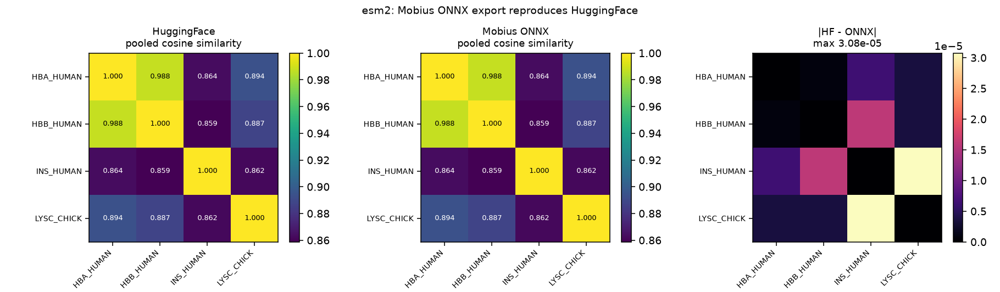
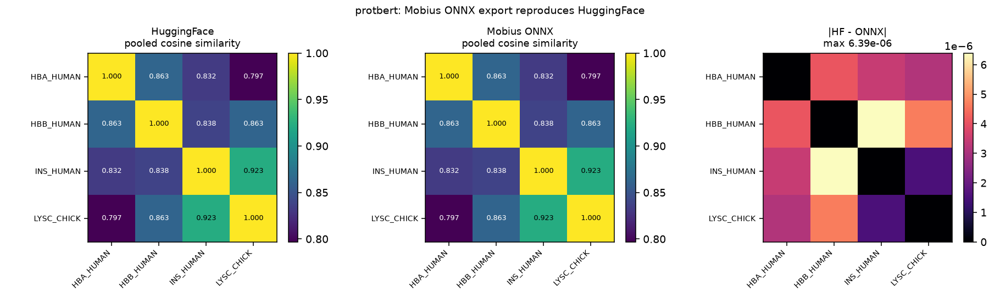

# ESM-2 and ProtBert: real-weight evidence for the encoder-embedding workflow

Encoder models emit embeddings, not text. The evidence below is therefore
numerical parity against upstream HuggingFace, proof that padding and batch
order do not change a row, and measured throughput. No generated text appears
anywhere, because neither model can produce any.

## facebook/esm2_t6_8M_UR50D

- revision `c731040fcd8d73dceaa04b0a8e6329b345b0f5df`  ·  licence: MIT
- ONNX artifact: 29.8 MB, graph inputs `input_ids`, `attention_mask`
- GPU: NVIDIA H200  ·  onnxruntime 1.29.0  ·  torch 2.13.0+cu130  ·  transformers 5.14.1

### Inputs (UniProt reviewed entries)

| accession | entry | protein | residues |
|---|---|---|---|
| P69905 | HBA_HUMAN | Hemoglobin subunit alpha | 142 |
| P68871 | HBB_HUMAN | Hemoglobin subunit beta | 147 |
| P01308 | INS_HUMAN | Insulin | 110 |
| P00698 | LYSC_CHICK | Lysozyme C | 147 |

Sequences (exact strings fed to the tokenizer):

- `HBA_HUMAN` (142 aa)

  ```
  MVLSPADKTNVKAAWGKVGAHAGEYGAEALERMFLSFPTTKTYFPHFDLSHGSAQVKGHGKKVADALTNAVAHVDDMPNALSALSDLHAHKLRVDPVNFKLLSHCLLVTLAAHLPAEFTPAVHASLDKFLASVSTVLTSKYR
  ```

- `HBB_HUMAN` (147 aa)

  ```
  MVHLTPEEKSAVTALWGKVNVDEVGGEALGRLLVVYPWTQRFFESFGDLSTPDAVMGNPKVKAHGKKVLGAFSDGLAHLDNLKGTFATLSELHCDKLHVDPENFRLLGNVLVCVLAHHFGKEFTPPVQAAYQKVVAGVANALAHKYH
  ```

- `INS_HUMAN` (110 aa)

  ```
  MALWMRLLPLLALLALWGPDPAAAFVNQHLCGSHLVEALYLVCGERGFFYTPKTRREAEDLQVGQVELGGGPGAGSLQPLALEGSLQKRGIVEQCCTSICSLYQLENYCN
  ```

- `LYSC_CHICK` (147 aa)

  ```
  MRSLLILVLCFLPLAALGKVFGRCELAAAMKRHGLDNYRGYSLGNWVCAAKFESNFNTQATNRNTDGSTDYGILQINSRWWCNDGRTPGSRNLCNIPCSALLSSDITASVNCAKKIVSDGNGMNAWVAWRNRCKGTDVQAWIRGCRL
  ```

### B=2 padded batch

Rows `P69905` and `P01308` batched together: token tensor (2, 144), valid tokens per row [144, 112], padding per row [0, 32]. Embedding output shape (2, 144, 320).

### Parity vs HuggingFace (valid residues only)

| EP | protein | residues | max abs diff | rel L2 err | min per-residue cosine | pooled cosine |
|---|---|---|---|---|---|---|
| cpu | P69905 | 144 | 4.04e-04 | 1.24e-04 | 0.999999821 | 1.000000000 |
| cpu | P01308 | 112 | 4.53e-04 | 1.55e-04 | 0.999999821 | 1.000000000 |
| cuda | P69905 | 144 | 1.17e-03 | 4.03e-04 | 0.999999642 | 0.999999881 |
| cuda | P01308 | 112 | 1.29e-03 | 5.00e-04 | 0.999999642 | 1.000000000 |
| cuda_tf32_off | P69905 | 144 | 4.05e-04 | 1.24e-04 | 0.999999821 | 0.999999881 |
| cuda_tf32_off | P01308 | 112 | 4.52e-04 | 1.55e-04 | 0.999999821 | 1.000000119 |

The larger CUDA gap is TF32: with `use_tf32=0` the CUDA EP reproduces the
CPU numbers exactly, so it is a GEMM precision setting, not an export defect.

### Padding, batch order and pad-token isolation

| row | perturbation | max abs change in valid region |
|---|---|---|
| P69905 | 144 -> 144 | 0.0 |
| P01308 | 112 -> 144 | 0.0 |
| P69905 (row 0 <-> 1) | batch order reversed | 0.0 |
| P01308 (row 1 <-> 0) | batch order reversed | 0.0 |
| all rows | 32 pad ids rewritten to 5 | 0.0 |

Every entry is exactly `0.0` — bit-identical, not merely close.

### Pooled sequence embeddings (mask-aware mean)

| protein | HF ‖e‖ | ONNX ‖e‖ | cosine(HF, ONNX) | first 4 ONNX dims |
|---|---|---|---|---|
| P69905 | 5.6663 | 5.6663 | 0.999999998868 | -0.2323, +0.0382, +0.0532, -0.0048 |
| P68871 | 5.5700 | 5.5700 | 0.999999999041 | -0.1498, +0.0068, +0.1048, -0.0090 |
| P01308 | 5.8267 | 5.8267 | 0.999999995976 | +0.0601, -0.3402, +0.2102, +0.2600 |
| P00698 | 5.5292 | 5.5291 | 0.999999995224 | +0.0539, -0.0065, +0.1412, +0.1144 |

Embedding dimension 320. Cosine similarity matrix over the four pooled embeddings (ONNX; HF agrees to 3.1e-05):

|  | P69905 | P68871 | P01308 | P00698 |
|---|---|---|---|---|
| P69905 | 1.0000 | 0.9878 | 0.8637 | 0.8940 |
| P68871 | 0.9878 | 1.0000 | 0.8587 | 0.8874 |
| P01308 | 0.8637 | 0.8587 | 1.0000 | 0.8618 |
| P00698 | 0.8940 | 0.8874 | 0.8618 | 1.0000 |

### Performance

| EP | batch | padded len | residues | p50 ms | seq/s | residues/s | peak GPU MiB |
|---|---|---|---|---|---|---|---|
| cpu | 1 | 144 | 144 | 5.183 | 192.9 | 27,782 | - |
| cpu | 2 | 149 | 293 | 7.505 | 266.5 | 39,043 | - |
| cpu | 8 | 149 | 1108 | 17.572 | 455.3 | 63,054 | - |
| cuda | 1 | 144 | 144 | 0.759 | 1,317.8 | 189,758 | 942 |
| cuda | 2 | 149 | 293 | 0.903 | 2,214.0 | 324,353 | 942 |
| cuda | 8 | 149 | 1108 | 1.763 | 4,537.7 | 628,471 | 1006 |



## Rostlab/prot_bert

- revision `7a894481acdc12202f0a415dd567f6cfdb698908`  ·  licence: none declared on the model card
- ONNX artifact: 1675.9 MB, graph inputs `input_ids`, `attention_mask`, `token_type_ids`
- GPU: NVIDIA H200  ·  onnxruntime 1.29.0  ·  torch 2.13.0+cu130  ·  transformers 5.14.1

### Inputs (UniProt reviewed entries)

| accession | entry | protein | residues |
|---|---|---|---|
| P69905 | HBA_HUMAN | Hemoglobin subunit alpha | 142 |
| P68871 | HBB_HUMAN | Hemoglobin subunit beta | 147 |
| P01308 | INS_HUMAN | Insulin | 110 |
| P00698 | LYSC_CHICK | Lysozyme C | 147 |

Sequences (exact strings fed to the tokenizer):

- `HBA_HUMAN` (142 aa)

  ```
  MVLSPADKTNVKAAWGKVGAHAGEYGAEALERMFLSFPTTKTYFPHFDLSHGSAQVKGHGKKVADALTNAVAHVDDMPNALSALSDLHAHKLRVDPVNFKLLSHCLLVTLAAHLPAEFTPAVHASLDKFLASVSTVLTSKYR
  ```

- `HBB_HUMAN` (147 aa)

  ```
  MVHLTPEEKSAVTALWGKVNVDEVGGEALGRLLVVYPWTQRFFESFGDLSTPDAVMGNPKVKAHGKKVLGAFSDGLAHLDNLKGTFATLSELHCDKLHVDPENFRLLGNVLVCVLAHHFGKEFTPPVQAAYQKVVAGVANALAHKYH
  ```

- `INS_HUMAN` (110 aa)

  ```
  MALWMRLLPLLALLALWGPDPAAAFVNQHLCGSHLVEALYLVCGERGFFYTPKTRREAEDLQVGQVELGGGPGAGSLQPLALEGSLQKRGIVEQCCTSICSLYQLENYCN
  ```

- `LYSC_CHICK` (147 aa)

  ```
  MRSLLILVLCFLPLAALGKVFGRCELAAAMKRHGLDNYRGYSLGNWVCAAKFESNFNTQATNRNTDGSTDYGILQINSRWWCNDGRTPGSRNLCNIPCSALLSSDITASVNCAKKIVSDGNGMNAWVAWRNRCKGTDVQAWIRGCRL
  ```

### B=2 padded batch

Rows `P69905` and `P01308` batched together: token tensor (2, 144), valid tokens per row [144, 112], padding per row [0, 32]. Embedding output shape (2, 144, 1024).

### Parity vs HuggingFace (valid residues only)

| EP | protein | residues | max abs diff | rel L2 err | min per-residue cosine | pooled cosine |
|---|---|---|---|---|---|---|
| cpu | P69905 | 144 | 5.53e-05 | 1.73e-05 | 0.999999821 | 1.000000000 |
| cpu | P01308 | 112 | 3.34e-05 | 1.32e-05 | 0.999999762 | 1.000000119 |
| cuda | P69905 | 144 | 5.84e-03 | 1.48e-03 | 0.999987006 | 1.000000119 |
| cuda | P01308 | 112 | 3.88e-03 | 1.33e-03 | 0.999997735 | 0.999999881 |
| cuda_tf32_off | P69905 | 144 | 6.44e-05 | 1.75e-05 | 0.999999821 | 1.000000000 |
| cuda_tf32_off | P01308 | 112 | 3.19e-05 | 1.32e-05 | 0.999999821 | 1.000000119 |

The larger CUDA gap is TF32: with `use_tf32=0` the CUDA EP reproduces the
CPU numbers exactly, so it is a GEMM precision setting, not an export defect.

### Padding, batch order and pad-token isolation

| row | perturbation | max abs change in valid region |
|---|---|---|
| P69905 | 144 -> 144 | 0.0 |
| P01308 | 112 -> 144 | 0.0 |
| P69905 (row 0 <-> 1) | batch order reversed | 0.0 |
| P01308 (row 1 <-> 0) | batch order reversed | 0.0 |
| all rows | 32 pad ids rewritten to 5 | 0.0 |

Every entry is exactly `0.0` — bit-identical, not merely close.

### Pooled sequence embeddings (mask-aware mean)

| protein | HF ‖e‖ | ONNX ‖e‖ | cosine(HF, ONNX) | first 4 ONNX dims |
|---|---|---|---|---|
| P69905 | 3.4556 | 3.4556 | 0.999999999900 | +0.0656, +0.0995, +0.0086, -0.1729 |
| P68871 | 2.8728 | 2.8729 | 0.999999999745 | +0.1123, +0.0081, +0.0326, -0.0185 |
| P01308 | 4.0000 | 4.0000 | 0.999999999977 | +0.0932, +0.0043, -0.0187, -0.0211 |
| P00698 | 3.5791 | 3.5791 | 0.999999999922 | +0.0521, +0.0073, -0.0140, -0.0115 |

Embedding dimension 1024. Cosine similarity matrix over the four pooled embeddings (ONNX; HF agrees to 6.4e-06):

|  | P69905 | P68871 | P01308 | P00698 |
|---|---|---|---|---|
| P69905 | 1.0000 | 0.8631 | 0.8323 | 0.7968 |
| P68871 | 0.8631 | 1.0000 | 0.8376 | 0.8626 |
| P01308 | 0.8323 | 0.8376 | 1.0000 | 0.9227 |
| P00698 | 0.7968 | 0.8626 | 0.9227 | 1.0000 |

### Performance

| EP | batch | padded len | residues | p50 ms | seq/s | residues/s | peak GPU MiB |
|---|---|---|---|---|---|---|---|
| cpu | 1 | 144 | 144 | 282.952 | 3.5 | 509 | - |
| cpu | 2 | 149 | 293 | 294.549 | 6.8 | 995 | - |
| cpu | 8 | 149 | 1108 | 1120.366 | 7.1 | 989 | - |
| cuda | 1 | 144 | 144 | 7.999 | 125.0 | 18,003 | 4912 |
| cuda | 2 | 149 | 293 | 5.709 | 350.3 | 51,324 | 4912 |
| cuda | 8 | 149 | 1108 | 10.565 | 757.2 | 104,871 | 5936 |




## Reproduction

Environment: 8x NVIDIA H200 (143 GB, driver CUDA 13.0), Python 3.12.9,
onnxruntime-gpu 1.29.0 in an isolated overlay so the shared virtualenv was never
mutated. `source protein-evidence/env.sh` sets `PY` and `PYTHONPATH`.

```bash
# ESM-2: exported straight from the hub
$PY -m mobius build facebook/esm2_t6_8M_UR50D \
    --revision c731040fcd8d73dceaa04b0a8e6329b345b0f5df \
    --output $EV/exports/esm2_t6_8M --runtime onnx-genai

# ProtBert: the hub copy ships only pytorch_model.bin and declares no
# model_type, so it is converted once to a local safetensors directory.
$PY $EV/scripts/prepare_protbert.py
$PY -m mobius build $EV/checkpoints/prot_bert \
    --config $EV/checkpoints/prot_bert \
    --output $EV/exports/prot_bert --runtime onnx-genai

# Parity + performance for either model
$PY $EV/scripts/evidence.py --model esm2 --hf facebook/esm2_t6_8M_UR50D \
    --revision c731040fcd8d73dceaa04b0a8e6329b345b0f5df \
    --export $EV/exports/esm2_t6_8M --inputs $EV/inputs --out $EV/artifacts
$PY $EV/scripts/evidence.py --model protbert --hf $EV/checkpoints/prot_bert \
    --hf-class BertModel --spaced \
    --export $EV/exports/prot_bert --inputs $EV/inputs --out $EV/artifacts
```

Tests added alongside the code:

```bash
$PY -m pytest src/mobius/models/esm_test.py \
    src/mobius/integrations/onnx_genai/encoder_embedding_metadata_test.py \
    tests/canonical_workflow_contract_test.py -k "not phi4mm" -q
$PY -m pytest tests/integration_test.py -m integration -k "Encoder" -q
```

## Caveats and blockers

- ESM-2 had no implementation. Both PR #478 and PR #86 route `esm` to the
  generic BERT module, which cannot load the checkpoint (rotary embeddings,
  pre-norm blocks, a final embedding LayerNorm, token dropout, and no
  token-type embeddings). `models/esm.py` was written for this work.
- `Rostlab/prot_bert` declares no licence on its model card, so redistribution
  status is unclear; only the measurements are reported here. Its `config.json`
  omits `model_type` and the repo ships no safetensors, so a one-time local
  conversion is required. All 487 encoder tensors in the converted file are
  bit-identical to the upstream `pytorch_model.bin`
  (sha256 `6ea3edd26cfefc3111176100ee2a027ed510f9c86b63e5b53a2a050b59f2af9d`);
  only the unused MLM and NSP heads are dropped, because
  `cls.predictions.decoder.weight` is tied to the input embedding and
  safetensors rejects shared storage. Its L4 case therefore ships with a
  documented `skip_reason`.
- Encoder packages previously fell through to the decoder metadata producer and
  emitted a greedy autoregressive loop with a sampler and KV cache for a
  bidirectional encoder. Fixed by the encoder-embedding producer.
- Encoder graphs were wrong for batch > 1: the rank-2 int64 attention mask went
  straight into `op.Attention`, which fails to broadcast. Fixed by building a
  4D bool padding mask.
- `DistilBertModel` silently discarded `attention_mask` entirely. Found by the
  new padded-batch integration test and fixed here.
- `ModernBertModel` builds `position_ids` as `(1, seq)` and looks to have the
  same batch > 1 rotary defect. Not fixed — out of scope, and untested here.
- `lintrunner` cannot run in this environment (it shells out to a `python`
  binary that does not exist); `ruff format` and `ruff check` were run directly
  on every changed file and are clean.
- `tests/arch_validation_test.py` (17) and `tests/ort_genai_test.py` /
  `nemo_rnnt_integration_test.py` (5) failures are pre-existing; confirmed by
  re-running against a stashed tree and by their causes (missing
  `sentencepiece`, ORT-GenAI runtime version drift, VLM downloads).
