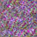

# Stable Diffusion — generated-image evidence

This `64x64` image was generated by
[`hf-internal-testing/tiny-stable-diffusion-torch`](https://huggingface.co/hf-internal-testing/tiny-stable-diffusion-torch)
at revision `a88cdfbd91f96ec7f61eb7484b652ff0f4ee701d`, using prompt
`a photo of an astronaut`, seed `1234`, five Euler steps, and CFG `7.5`.
[`run.json`](run.json) records the exact schedule and tensor dimensions.

This is durable **real-output/reference evidence**, not a runtime-parity claim:
the retained run did not save a separately rendered inference-metadata output
or timing record. The catalogue example shows how the workflow is expressed,
while this bundle proves the image-generation fixture produced an actual image.

